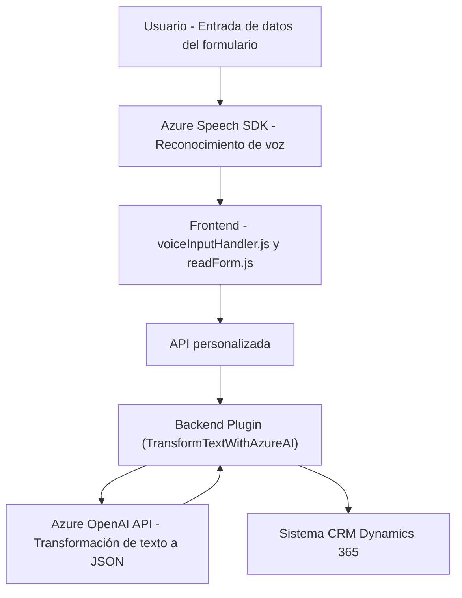

### Breve resumen técnico

La solución consiste en una aplicación orientada al manejo de formularios dentro de un sistema CRM (Dynamics 365), utilizando tecnologías como **Azure Speech SDK** para reconocimiento y síntesis de voz, y **Azure OpenAI** para procesar texto proveniente de voz o entradas externas, enriqueciendo los datos con inteligencia artificial. Los tres archivos proporcionados sugieren una combinación de un **frontend** JavaScript para interacción con el usuario, comunicación mediante APIs, y un **backend o plugin en C#** para lógica específica del negocio y procesamiento externo.

---

### Descripción de arquitectura

1. **Tipo de solución**:  
   - **Multiparte (integral)**: Incluye un **frontend** en JavaScript para procesamiento de voz con Azure Speech SDK, un mecanismo de **integración con APIs externas** mediante reconocimiento de voz (gestionado en `voiceInputHandler.js`), y un **plugin** en C# para extender funcionalidad en un sistema CRM (Dynamics 365) con operaciones específicas.  
   - Combina funcionalidad de **API**, **frontend**, e **integración extensible con un CRM**.

2. **Arquitectura**:  
   - **Multi-capas** (n-capas): El nivel de front-end (JavaScript) gestiona directamente interacción del usuario y servicios externos (Azure Speech SDK). El backend introducido mediante el plugin en C# explota las APIs de Azure OpenAI y se comunica con el CRM. Cada capa tiene un propósito claramente definido.
   - **Event-driven**: El flujo del sistema depende de eventos (e.g., reconocimiento de voz, procesamiento de transcripción, APIs externas y desencadenar Plugins en CRM).
   - **Integración externa**: Servicios de Azure, como Speech SDK y OpenAI, son componentes fundamentales en la arquitectura para el enriquecimiento de datos y transcripción/reconocimiento de texto.

---

### Tecnologías usadas

1. **Azure Speech SDK**: Para reconocimiento y síntesis de voz en los archivos de frontend (`readForm.js`, `speechForm.js`).
2. **Microsoft Dynamics CRM**: Extendido mediante un plugin (`TransformTextWithAzureAI.cs`) que opera dentro de su contexto.
3. **Azure OpenAI API**: Para transformar texto en JSON estructurado con lógica externa, utilizada en el archivo de plugin.
4. **REST APIs**: Comunicación entre JavaScript y servicios externos como Azure Speech y APIs personalizadas.
5. **C#/.NET Framework**: Para la implementación del plugin de Dynamics CRM.
6. **JavaScript ES6**: Para lógica del frontend en los archivos `.js`.
7. **Dependency Injection**: En el plugin, como parte del uso de la interfaz `IPlugin`.
8. **Promises & Callbacks**: Para la sincronización de procesos asíncronos en los archivos JS mientras se interactúa con Azure Speech SDK.

---

### Dependencias o componentes externos

1. **Azure Speech SDK**: Usado en el frontend para la síntesis y reconocimiento de voz (`https://aka.ms/csspeech/jsbrowserpackageraw`). 
2. **Azure OpenAI API**: Conexión mediante un endpoint para procesamiento de datos en el backend (plugin).
3. **Microsoft Dynamics CRM Framework**: Necesario para la ejecución de plugins `IPlugin` y para interactuar con datos en este entorno.
4. **APIs externas personalizadas**: Utilizadas en el archivo `voiceInputHandler.js` para enriquecimiento adicional de las transcripciones.
5. **System & External Libraries**: Para manejo de JSON (`Newtonsoft.Json.Linq`, `System.Text.Json`), comunicación HTTP (`System.Net.Http`, `System.Net.Http.Headers`).

---

### Diagrama Mermaid

---

### Conclusión final

La solución arquitectónica presentada utiliza un enfoque **multi-capa** donde el frontend es responsable de manejar interacciones de usuario y comunicación con APIs como Azure Speech SDK. Una capa intermedia funciona como enlace entre las transcripciones de voz y los formularios del sistema CRM, procesando datos con servicios externos (e.g., Azure OpenAI). Por último, una capa de backend en forma de **plugin** opera dentro del contexto de Dynamics CRM para aplicar las reglas personalizadas y enriquecer los datos de negocio.

Este diseño utiliza patrones como **event-driven**, delegación de procesamiento, carga dinámica de dependencias, integración API, y extensibilidad de CRM mediante **plugins**, proporcionando tanto modularidad como escalabilidad.