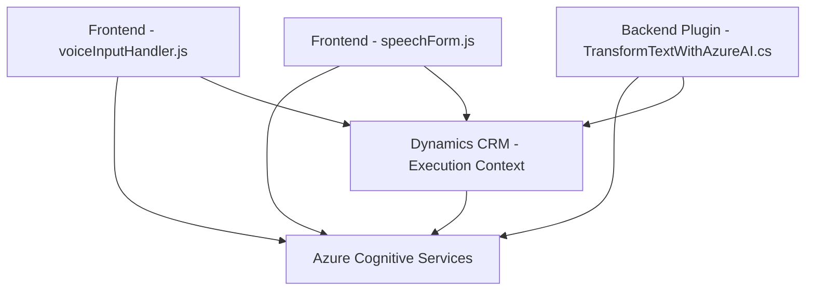

### Breve resumen técnico:
El repositorio combina un *front-end* basado en JavaScript con integración de SDKs y un *plugin* .NET para Dynamics CRM. Utiliza servicios de Azure Cognitive Services como el Speech SDK y OpenAI para funcionalidades avanzadas de síntesis y comprensión de texto, adaptados específicamente para la manipulación y procesamiento dinámico de datos en formularios de Dynamics CRM.

---

### Descripción de arquitectura:
La arquitectura general es un **multicapa** centrada en la interacción entre capas de presentación, lógica de negocio y servicios. Hay una división clara entre el código JavaScript, que administra la interacción del usuario (frontend) y el *plugin* .NET que actúa como un componente que extiende Dynamics CRM. Destaca la integración de servicios externos mediante SDKs y APIs como Azure Speech y GPT-4 a través de Azure Cognitive Services, lo que sugiere un patrón de arquitectura **orientado a servicios**.

---

### Tecnologías usadas:
1. **Frontend**:
   - Lenguaje: JavaScript.
   - Framework/servicio: Azure Speech SDK.
   - Patrones: Modularización, integración de servicios, carga dinámica de dependencias.

2. **Backend/plugin**:
   - Lenguaje: C# (.NET).
   - Framework: Dynamics CRM SDK, Microsoft.Xrm.Sdk.
   - Servicio: Azure OpenAI (GPT-4), JSON Management (Newtonsoft.Json).
   - Patrones: Plugin, orientación a servicios, integración de APIs externas.

3. **Servicios externos**:
   - Azure Cognitive Services: Speech Service y OpenAI para AI-powered operations.
   - Dynamics CRM: Infraestructura de base para el contexto empresarial.

---

### Diagrama Mermaid válido para GitHub:

---

### Conclusión final:
La solución es un sistema basado en capas orientado a servicios que extiende las capacidades de Dynamics CRM combinando un frontend interactivo (en JavaScript) y un backend integrado como un *plugin* (.NET). La arquitectura está diseñada para aprovechar tecnologías modernas como Azure Cognitive Services para ofrecer funcionalidades avanzadas como síntesis y procesamiento de voz y texto con IA. Aunque funcional, debe revisarse el manejo de claves de API en el código fuente para mitigar riesgos de seguridad y considerar un enfoque más modular en el frontend para mejorar la mantenibilidad.