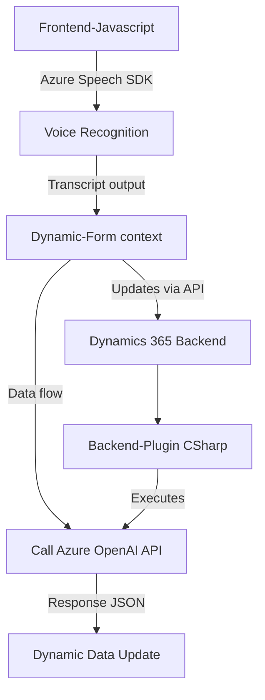

### Breve Resumen Técnico:

El repositorio tiene dos componentes principales en **JavaScript** y uno basado en **C#** dentro de Dynamics CRM. Los motivos de sus implementaciones son:
1. **Front-end:** 
   - Permitir interacción basada en reconocimiento de voz mediante Azure Speech SDK (procesar grabaciones, transcribir voz y procesar datos obtenidos).
   - Integrar directamente con formularios dinámicos, probablemente en un contexto de Dynamics CRM o ERP, para actualizar y manejar datos.

2. **Plugin** (backend):
   - Un complemento en Dynamics CRM que utiliza **Azure OpenAI API** para transformar texto en JSON basado en reglas. Este aspecto está diseñado para procesamiento más avanzado de texto reconocido por la capa front-end.

Se observa una solución híbrida que combina servicios en la nube, un flujo de interacción dinámico (API) y extensiones CRM.

---

### Descripción de la Arquitectura:

La solución utiliza una arquitectura distribuida basada en la siguiente estructura:
1. **Arquitectura N-capas:**
   - Frontend: Procesamiento de entrada (voz y texto), manipulación en UI/Form context.
   - Backend: Plugin implementado directamente como capa de lógica personalizada en Dynamics CRM.
   - Dependencias en la nube: Azure Speech SDK y Azure OpenAI API actúan como servicios externos.

2. **Microservicios en extensión:**
   - La lógica del plugin CRM opera como una extensión modular autónoma que puede ser desplegada según las necesidades específicas.

3. **Integración a servicios de terceros:** 
   - Usa patrones de **API Gateway** y **Proxy-like**, conectando la lógica CRM con servicios Azure (Speech y OpenAI).

---

### Tecnologías, Frameworks y Patrones Usados:

1. **Tecnologías**:
   - **Frontend (JavaScript)**: 
     - Dominado por Azure Speech SDK para transcripción de voz y síntesis de texto a voz.
   - **Backend (C# Plugin in Dynamics CRM)**:
     - Interacción con APIs usando `HttpClient` para Azure OpenAI.
     - Manipulación de objetos JSON (`JsonDocument`).

2. **Frameworks**:
   - Dynamics CRM SDK (Microsoft.Xrm.Sdk).
   - Azure Speech SDK.
   - Azure OpenAI API.

3. **Patrones de diseño**:
   - **Adapter Pattern:** La solución se adapta al contexto del formulario CRM (front-end variables como `formContext`).
   - **API Proxy:** Plugin interactuando y formateando datos para un servicio externo.
   - **MVC-like modularidad:** Separación clara de responsabilidades (interfaz voz-datos, lógica de negocio, conectividad).

---

### Dependencias o Componentes Externos Presentes:

1. **Azure Speech SDK:**
   - CDN externo para carga dinámica de bibliotecas relacionadas con reconocimiento y síntesis de voz.

2. **Azure OpenAI API:**
   - Procesa texto recibido desde front-end o CRM y lo transforma en JSON conforme a normativas.

3. **Dynamics CRM SDK:**
   - Manejo de extensiones y servicios internos del CRM, especialmente `IPlugin`.

4. **Dynamics 365 Web API (Xrm.WebApi):**
   - Utilizada en los componentes de front-end para manipular datos del formulario dinámico.

---

### Diagrama Mermaid válido para GitHub:

---

### Conclusión Final:

El proyecto combina capacidades de **Azure Cognitive Services** (Speech y OpenAI) con extensiones de **Dynamics CRM** para crear una solución avanzada de reconocimiento de voz y procesamiento de texto. Con una arquitectura distribuida y modular, habilita la interacción fluida con APIs externas y el sistema CRM interno.

La solución es idónea para aplicaciones empresariales con entornos complejos como CRM/ERP y resalta el uso estratégico de tecnologías cloud y plugin de extensiones.