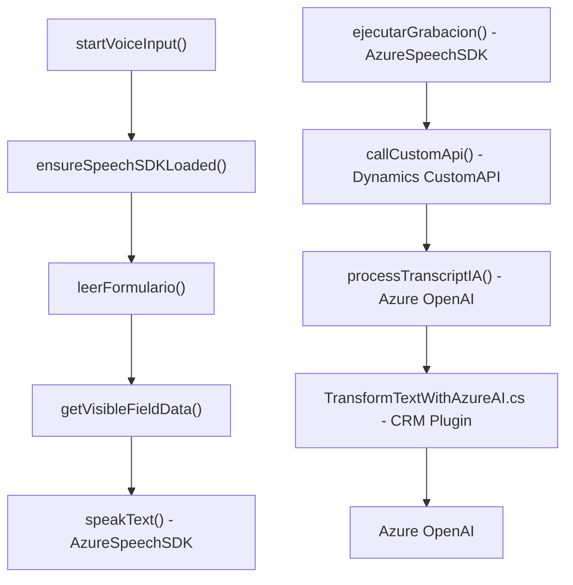

### Breve resumen técnico
El proyecto es una solución híbrida orientada a Dynamics CRM, compuesta por un **frontend basado en JavaScript**, que interactúa con formularios del CRM, y **plugins .NET** para procesar datos en el backend. Además, se integra con **Azure Speech SDK** para sintetizar y reconocer voz, y con **Azure OpenAI** para transformaciones de texto inteligente.

### Descripción de arquitectura
La arquitectura en su conjunto es **orientada a servicios**, con integración de tecnologías cloud como **Azure Speech SDK** y **Azure OpenAI**. Por otro lado, las soluciones específicas como los plugins siguen el patrón de **n capas** en Dynamics CRM, con separación entre lógica empresarial (Plugins), presentación (Frontend), y servicios externos (Azure).

#### Componentes visibles:
1. **Frontend/JS**: Archivos como `readForm.js` y `speechForm.js` manejan el acceso a datos de formularios y la síntesis/reconocimiento de voz.
2. **Backend Plugin**: El archivo `TransformTextWithAzureAI.cs` implementa una funcionalidad específica para transformar texto en Dynamics CRM, invocando Azure OpenAI.
3. **Servicios externos**: 
   - **Azure Speech SDK**: Maneja reconocimiento y síntesis de voz en tiempo real.
   - **Azure OpenAI API**: Procesa texto bajo normas y devuelve resultados en JSON.

#### Patrones utilizados:
- **Carga dinámica de dependencias**: El SDK de Azure Speech se carga bajo demanda.
- **Flow-based architecture** (en el frontend): Las funciones están estructuradas en un flujo, separando la extracción de datos, la transformación y la reproducción.
- **Plugin Design Pattern**: En el backend, el archivo C# implementa el estándar de Dynamics CRM.
- **HttpConnector**: Uso del patrón para interactuar con APIs de servicios externos (Azure).

### Tecnologías usadas
1. **Frontend**
   - **JavaScript**: Para la manipulación de DOM y lógica de interacción.
   - **Azure Speech SDK**: Para reconocimiento y síntesis de voz en web apps.
   - **Dynamics CRM Context (`executionContext`)**: Para interactuar con formularios del sistema.

2. **Backend**
   - **C# / .NET Framework** (para plugin CRM): Se implementan transformaciones de texto y la lógica de negocio con `IPlugin`.

### Dependencias o componentes externos
1. **Speech SDK (MS)**: Utilizado para enfrentar tareas de síntesis y reconocimiento de voz.
2. **Azure OpenAI**: Utilizado para transformar texto con inteligencia artificial.
3. **Dynamics CRM WebApi**: Para realizar operaciones basadas en APIs personalizadas.
4. **.NET Libraries**: Serialización de JSON, manejo de expresiones, y comunicación vía HTTP.

---

### Diagrama Mermaid válido para GitHub Markdown

---

### Conclusión final
El proyecto combina tecnologías modernas de frontend (JavaScript, Azure Speech SDK) y backend (.NET y Dynamics CRM) para ofrecer una solución orientada al flujo de datos relacionada con formularios, síntesis/reconocimiento de voz y procesamiento mediante inteligencia artificial. La arquitectura combina **n capas** en CRM con integración en la nube (Azure), destacando por su modularidad y eficiencia en la interacción entre componentes dinámicos.