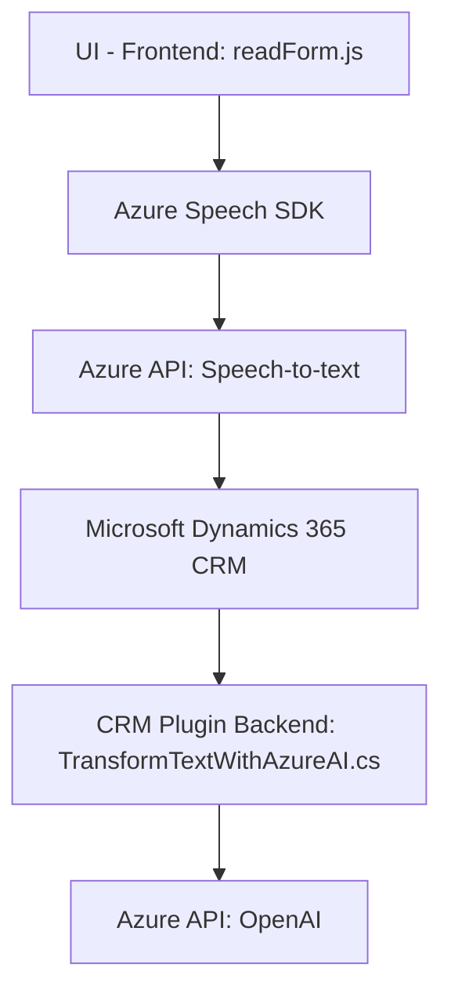

### Breve resumen técnico
La solución presentada es una combinación de una **frontend JavaScript Application**, orientada a la interacción dinámica de usuarios con formularios, y un **backend CRM Plugin**, que se integra con sistemas Microsoft Dynamic 365 y un servicio externo de Azure OpenAI. El diseño sigue una arquitectura híbrida (cliente-servidor) que permite la integración de servicios en entornos empresariales.

### Descripción de arquitectura
La solución utiliza una **arquitectura de integración de aplicación en n-capas**, separando claramente las responsabilidades de frontend y backend. El frontend en JavaScript se usa como una interfaz de interacción con un usuario, mientras que el backend en .NET actúa como **plugin** que facilita la comunicación con Microsoft Dynamics CRM y con el endpoint de Azure OpenAI.

Además, presenta pequeños componentes orientados a la **Arquitectura Limpia**, en particular con:
1. **Facade Pattern**: Encapsula manipulación del SDK y otros servicios dentro de funciones y clases claras. Por ejemplo, `startVoiceInput`, `ensureSpeechSDKLoaded` y `speakText`.
2. **Carga dinámica**: Uso de carga dinámica de SDK en frontends como Azure Speech SDK.
3. **Patrón Plugin**: Utilizado para el backend para extender las funcionalidades de Microsoft Dynamics.
4. **Modularidad y capas**: Estructuración separada de extracción, procesamiento y actualización de datos en tiempo real tanto en el frontend como en los plugins backend.

### Tecnologías usadas
1. **Frontend**:
   - **JavaScript (ES6)** y principios de modularización. Funcionalidad segmentada en funciones y objetos.
   - **Azure Speech SDK** para reconocimiento de voz y síntesis de texto a voz.
2. **Backend (C# Plugin para Dynamics 365)**:
   - **Microsoft Dynamics CRM Integration**: `IPlugin` para extender CRM.
   - **Azure OpenAI API**: Procesamiento avanzado de textos y transformación contextual.
   - **System.Net.Http** y **JSON Libraries** para solicitudes HTTP al API.
   - **Newtonsoft.Json.Linq** y **System.Text.Json** para manipulación y serialización de JSON.
   - **System.Text** y **Regular Expressions** para manipulación adicional de datos textuales.
3. **Patterns**:
   - Facade: Simplifica interfaz de uso para SDK y normalización de datos.
   - Carga dinámica.
   - Cliente de servicios interactuando con APIs como Azure OpenAI y Speech SDK.

### Dependencias o componentes externos
La solución depende de varios servicios y componentes externos:
1. **Azure Speech SDK**: Carga de manera dinámica desde un endpoint de Microsoft (`https://aka.ms/csspeech/jsbrowserpackageraw`) para el front-end. Utilizado para reconocimiento y síntesis de voz.
2. **Microsoft Dynamics CRM SDK**: Usado en el archivo `Plugins/TransformTextWithAzureAI.cs` como punto de extinción del plugin.
3. **Azure OpenAI API**: Utilizado para transformar textos en el backend. El endpoint parece ser específica para una instancia de cliente Azure; incluye una API key (mal gestionada en el código actual y requiere una configuración más segura).
4. **Custom API**: API específica mencionada como `trial_TransformTextWithAzureAI` para procesamiento IA en el frontend en algunos flujos de datos.

### Diagrama Mermaid válido para GitHub

### Conclusión Final
La solución presentada es una implementación híbrida que utiliza adquisiciones de voz y procesamiento de lenguaje natural para transformar datos de entrada en resultados estructurados de forma automática. Su aplicación está pensada para mejorar la experiencia de usuarios en entornos CRM (Microsoft Dynamics 365). Aunque la arquitectura sigue una jerarquía n-capas con separación lógica de interacción entre frontend y backend, hay ciertos puntos de mejora en cuanto a la gestión de claves y excepciones para garantizar mayor seguridad y optimización.