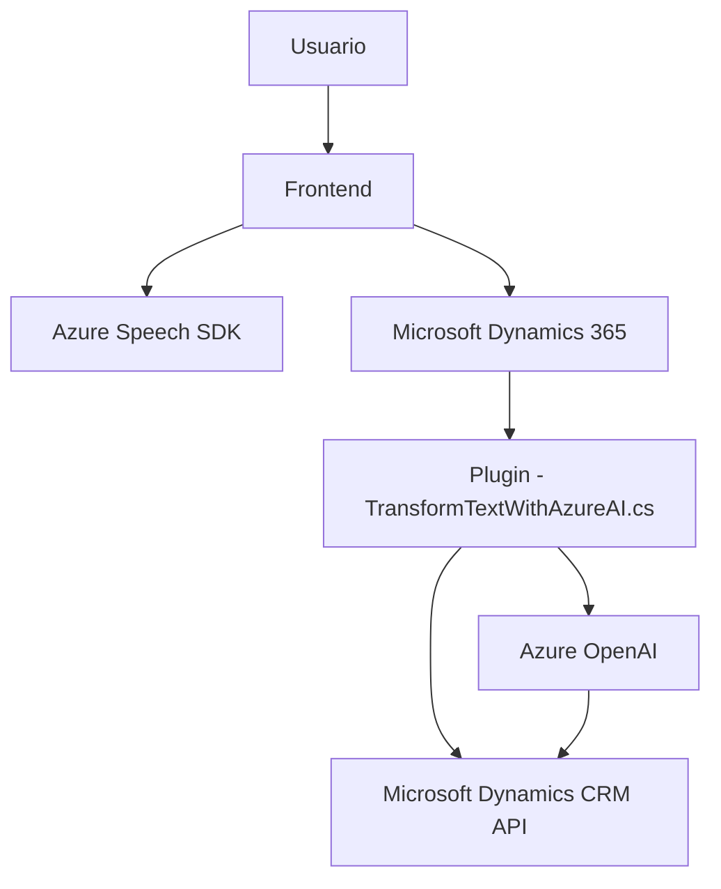

### Breve resumen técnico
El repositorio parece implementar una solución integrada con Microsoft Dynamics 365 que extiende sus funcionalidades mediante el uso de servicios de inteligencia artificial de Azure. Consiste en un frontend basado en JavaScript para interactuar con formularios mediante entrada por voz y salida por síntesis de voz, con procesamiento adicional a través de un backend en C#, que actúa como un plugin en Dynamics CRM y utiliza APIs de Azure OpenAI para transformación de textos.

---

### Descripción de arquitectura
La arquitectura podría clasificarse como **arquitectura de n capas**:
1. **Frontend:** Una capa de presentación para interacción con formularios usando tecnologías JavaScript (Dynamics 365).
2. **Backend:** Un plugin en C# que actúa como la capa de lógica del negocio, permitiendo la transformación y procesamiento de datos con reglas predefinidas.
3. **Servicios externos:** Integración con servicios en la nube como:
   - Azure OpenAI para la transformación de textos.
   - Azure Speech SDK para síntesis de voz y reconocimiento de voz.

El patrón de integración con servicios externos sugiere un enfoque en diseño modular, donde se delegan tareas especializadas (IA, voz) a servicios externos.

---

### Tecnologías usadas
1. **Frontend:**
   - **JavaScript:** Lenguaje principal para interacción con formularios.
   - **Azure Speech SDK:** Para síntesis y reconocimiento de voz.
   - **Microsoft Dynamics 365 APIs:** Para la manipulación y actualización de formularios CRM.
   
2. **Backend:**
   - **C#:** Lenguaje principal del plugin.
   - **Microsoft Dynamics CRM SDK:** Para lógica de negocio.
   - **Azure OpenAI:** Transformación de textos con IA.

3. **Comunicación y formato:**
   - **JSON:** Para envío y recepción de datos entre los distintos sistemas.
   - **HTTP Requests y Responses:** Para integración con servicios en la nube.

---

### Diagrama Mermaid válido para GitHub

---

### Conclusión final
La solución descrita es un **sistema híbrido de n capas** que combina tecnologías modernas para extender Microsoft Dynamics 365 con nuevas funcionalidades basadas en inteligencia artificial y entrada/salida de voz mediante servicios de Azure. Esto permite mejorar la interacción de los usuarios con el CRM, proporcionando una experiencia más intuitiva y automatizada. Aunque modular y funcional, podría beneficiarse de ciertas mejoras en factores como la externalización de configuraciones sensibles y optimización de tiempos de respuesta en consultas de voz y OpenAI.