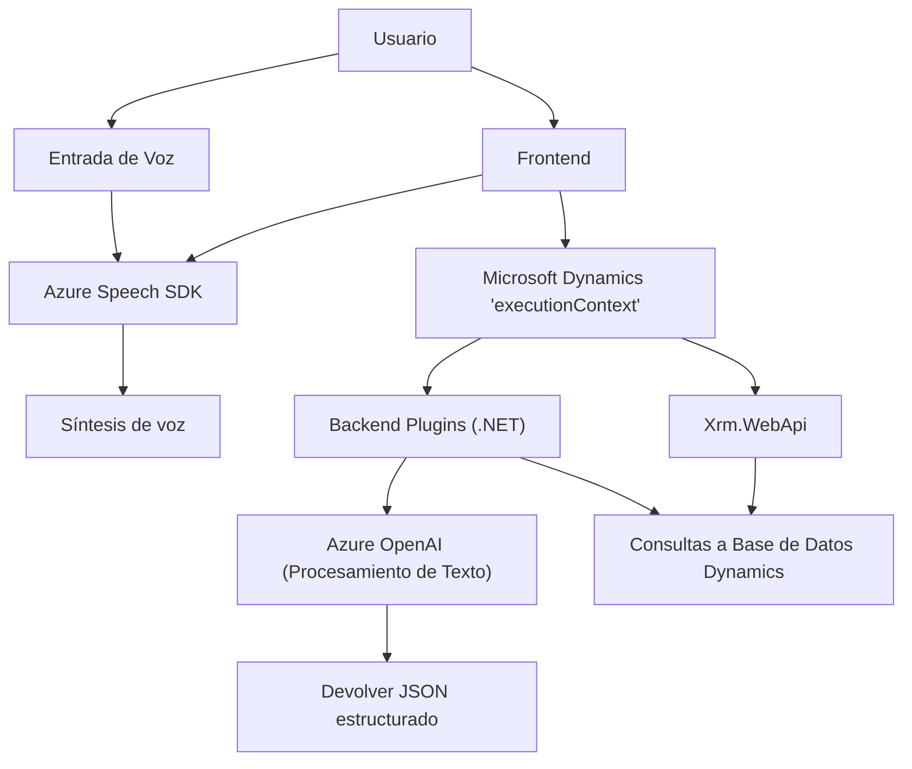

### Breve Resumen Técnico:
El repositorio implementa una solución que combina un **frontend** ligero basado en JavaScript para formularios dinámicos, plugins de **backend en .NET** y la integración con servicios externos como **Azure OpenAI** y **Azure Speech SDK**. La funcionalidad está orientada hacia la interacción mediante voz y texto en formularios de Microsoft Dynamics CRM, permitiendo lectura, transcripción y procesamiento de texto con inteligencia artificial.

---

### Descripción de Arquitectura:
La arquitectura general es una **n capas** que combina:
1. **Frontend**: JavaScript para manejo dinámico de los formularios, interacción con Azure Speech SDK y procesamiento del contenido visible en formularios de Dynamics.
2. **Backend plugins**: Código .NET que procesa eventos específicos en texto desde Dynamics CRM y los conecta con Azure OpenAI.
3. **Servicios externos**: Integración directa con Azure Speech (reconocimiento y síntesis de voz) y Azure OpenAI (procesamiento avanzado de texto).

**Elementos clave:**
- **Encapsulación modular:** Cada funcionalidad (lectura de voz, entrada de texto en formularios, procesamiento de texto con IA, etc.) está implementada en archivos distintos, bien organizados, con funciones y clases específicas.
- **Event-driven:** Predominante uso de invocaciones dependientes directamente de la interacción del usuario (voz desde el frontend o triggers en Dynamics CRM).
- **Microintegración:** Se están utilizando servicios externos especializados para tareas específicas (voz y OpenAI) que son orquestados por la capa intermedia (.NET y Javascript).

---

### Tecnologías Usadas:
1. **Frontend:**
   - **JavaScript (ES6):** Lógica con modularidad separada en funciones para generación dinámica de datos.
   - **Azure Speech SDK:** Servicios para transcripción y síntesis de voz.
   - **HTML/CSS/Dynamics Web Resources:** Gestión del contexto `executionContext` de Dynamics CRM.

2. **Backend:**
   - **.NET Framework (C#):** Plugins de Dynamics CRM usando la interfaz `IPlugin`.
   - **Azure OpenAI:** API para transformación de texto avanzado mediante inteligencia artificial.
   - **System.Text.Json:** Serialización/deserialización para interacción con JSON.
   - **Microsoft Dynamics APIs (Xrm.WebApi):** Servicios para manipulación interna de datos en entornos Dynamics CRM.

3. **Arquitectura orientada servicios:**
   - REST API: Consumida para interactuar con Azure OpenAI y Azure Speech.

---

### Dependencias y Componentes Externos:
1. **Microsoft Azure Speech SDK** (https://aka.ms/csspeech/jsbrowserpackageraw): Manejo de entrada y salida de voz.
2. **Microsoft Azure OpenAI**: Procesa transformaciones de texto con reglas avanzadas.
3. **Microsoft Dynamics CRM**: Contexto del entorno empresarial donde se implementan todos los plugins y lógica del negocio.
4. **.NET Libraries**:
   - `System.Net.Http`: Gestión de llamadas HTTP.
   - `Newtonsoft.Json`: Procesamiento de JSON.
   - `System.Text.Encoding`: Codificación de texto.
5. **Configuración externa**: Claves API como `azureKey` y `azureRegion` se almacenan de forma directa, aunque se recomienda usar variables de entorno para garantizar seguridad.

---

### Diagrama Mermaid:

---

### Conclusión Final:
La solución presentada tiene un enfoque robusto para integrar una capa de voz y procesamiento de texto con Dynamics CRM. Está diseñada en **n capas**, empleando el frontend para manejar interacciones de usuario, plugins de backend para orquestación lógica avanzada y servicios externos como Azure Speech SDK y OpenAI para ejecutar las tareas especializadas. La arquitectura modular favorece que cada componente cumpla una responsabilidad específica, haciéndola escalable y reutilizable en escenarios empresariales, aunque la gestión de claves sensibles debería mejorar para garantizar seguridad.