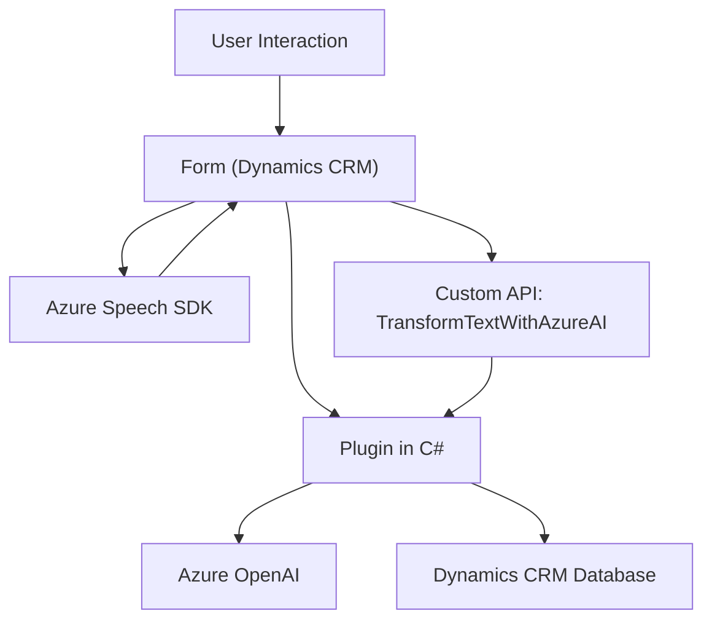

### Breve resumen técnico
Este repositorio contiene tres archivos relacionados que, en conjunto, proporcionan funcionalidades avanzadas para integrar reconversión y procesamiento de voz en un entorno de Dynamics CRM. Los scripts JavaScript manejan interacciones front-end dentro del contexto de formularios de Dynamics CRM. El archivo C# define un plugin que utiliza Azure OpenAI para transformar texto basado en reglas específicas.

---

### Descripción de la arquitectura
La solución presentada se basa en una arquitectura **n-capas** distribuida, donde las capas principales son:
1. **Presentación** (frontend): Los archivos JavaScript (`readForm.js` y `speechForm.js`) interactúan con el usuario, procesan formularios y se integran con SDKs y APIs para la conversión de texto a voz y reconocimiento.
2. **Información** (backend): El plugin de C# actúa como un servicio que realiza transformaciones de texto mediante interacción con Azure OpenAI a través de un cliente API. Además, comunica las modificaciones con Dynamics CRM.
3. **Datos**: Dynamics CRM actúa como el sistema de almacenamiento, proporcionado por su API y modelo de datos.

---

### Tecnologías usadas
1. **Lenguajes y Frameworks**:
   - `JavaScript`: Para scripts front-end interactuando con Dynamics CRM.
   - `.NET (C#)`: Para el desarrollo del plugin que interactúa con CRM y Azure OpenAI.

2. **Servicios externos**:
   - **Azure Speech SDK**: Usado para conversión de texto a voz y transcripción de voz a texto en los scripts de JavaScript.
   - **Azure OpenAI**: Llamado desde el plugin para transformación y análisis avanzado de texto.
   - **Microsoft Dynamics CRM SDK**: Proporciona acceso y modificación de datos dentro del sistema CRM.

3. **APIs**:
   - **WebAPI de Dynamics CRM**: Consulta y actualiza los datos del formulario.
   - **API personalizada (`trial_TransformTextWithAzureAI`)**: Llamada en `speechForm.js` para información transformada por IA.

4. **Programación modular**:
   - Cada funcionalidad está organizada en funciones para promover la reutilización y encapsulación.
   
5. **Patrones de diseño**:
   - **Modelo Vista Controlador (MVC)** para la organización del código front-end.
   - **Cargador dinámico** para importar el SDK de Azure Speech en tiempo de ejecución.
   - **Delegación de responsabilidad** clara entre lógica de frontend y plugin/backend.

---

### Diagrama Mermaid

### Conclusión final
Esta solución corresponde a una **n-capas**, donde cada archivo tiene un rol específico:
- **Frontend scripts**: Capturan datos de formularios en tiempo de ejecución y usan SDKs/API externas para realizar funcionalidades avanzadas. Se delega tanto el manejo del frontend como la interacción con Dynamics CRM y APIs externas mediante patrones modulares y sintácticamente claros.
- **Backend plugin**: Implementa un patrón de **Plugin** típico en Microsoft Dynamics CRM y actúa en una capa de negocio. Utiliza una API de Azure OpenAI para procesar texto y reglas definidas externamente.

La integración con **Azure Speech SDK** y **Azure OpenAI** destaca un principio de proxied services, donde el sistema se comunica de forma extensible con servicios externos para proporcionar capacidades avanzadas como síntesis y análisis de voz/texto, obteniendo un diseño robusto y escalable.