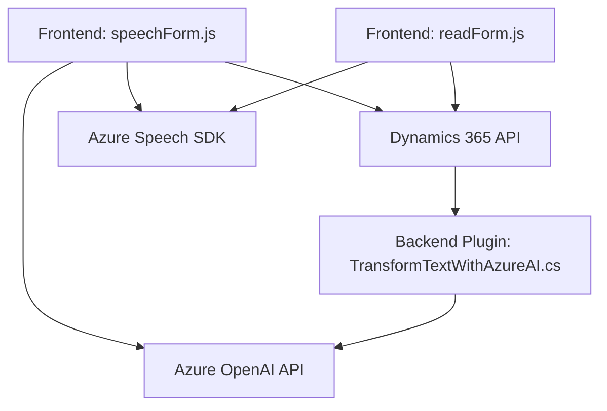

### Breve resumen técnico:

El repositorio contiene implementaciones de JavaScript y C# integradas principalmente con servicios de Azure y Dynamics CRM. Los archivos analizados aportan capacidades avanzadas de reconocimiento de voz, síntesis de voz y transformación de texto con IA, configuradas para mejorar la experiencia de usuario y la accesibilidad en un sistema empresarial.

---

### Descripción de arquitectura:

La solución integra componentes frontend (JavaScript) para manejar interacciones dinámicas en formularios de Dynamics CRM, y un backend (C# plugin) para procesamiento más avanzado con Azure OpenAI. La arquitectura incluye:
1. **Modularidad y desacoplamiento**: Cada archivo concentra funciones específicas que se exponen al contexto del sistema (formulario y plugins).
2. **Arquitectura híbrida**:
   - **Frontend en capas**: Manipulación de formularios mediante funciones organizadas (control | datos | lógica).
   - **Backend basado en plugins**: Uso del patrón de extensibilidad de Dynamics CRM.
   - **Integración de servicios externos**: Azure Speech SDK para voz y OpenAI API para transformación de texto.
3. **Dependencias externas**: SDKs de Azure, APIs de Dynamics CRM, servicios proporcionados por Azure AI.

---

### Tecnologías usadas:

#### **Frontend (JS):**
- **Azure Speech SDK**: Para entrada de voz y síntesis de texto a voz. Cargado dinámicamente para optimizar rendimiento.
- **JavaScript estándar**: Manipulación del contexto del formulario en Dynamics.
- **Dynamics CRM APIs**: Uso extensivo de `executionContext` y métodos como `Xrm.WebApi.online.execute`.

#### **Backend (C#):**
- **Microsoft Dynamics SDK (`Microsoft.Xrm.Sdk`)**: Para la gestión y ejecución de plugins.
- **Azure OpenAI API**: Para transformar texto basado en normas personalizadas.
- **Librerías JSON**: `Newtonsoft.Json` y `System.Text.Json` para manejar datos estructurados.

#### **Patrones empleados:**
- Modularidad.
- Encapsulación de funciones y métodos.
- Integración de servicios cloud.
- Sincronización asincrónica (callbacks, promesas, y plugins).

---

### Diagrama Mermaid:

---

### Conclusión final:

La solución se basa en una estructura híbrida donde los archivos frontend (JavaScript) interactúan directamente con formularios de Dynamics 365, proporcionando funcionalidades de voz mediante Azure Speech SDK. Paralelamente, un backend C# plugin expande las capacidades al integrar OpenAI, convirtiendo los datos procesados en JSON para actualizar el sistema. 

#### Características principales:
- **Accesibilidad mejorada:** Uso de voz y texto sintetizado para interactuar con formularios.
- **IA aplicada:** OpenAI para transformación de datos empresariales conforme a normas personalizadas.
- **Servicios integrados:** Azure Speech y OpenAI fortalecen la funcionalidad basada en la nube, además de APIs para la manipulación interna de datos en Dynamics CRM.

En términos de arquitectura, es una solución distribuida basada en una combinación de n capas y frameworks de integración con servicios cloud.