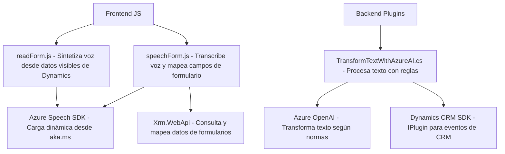

## Breve resumen técnico
El repositorio parece estar enfocado en proporcionar herramientas para la automatización e interacción mediante entrada/salida de voz utilizando tecnologías de Azure, particularmente en el contexto de formularios y aplicaciones Dynamics 365. Incluye tanto componentes frontend (archivos JS) como backend (plugins en C#), con funcionalidades de síntesis y reconocimiento de voz, además de procesamiento e integración de datos con APIs de Inteligencia Artificial.

---

## Descripción de arquitectura
La solución emplea una arquitectura de:
1. **Frontend modular**: Archivos JS organizados por responsabilidades específicas, como el reconocimiento de voz y la síntesis de datos en texto extraídos de formularios.
2. **Backend extensible (plugins)**: Plugins en C# diseñados para integrarse con Dynamics 365 a través del modelo de eventos. Estos se centran en transformar texto mediante Azure OpenAI y aplicar lógica de negocio.
3. **Integración con servicios de terceros**: Uso de servicios de Azure (Speech SDK y OpenAI) para operaciones avanzadas como transcripción de voz y procesamiento de texto con IA.
4. **Patrones comunes**:
   - Modularidad: Dividiendo las responsabilidades entre funciones independientes.
   - Carga dinámica: Script del Speech SDK cargado al momento de necesitarlo.
   - Adaptador: Traducir transcripciones y procesamiento a datos manejables en formularios.

---

## Tecnologías usadas
1. **Frontend:**
   - JavaScript para la lógica de frontend.
   - Azure Speech SDK (`https://aka.ms/csspeech/jsbrowserpackageraw`) para síntesis y reconocimiento de voz.
   - Dynamics Web API (`Xrm.WebApi`) para insertar y consultar datos en formularios de Dynamics 365.

2. **Backend:**
   - C# en .NET Framework para los plugins.
   - Microsoft Dynamics CRM SDK (`Microsoft.Xrm.Sdk`) para integración directa con Dynamics.
   - Azure OpenAI para transformación avanzada de texto.
   - `System.Net.Http` y `System.Text.Json` para manejo de solicitudes HTTP y JSON.

3. **Servicios externos:**
   - Azure OpenAI (servicio de procesamiento de texto avanzado).
   - Azure Speech API (reconocimiento y síntesis de voz).

---

## Diagrama Mermaid válido para GitHub

---

## Conclusión final
La solución está diseñada para optimizar la interacción con formularios utilizando entrada/salida por voz y capacidades avanzadas de IA para el procesamiento de texto. Combina una arquitectura modular en el frontend con plugins extensibles en el backend, asegurando una integración eficiente con servicios de terceros como Azure Speech y OpenAI. Esto sugiere una implementación híbrida entre frontend y plugins que interactúan con Dynamics 365, siendo altamente extensible y utilizable en escenarios empresariales donde la automatización es clave.