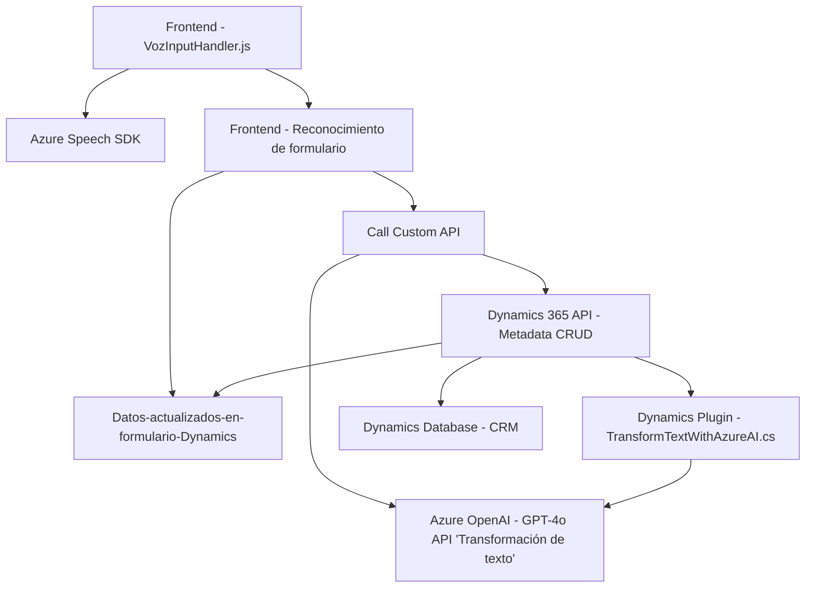

### Breve resumen técnico
Este repositorio representa una solución completa orientada a la interacción entre usuario y sistemas de negocio mediante comandos de voz y procesamiento de lenguaje natural para aumentar la eficiencia en formularios de Dynamics 365 CRM. La solución está dividida en múltiples capas y utiliza tecnologías de reconocimiento de voz, manipulación de formularios y procesamiento avanzado con modelos AI mediante APIs. 

---

### Descripción de arquitectura
La solución implementa una arquitectura de **n capas** que interconecta tres componentes principales:
1. El **frontend** para la captura de voz y la síntesis de texto a voz. Este sigue un enfoque modular, con cada función implementando una responsabilidad única.
2. El **backend**, estructurado como plugins en Dynamics 365, manejando eventos y llamadas a servicios externos, como Azure OpenAI para procesamiento avanzado de lenguaje.
3. Integración con APIs externas, especialmente mediante SDK de Azure Speech y la API de Azure OpenAI.

Los patrones observados incluyen:
- **Modularización**: Descomposición del código según responsabilidades específicas.
- **Event-driven programming**: Uso de funciones de callback y ejecución condicionada.
- **External systems integration**: Conexión dinámica con servicios de Azure (Speech SDK y OpenAI).

La arquitectura aprovecha el framework de extensibilidad de Dynamics 365 para integrar plugins, permitiendo realizar transformaciones avanzadas de datos obtenidos por voz y completarlos en formularios de negocio.

---

### Tecnologías usadas
1. **Frameworks**:
   - Dynamics 365 SDK para el manejo del contexto y los datos del CRM.
2. **Backend**:
   - C# para implementar los plugins de Dynamics CRM.
   - Consumo de REST API de Azure OpenAI usando HTTP Client.
3. **Frontend**:
   - Azure Speech SDK (JavaScript) para reconocimiento de voz y síntesis en el navegador.
4. **Dependencias externas**:
   - Azure Speech SDK (API y CDN: `https://aka.ms/csspeech/jsbrowserpackageraw`).
   - Azure OpenAI API (endpoint externo con modelos GPT para procesamiento avanzado de texto).
   - System.Net libraries para operaciones HTTP.
   - Newtonsoft.Json para manipulación de objetos JSON.

---

### Diagrama en Mermaid

Este diagrama describe la interacción de los componentes clave y su vinculación con servicios externos:

---

### Conclusión Final
La solución presentada es un sistema orientado a transformar la interacción humana en acciones estructuradas dentro del entorno de Dynamics 365 CRM. Con una arquitectura de **n capas**, utiliza tecnologías modernas como el **Azure Speech SDK**, la **API de Azure OpenAI**, y los **plugins de Dynamics CRM**, asegurando modularidad y escalabilidad.

El frontend captura datos mediante comandos de voz, los estructura y envía a través de llamadas API, mientras que el backend optimiza el texto recibido con inteligencia artificial antes de insertarlo en el CRM. Esto hace que esta solución sea precisa para aplicaciones empresariales centradas en la mejora de la interacción humana con sistemas complejos y burocráticos, como ventas, atención al cliente o servicio al usuario.

