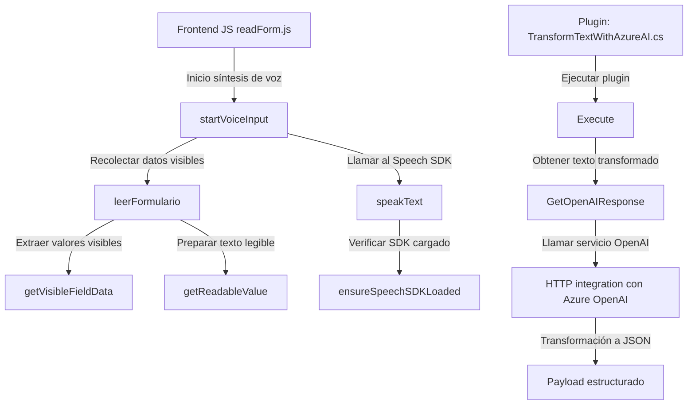

### Breve resumen técnico
El repositorio contiene funcionalidades para:
1. **Frontend:** Procesamiento de interacción de voz en formularios, basado en servicios de Azure Speech SDK.
2. **Plugin:** Un componente backend diseñado para Microsoft Dynamics CRM que aprovecha Azure OpenAI para transformar textos según reglas definidas.

---

### Descripción de arquitectura
1. **Frontend:** 
   - Orientado a la interacción con formularios del CRM en el navegador.
   - Implementa una arquitectura modular basada en funciones con integración dinámica del Azure Speech SDK (event-driven/asíncrona).
   - Se utiliza la arquitectura de n capas para organizar las funciones (captura de datos, procesamiento del texto, comunicación con API externas como Azure Speech SDK y Custom API).

2. **Plugin (backend):**
   - Sigue una arquitectura de **plugin-based design**, común en soluciones de Dynamics 365.
   - El flujo se basa en el ciclo de vida del CRM, manipulando entrada y salida de parámetros para realizar operaciones específicas.
   - Se conecta con el servicio externo **Azure OpenAI**.

---

### Tecnologías, frameworks y patrones usados
1. **Frontend:**
   - **Azure Speech SDK:** Para síntesis y reconocimiento de voz.
   - Integración **JavaScript** nativa, con funciones asíncronas y manejo de promesas.
   - Uso de patrones como **event-driven flow** y modularidad funcional.

2. **Plugin (backend):**
   - **C#/.NET Framework** para desarrollo del plugin conforme a la interfaz requerida (IPlugin).
   - **Microsoft Dynamics SDK:** Para gestionar el ciclo de vida del plugin, y manipular datos del CRM.
   - **Azure OpenAI GPT-4:** Para transformar e interpretar textos de entrada mediante APIs REST.
   - Uso de una arquitectura **plugin-based** con integración de servicios externos.
   - **HttpClient** para solicitudes asíncronas de la API en el backend utilizando el protocolo HTTP.

---

### Dependencias externas presentes
1. **Azure Speech SDK:** Importado desde un endpoint de Microsoft para sintetizar texto en audio y realizar reconocimiento de voz.
2. **Azure OpenAI:** Consumido en el plugin mediante una API REST para la generación de respuestas JSON.
3. **Microsoft Dynamics CRM SDK:** En el plugin, usado para acceder y modificar datos del formulario en el CRM.
4. **HttpClient y Json libraries:** Para comunicación y manipulación de datos en formato JSON con servicios web.

---

### Diagrama Mermaid compatible con GitHub Markdown

---

### Conclusión final
Este repositorio representa una solución completa e integrada para aprovechar servicios de voz y procesamiento de lenguaje natural en el contexto de Microsoft Dynamics CRM:
1. **Frontend** relacionado con la interacción de voz, procesamiento de formularios, y síntesis de voz mediante Azure Speech SDK.
2. **Plugin** backend diseñado para trabajar en el ciclo de vida de Dynamics CRM, utilizando Azure OpenAI para interpretar y transformar datos.

**Arquitectura:** El diseño del sistema utiliza una arquitectura **n capas** con **integraciones externas** (Azure Speech SDK y Azure OpenAI), acompañada por un componente **plugin-based** del backend.  
**Potenciales mejoras:** Modularizar aún más los servicios externos, incluir puntos de recuperación/timeout para SDK/API y utilizar configuraciones dinámicas en lugar de valores fijos.