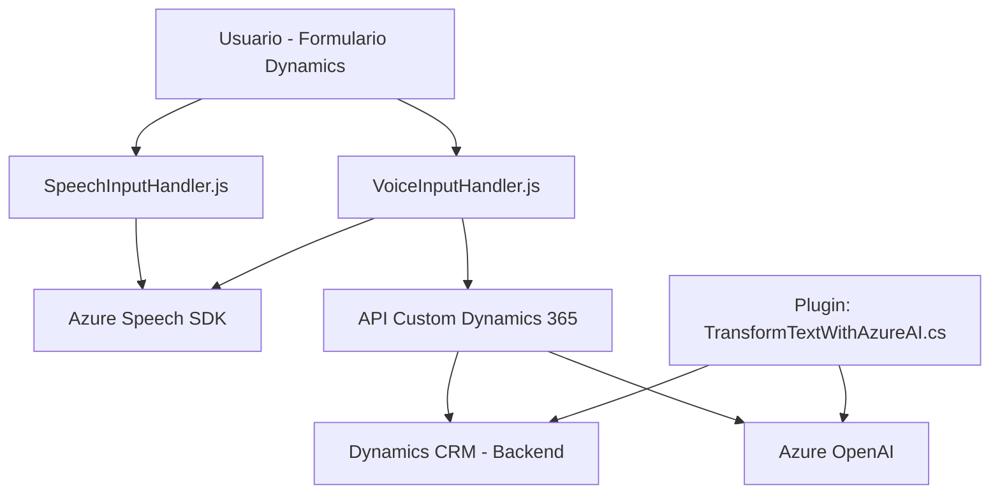

### Breve resumen técnico
El repositorio presenta una solución que combina capacidades frontend dinámicas y backend, enfocada principalmente en el uso de *Azure Speech SDK* y *Azure OpenAI* para convertir datos entre voz, texto y JSON en integraciones dentro de un ecosistema **Dynamics 365 CRM**.

### Descripción de arquitectura
La arquitectura del proyecto utiliza el patrón de **n capas**, que organiza el sistema en distintas capas funcionales: 
- **Frontend**: Incluye funciones de interacción con el usuario (formularios, voz, mapeo a campos).
- **Plugin backend**: Extiende las capacidades de Dynamics CRM mediante procesamiento en un plugin propio.
- **Servicios externos**: Azure Speech SDK y Azure OpenAI manejan voz y procesamiento de texto mediante APIs HTTP. 

El enfoque modular y estricto en separación de responsabilidades sugiere una **arquitectura orientada a eventos** para interacciones externas y una **estructura n capas** dentro del CRM.

### Tecnologías usadas
1. **Frontend**:  
   - Azure Speech SDK (carga dinámica) para síntesis y reconocimiento de voz.  
   - JavaScript para interacción con formularios mediante Dynamics CRM APIs (`executionContext`, `formContext`).  

2. **Backend**:  
   - Microsoft.Xrm.Sdk para extendibilidad en Dynamics CRM como plugins.  
   - Azure OpenAI (GPT) para procesar el texto y transformarlo en JSON estructurado.  

3. **Otros servicios**:
   - Azure Speech SDK para convertir voz a texto.
   - Dynamics 365 Web API para interacción con formularios y búsquedas de entidades.
   - *HTTP Client* (System.Net.Http) para conectar con el servicio Azure OpenAI.

### Diagrama Mermaid

### Conclusión final
El repositorio describe una solución integrada que utiliza voz, texto y procesamiento dinámico en un contexto CRM.  
Se basa en tecnologías modernas de Azure y SDKs optimizados para tareas específicas (sintetizar voz, mapear texto y procesarlo), lo cual acorta ciclos de interacción y automatiza procesos.  
Aunque la arquitectura es sencilla y clara con un patrón n capas, depende intensamente de servicios externos (Azure), lo que puede agregar restricciones asociadas a costos, disponibilidad y tiempos de respuesta del servicio.