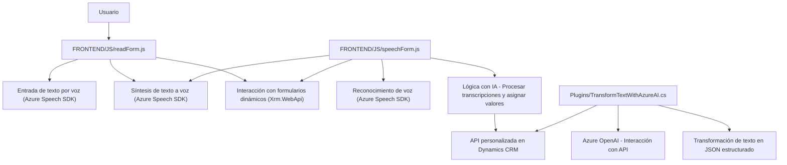

### Breve resumen técnico
El repositorio consiste en una solución que integra procesamiento de entrada de voz, síntesis de texto a voz y transformación de texto mediante inteligencia artificial (IA). Está compuesta por dos módulos principales en el lado frontend y un plugin en el backend, diseñado para interactuar con Dynamics CRM y APIs de Microsoft Azure (Speech SDK y OpenAI). 

---

### Descripción de arquitectura
La solución tiene componentes en **n capas**:
1. **Frontend**: Implementado en JavaScript, interactúa con Azure Speech SDK para entrada de voz y síntesis de texto a voz. Utiliza un modelo cliente-servidor para comunicarse con Dynamics CRM y APIs personalizadas.
2. **Backend**: Plugin escrito en C# para Dynamics CRM, que interactúa con Azure OpenAI para realizar transformaciones de datos de entrada en JSON estructurados.

**Aspectos arquitectónicos principales**:
- **N-capas**: La solución separa el frontend y el backend con comunicación mediante APIs.
- **Interacción con servicios externos**:
  - Azure Speech para reconocimiento y síntesis de voz en frontend.
  - Azure OpenAI en el backend para procesamiento de texto avanzado.
- **Modularización**: El código está diseñado con funciones y clases que implementan tareas específicas, promoviendo la mantenibilidad y la extensibilidad.
- **Patrón de Carga Diferida**: Se utiliza Lazy Loading para cargar el SDK de Azure Speech en el frontend.
- **Orientado a servicios (SOA)**: La lógica central se construye en torno a servicios de Azure.

---

### Tecnologías usadas
1. **Frontend**:
   - JavaScript como lenguaje de programación.
   - Azure Speech SDK para entrada de voz y síntesis de texto a voz.
   - Dynamics CRM Framework (`Xrm.WebApi`) para la interacción con formularios y datos.

2. **Backend**:
   - C# como lenguaje de programación.
   - Dynamics CRM como plataforma empresarial.
   - Azure OpenAI para procesamiento y transformación de textos según IA.
   - `Newtonsoft.Json.Linq` para manipulación avanzada de JSON.
   - `System.Net.Http` y `System.Text.Json` para llamadas al servicio externo y manejo de JSON.

---

### Diagrama Mermaid válido para GitHub

---

### Conclusión final
Este repositorio corresponde a una solución basada en **n capas** que combina un frontend y un backend para ofrecer funcionalidades avanzadas con integración de APIs externas. El frontend, construido sobre JavaScript, se enfoca en el procesamiento de voz mediante Azure Speech SDK y la interacción con formularios dinámicos de Dynamics CRM, mientras que el backend usa C# para extender la funcionalidad de Dynamics CRM y conectar con Azure OpenAI para la transformación de texto.

La arquitectura modular y el uso de patrones como Carga Diferida y Facade facilitan la extensibilidad y la integración en sistemas empresariales. Este diseño es ideal para aplicaciones orientadas a mejorar la interactividad y automatización mediante IA y herramientas de reconocimiento de voz.