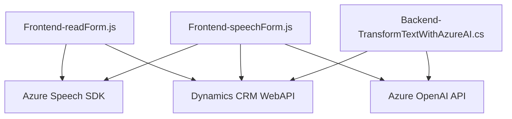

### Breve resumen técnico

El repositorio contiene tres componentes clave que interactúan entre sí para proporcionar funcionalidades avanzadas relacionadas con reconocimiento de voz, síntesis de texto a voz, y procesamiento de texto mediante IA. Estas funcionalidades están integradas con sistemas empresariales como Microsoft Dynamics CRM y Azure Speech/OpenAI.

1. El código de **frontend** (`readForm.js` y `speechForm.js`) contiene componentes escritos en JavaScript que interactúan con los servicios de Dynamics CRM y Azure Speech SDK para la manipulación de formularios y entrada/salida de voz.
2. El **plugin de Azure OpenAI** (`TransformTextWithAzureAI.cs`) adicionalmente transforma texto JSON a través de un servicio de inteligencia artificial integrado.

---

### Descripción de arquitectura

#### Tipo de solución
Este repositorio parece ser una integración de **front-end especializado** (proceso de datos y voz) con un plugin en **back-end** orientado a un sistema empresarial como Microsoft Dynamics CRM. Es una combinación de **librería funcional frontend (JavaScript)** y **plugin backend (.NET)** que utiliza múltiples servicios externos (Azure Speech SDK y OpenAI) para habilitar capacidades avanzadas de voz e IA en formularios empresariales.

#### Tipo de arquitectura
La arquitectura en general es una implementación de **n capas**:
- **Capa 1: Presentación** (JavaScript frontend) para interacción con el usuario y procesamiento de voz.
- **Capa 2: Lógica de negocio** para procesar datos mediante plugins denominados (`TransformTextWithAzureAI.cs`).
- **Capa 3: Servicios externos** para realizar síntesis de voz y transformaciones IA (Azure Speech/OpenAI).

Los módulos están altamente integrados con dependencias externas vía APIs SaaS (Azure Speech SDK y OpenAI). El diseño utiliza patrones como **evento-reactivo** y **plugin pattern** dado que algunas funciones se activan dinámicamente por eventos o procesos específicos.

---

### Tecnologías usadas
1. **Frontend (JavaScript)**:
   - **Frameworks/librerías**:
     - Azure Speech SDK (para síntesis y reconocimiento de voz).
     - Xrm.WebApi (integrado en Dynamics CRM para manipulación de entidades).
   - **Patrones utilizados**:
     - Modularidad.
     - Event-driven programming.
   
2. **Backend (C#)**:
   - **Frameworks/librerías**:
     - Dynamics CRM SDK (`Microsoft.Xrm.Sdk`) para registro de plugins.
     - Azure OpenAI para transformación de texto mediante inteligencia artificial.
     - JSON processing (`Newtonsoft.Json`, `System.Text.Json`).
   - **Patrones utilizados**:
     - Plugin pattern.
     - Facade para la interacción con servicios externos como OpenAI.

3. **Servicios externos**:
   - **Azure Speech SDK**: Sintetización de texto a voz y reconocimiento de voz.
   - **Azure OpenAI**: Procesamiento avanzado de texto con GPT.
   - **Dynamics CRM WebAPI**: Para manipular datos empresariales desde los formularios.

---

### Posibles dependencias o componentes externos
1. **Servicios SaaS**:
   - Azure Speech SDK (`https://aka.ms/csspeech/jsbrowserpackageraw`). Es necesario para sintetizar y reconocer voz en tiempo real.
   - Azure OpenAI: Utilizado desde el backend para procesar el texto mediante GPT API.
   - Microsoft Dataverse WebAPI: Integración con Dynamics CRM para acceder a la lógica de negocio, entidades, y datos almacenados.

2. **Librerías usadas**:
   - `System.Text.Json` / `Newtonsoft.Json` para manejo de JSON en el plugin backend.
   - `Microsoft.Xrm.Sdk` para definir e implementar un plugin en Dynamics CRM.
   
3. **Configuraciones necesarias**:
   - Claves API (`apiKey`) y endpoints:
     - **Azure Speech SDK** (para frontend).
     - **Azure OpenAI** (para backend).
   - Configuración de conexión a Dataverse en Dynamics CRM.

---

### Diagrama Mermaid válido para GitHub

---

### Conclusión final

La solución combina **JavaScript en frontend** con un **plugin en backend** para trabajar con un sistema empresarial (Dynamics CRM) y servicios SaaS avanzados (Azure Speech/OpenAI). La arquitectura está basada en **n capas** donde cada componente tiene responsabilidades bien definidas: interacción de botones en frontend, reconocimiento/síntesis de voz, actualización de formularios, y ejecución lógica empresarial mediante plugins.

Este diseño es eficiente para escenarios empresariales interactivos. Aun así, existe una alta dependencia de servicios externos, lo que requiere la configuración adecuada de APIs y claves de acceso para producción. Si se ampliara esta arquitectura, podría convertirse en una solución orientada a microservicios que escale horizontalmente.