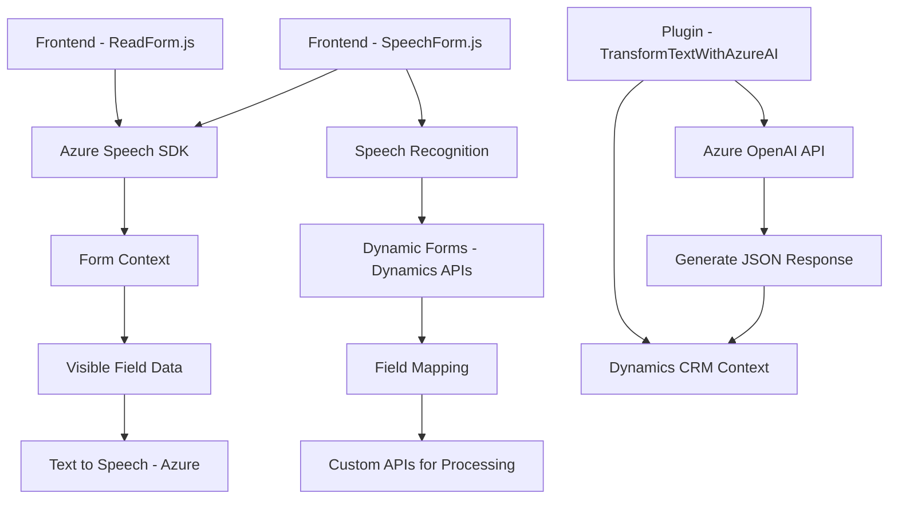

### Breve Resumen Técnico

La solución es una integración entre una infraestructura basada en formularios dinámicos de Dynamics 365 y tecnologías de Microsoft Azure para procesamiento de voz y datos. Combina frontend en JavaScript para interacción del usuario y plugins en C# para manipulación en backend.

---

### Descripción de Arquitectura

- **Tipo de solución**: Híbrida. Incluye un **frontend** con componentes JavaScript y un **backend** conectado a Dynamics 365 mediante C# plugins.
- **Arquitectura General**:
  - **Capas N**: Divide su funcionalidad en capas donde:
    - La capa de presentación (JavaScript) maneja la interacción del usuario.
    - La capa de lógica de negocio (backend C# plugin) se encarga del procesamiento y transformación de datos mediante APIs externas (Azure Speech SDK, OpenAI).
- **Patrones Observados**:
  - Modularización: Código subdividido por funciones específicas en las capas frontend y backend.
  - Integración basada en SDKs y APIs externas para extender funcionalidades.
  - Lógica asincrónica dirigida por promesas (`Promise`) en el frontend.

---

### Tecnologías Usadas

#### Frontend (`readForm.js` y `speechForm.js`)
1. **JavaScript**:
   - Manejo de formularios dinámicos (Dynamics 365).
   - Modificaciones en tiempo real basadas en entradas de voz.
2. **Azure Speech SDK**:
   - Reconocimiento de voz y conversión de texto a voz.
3. APIs y servicios:
   - Formularios dinámicos de Dynamics 365 (ej. `formContext` y controles).

#### Backend (`TransformTextWithAzureAI.cs`)
1. **C#**:
   - Plugin para Dynamics CRM.
2. **Azure OpenAI API**:
   - Procesamiento cognitivo de texto.
3. Frameworks .NET:
   - Servicios para generación de HTTP requests (via `System.Net.Http`) y manipulación JSON (`System.Text.Json` y `Newtonsoft.Json.Linq`).
4. **Microsoft Dynamics SDK**:
   - Extensión de funcionalidad mediante plugins.

---

### Dependencias o Componentes Externos Presentes
1. **Azure Speech SDK**: Reconocimiento de voz y síntesis de voz.
2. **Azure OpenAI**: Procesamiento y transformación de texto a JSON.
3. **Dynamics 365 APIs**: Para obtener, modificar y validar datos en formularios dinámicos.
4. **HTTP Capabilities**: Requeridas para consumo de las APIs externas.
5. **SDKs de Microsoft**: Amplían la funcionalidad del CRM para implementaciones personalizadas.

---

### Diagrama Mermaid

---

### Conclusión Final

La solución combina tecnologías esenciales para cumplir con tareas relacionadas con datos dinámicos en Dynamics 365 y servicios de Microsoft Azure. Adopta una **arquitectura en capas** al separar presentación, lógica de negocio, y consumo de servicios externos mediante APIs. Es robusta, modular, y extensible, pero requiere configuraciones cuidadosas de acceso y seguridad, especialmente para claves de Azure y Dynamics.