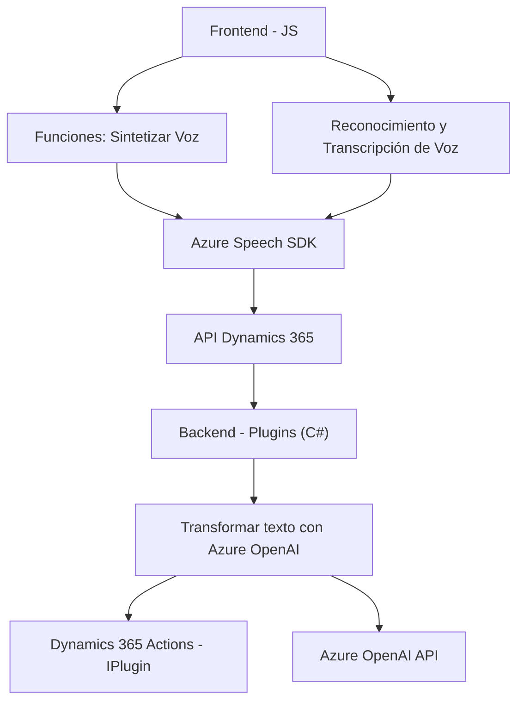

### Breve resumen técnico:
El repositorio parece ser parte de una solución integrada que aprovecha servicios de Microsoft Dynamics 365 y Microsoft Azure para lograr dos funciones principales: **síntesis de voz** y **reconocimiento de voz/transcripción** que nutre formularios dentro de Dynamics 365 con datos. Adicionalmente, se incluye un plugin para realizar transformaciones de texto mediante la **Azure OpenAI API**.

---

### Descripción de arquitectura:
La solución sigue una arquitectura híbrida basada en una estructura de capas:
1. **Presentación (Frontend)**: Manejo de interacción con el usuario y síntesis/reconocimiento de voz mediante integraciones con Dynamics CRM formulada en código JS.
2. **Lógica de Negocios (Plugins)**: Los plugins de Dynamics CRM procesan textos, los transforman utilizando Azure OpenAI y devuelven estructuras JSON.
3. **Integración con servicios (Externo)**: Conexión a APIs de Microsoft Dynamics 365 y Azure Speech.

Aunque contiene lógicas separadas para frontend y backend, se puede considerar parte de un sistema **n-capas**, donde cada capa tiene su propósito aislado. Si se extendiera con otros componentes, podría evolucionar hacia una arquitectura de **microservicios**, pero actualmente carece de esa separación explícita.

---

### Tecnologías usadas:
1. **Frontend (Javascript)**:
   - Azure Speech SDK: Para síntesis y reconocimiento de voz.
   - Dynamics 365: Interacción con formularios.
   - Promesas y programación asíncrona.
   - Modularización de funciones.

2. **Plugins (C#)**:
   - Microsoft Dynamics SDK: Para manejar eventos y lógica dentro de Dynamics 365.
   - Azure OpenAI API: Para transformar texto mediante GPT.

---

### Diagrama Mermaid

---

### Conclusión final:
Esta solución es una integración entre Microsoft Dynamics 365 y servicios de Azure, implementada en un formato que sigue una arquitectura modular de **n capas**, con componentes de frontend que enriquecen la experiencia del cliente y plugins backend que automatizan procesos con inteligencia artificial. El uso de **Azure Speech SDK** en el frontend y **Azure OpenAI GPT** en el backend muestra una alta dependencia de los servicios en la nube de Microsoft, presentando un ejemplo robusto de integración y extensibilidad en Dynamics 365.