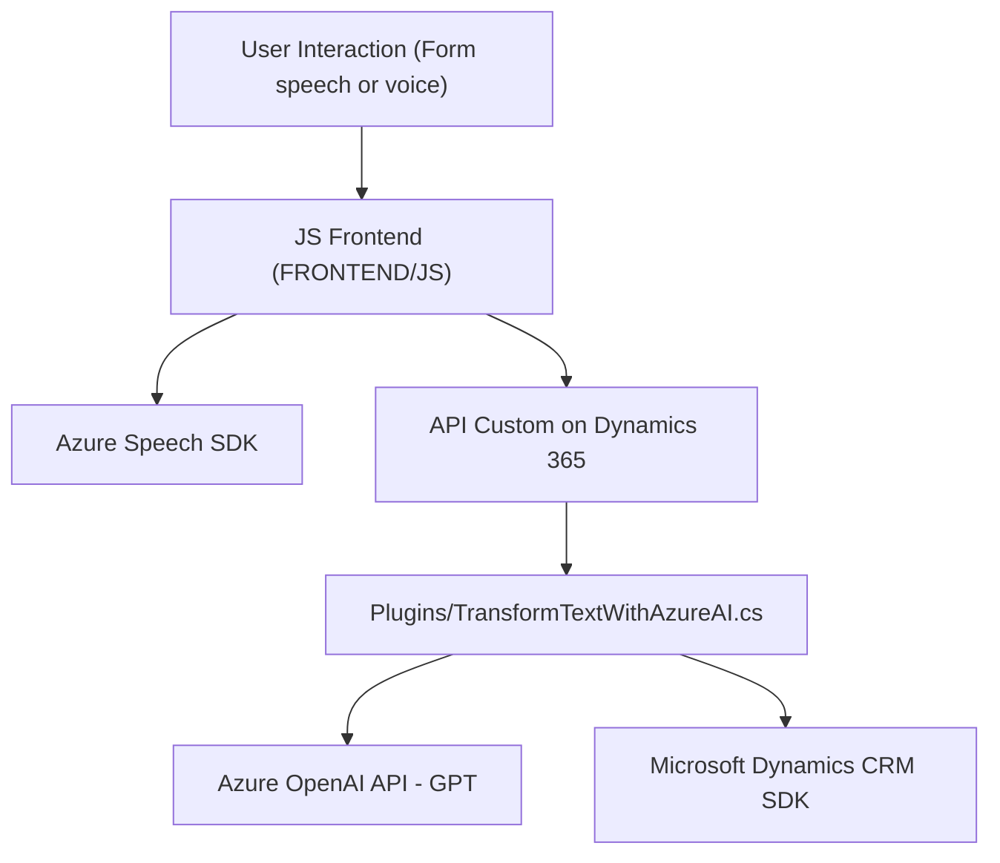

### Breve resumen técnico:
Este repositorio representa una solución integrada para un sistema Dynamics 365/PowerApps que utiliza un **frontend basado en JavaScript** y un **backend con plugins en .NET**. La finalidad es proporcionar funcionalidades avanzadas de procesamiento de voz y texto para interactuar dinámicamente con formularios en un entorno CRM. La solución utiliza **Azure Speech SDK** para convertir voz a texto y realizar síntesis de texto en voz, además del **Azure OpenAI API** para transformar texto utilizando un modelo GPT.

---

### Descripción de arquitectura:
1. **Arquitectura:** La solución parece ser un **híbrido entre una arquitectura de n-capas y una componente SOA/Microservicios**. 
   - **Capa frontend:** Se encuentra en `/FRONTEND/JS` y realiza la interacción con el usuario sobre la interfaz del CRM. Utiliza un modelo basado en DOM manipulación para actualizar los campos del formulario.
   - **Capa backend:** Situada en `/Plugins/TransformTextWithAzureAI.cs`, este plugin actúa como un microservicio especializado para el sistema CRM, utilizando una API externa de Azure OpenAI para llevar a cabo operaciones de procesamiento de lenguaje natural.
   - **Integración con servicios externos:** La comunicación con las APIs externas de Azure (Speech, OpenAI) refuerza el enfoque arquitectónico más orientado a SOA/microservicios.

---

### Tecnologías usadas:
1. **Frontend:**
   - **JavaScript:** Es el núcleo para las integraciones con la UI del CRM y manipulación del DOM.
   - **Azure Speech SDK:** Para reconocimiento y síntesis de voz.
   - Utilización de **API personalizada** para procesamiento avanzado con IA.

2. **Backend:**
   - **C#:** Desarrollo del plugin basado en la interfaz `IPlugin` de Dynamics CRM.
   - **Azure OpenAI GPT API:** Procesamiento de texto mediante modelos GPT.
   - **Microsoft Dynamics CRM SDK:** Para la integración nativa con funcionalidades del sistema CRM.
   - **HTTP Client:** Para realizar solicitudes a servicios externos.
   - Serialización y deserialización con **Newtonsoft.Json** y **System.Text.Json**.

3. **Ambientación:** Microsoft Dynamics 365/PowerApps como plataforma principal y API Xrm.WebApi para acceso a los datos del CRM.

---

### Diagrama Mermaid

---

### Conclusión final:
La solución descrita es una arquitectura híbrida que combina aspectos de **n-capas** y **orientación a microservicios SOA**. Los recursos frontend están diseñados para recoger, procesar y sintetizar información de formularios utilizando los servicios de Azure Speech SDK y una API personalizada. Mientras tanto, el backend extendido con un plugin .NET se encarga de realizar transformaciones avanzadas con Azure OpenAI. Este modelo resulta escalable, modular y apropiado para aplicaciones modernas que buscan integrar inteligencia artificial y procesamiento de voz en el contexto de plataformas CRM como Dynamics 365.