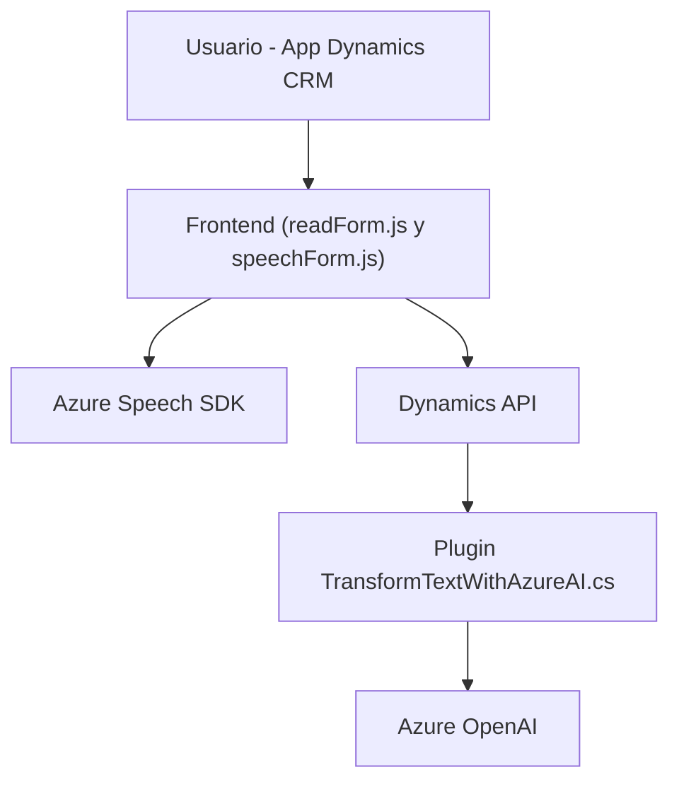

### Breve resumen técnico
El repositorio tiene tres módulos principales, cada uno enfocado en soluciones complementarias dentro del ecosistema Microsoft Dynamics 365. Los archivos se describen como:
1. **Frontend (readForm.js y speechForm.js):** Implementan capacidades de accesibilidad y reconocimiento de voz, integrando el **Azure Speech SDK** para síntesis y transcripción.
2. **Plugin (TransformTextWithAzureAI.cs):** Define un plugin de servidor para Microsoft Dynamics, que transforma texto con el servicio **Azure OpenAI**, siguiendo el modelo del patrón **Plugin Pattern**.

---

### Descripción de arquitectura
El sistema utiliza una arquitectura **n capas** dividida en:
1. **Frontend:** Compuesto por funciones de interacción directa con el usuario (formularios) y dependiente de **Azure Speech SDK** para reconocimiento de voz y accesibilidad.
2. **Backend:** Define un plugin para el procesamiento de texto (aplicación de reglas mediante **Azure OpenAI**) y utiliza la interacción directa con APIs REST de Dynamics 365.
3. **Servicios externos:** La integración con **Azure Speech SDK** y **Azure OpenAI** refuerza un patrón de arquitectura orientado a servicios.

Se observa un uso combinado de patrones de **modularidad** y **dependencia hacia servicios externos** para mejorar la funcionalidad del sistema mediante APIs y plugins.

---

### Tecnologías usadas
1. **JavaScript:** Para los módulos del frontend con integración al entorno Dynamics 365.
   - SDK: **Azure Speech SDK**.
2. **C#:** Para el backend con el plugin de Dynamics (`TransformTextWithAzureAI.cs`).
   - Integraciones externas:
     - **Azure OpenAI** (modelo GPT).
     - **Dynamics CRM SDK**
   - Frameworks internos: `System.Net.Http`, `Newtonsoft.Json`.

---

### Diagrama Mermaid válido para GitHub

---

### Conclusión final
El repositorio representa un sistema diseñado para extensiones personalizadas en entornos Dynamics CRM. Su arquitectura, basada en **n capas**, integra capas de frontend y backend con dependencias hacia servicios de Azure (Speech y OpenAI). Destaca por seguir patrones como **Plugin Pattern** para Dynamics y modularidad en los archivos del frontend. La flexibilidad del sistema lo hace ideal para aplicaciones CRM con énfasis en accesibilidad y procesamiento avanzado.