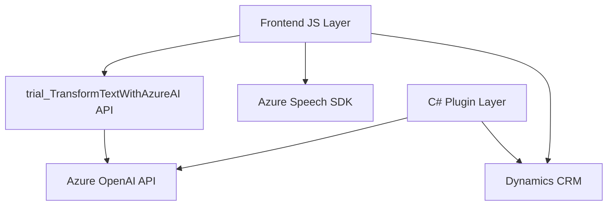

### Resumen técnico

Este repositorio implementa una solución híbrida que combina funcionalidad en frontend (JavaScript), respaldo con plugins en Dynamics CRM (C#) y servicios externos en la nube (Azure Speech SDK y Azure OpenAI). Está enfocado en la interacción con formularios para accesibilidad y automatización mediante reconocimiento de voz y generación de contenido basado en IA.

---

### Descripción de arquitectura

1. **Distribución de la solución**:
   - En el frontend, se utiliza JavaScript para manejar la interacción de usuario con formularios a través de reconocimiento de voz (Speech SDK de Azure) y generación de voz para accesibilidad.
   - En el backend, se usa un plugin en C# para transformar texto en un formato JSON utilizando servicios de Azure OpenAI.
   - La solución opera bajo un modelo de arquitectura híbrida con componentes cliente-servidor (Dynamics CRM) y microservicios para servicios en la nube.

2. **Tipo de arquitectura**:  
   - **Cliente-servidor**: La solución interactúa con APIs y bases de datos de Dynamics CRM desde el frontend y el backend.
   - **Integración con Microservicios**: Parte de la lógica de negocio se delega a servicios en la nube (Azure Speech SDK y Azure OpenAI API).
   - **N-capas (para Dynamics CRM)**: El plugin actúa como capa adicional en la lógica del servidor.
   - **Modular en frontend**: Código JS enfocado en separar responsabilidades por función (lectura, síntesis de voz, y capacidad de respuesta en formularios).

---

### Tecnologías usadas

1. **Principal en frontend**:
   - **JavaScript**: Implementación de lógica para reconocimiento y síntesis de voz.
   - **Azure Speech SDK**: Reconocimiento de voz y generación de voz sintetizada.
   - **Dynamics Environment JS API (Xrm.WebApi)**: Manipulación de datos en formularios y CRM.

2. **Principal en backend**:
   - **C#**: Lenguaje usado para plugins de Dynamics CRM.
   - **Azure OpenAI API**: Transformación avanzada de texto.
   - **Newtonsoft.Json & System.Text.Json**: Serialización y manejo de objetos JSON.

3. **Frameworks y conceptos**:
   - Extensibilidad con **IPlugin** (Dynamics CRM).
   - **Patrón de delegación**: Funciones que delegan responsabilidades específicas a servicios externos.
   - **Encadenamiento asíncrono**: En el frontend para la interacción con Speech SDK.

---

### Dependencias o componentes externos

1. **Frontend dependencias externas**:
   - **Azure Speech SDK**: Para reconocimiento y síntesis de voz.
   - **API personalizada trial_TransformTextWithAzureAI**: Para procesamiento de texto transcrito.

2. **Backend dependencias externas**:
   - **Azure OpenAI API**: Para transformación inteligente de texto.
   - **Microsoft Dynamics SDK**: Extensión del sistema CRM.
   - **Newtonsoft.Json** y **System.Text.Json**: Procesamiento de JSON.

---

### Diagrama **Mermaid** válido para GitHub

---

### Conclusión final

El repositorio implementa una solución modular y escalable enfocada en la interacción entre formularios y accesibilidad mediante voz e inteligencia artificial. La arquitectura híbrida aprovecha un modelo n-capas en el backend de Dynamics CRM, mientras que el frontend opera de forma asíncrona con servicios en la nube y APIs para potenciar funcionalidades de manejo de voz. La integración con microservicios de Azure asegura que el procesamiento pesado se delega a servicios especializados, logrando una solución eficiente y extensible.