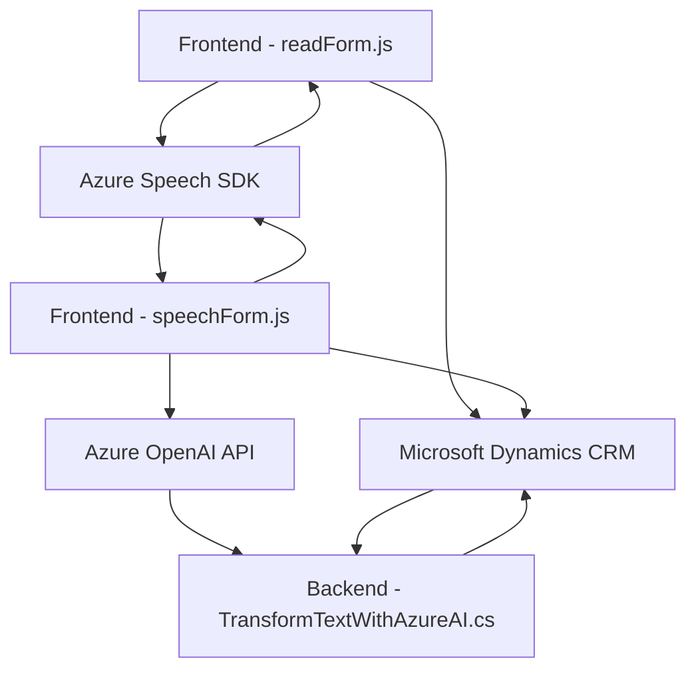

### Breve resumen técnico
El repositorio contiene tres componentes principales relacionados con el desarrollo de funcionalidades que integran servicios de Microsoft Dynamics CRM con Azure Speech SDK y Azure OpenAI API. Así, se puede concluir que esta solución está diseñada para habilitar funcionalidades inteligentes en formularios dinámicos con capacidades de reconocimiento y síntesis de voz, así como transformación de texto mediante inteligencia artificial.

---

### Descripción de arquitectura
1. **Arquitectura general**:  
   La plataforma sigue un enfoque **n-capas** donde las funcionalidades se separan entre:
   - Una capa de presentación en el frontend, que interactúa con formularios de Dynamics 365.
   - Una capa de lógica de negocio incorporada como plugins en Dynamics CRM y funciones externas.
   - Una capa de integración que conecta servicios externos como Azure Speech SDK y Azure OpenAI.

2. **Componentización**:  
   - **Frontend (readForm.js & speechForm.js):**  
     Modular, orientado a funciones, con gestión del estado del formulario, asignación de datos y validación en el navegador para interacción directa con Dynamics.
   - **Backend/Plugins (TransformTextWithAzureAI.cs):**  
     Implementa un plugin bajo la arquitectura extensible de Dynamics CRM, delegándose a servicios externos para ampliar la funcionalidad fuera del sistema base.

3. **Patrón de delegación e integración**:  
   Los módulos utilizan patrones como delegación de responsabilidades y integración de servicios externos (Azure Speech SDK y Azure OpenAI), permitiendo una gestión eficiente de la modularidad y escalabilidad.

---

### Tecnologías usadas
1. **Frontend:**
   - Lenguaje: JavaScript (ES6).
   - Azure Speech SDK: Proporciona reconocimiento y síntesis de voz.

2. **Backend:**
   - Lenguaje: C#.
   - Framework: Dynamics CRM SDK (`IPlugin`, `IOrganizationService`, etc.).
   - Azure OpenAI API: Interactúa con inteligencia artificial para procesamiento de texto.
   - HTTP communication libraries (`System.Net.Http`, `Newtonsoft.Json.Linq`).

3. **External services:**
   - Azure Speech SDK.
   - Azure OpenAI API.
   - Dynamics 365 SDK for platform interaction.

---

### Diagrama Mermaid válido para GitHub

---

### Conclusión final
Este repositorio implementa una solución combinada de frontend y plugins integrados que habilitan la interacción mediante voz y transformación avanzada de texto con inteligencia artificial en formularios de Microsoft Dynamics CRM. La solución sigue una arquitectura **n-capas**, con conceptos de modularidad, delegación de responsabilidades y extensibilidad mediante SDK y APIs externas (Azure Speech y Azure OpenAI). Aunque está diseñado para un entorno corporativo como Dynamics, podría adaptarse a otros sistemas que admitan complementos y servicios inteligentes.