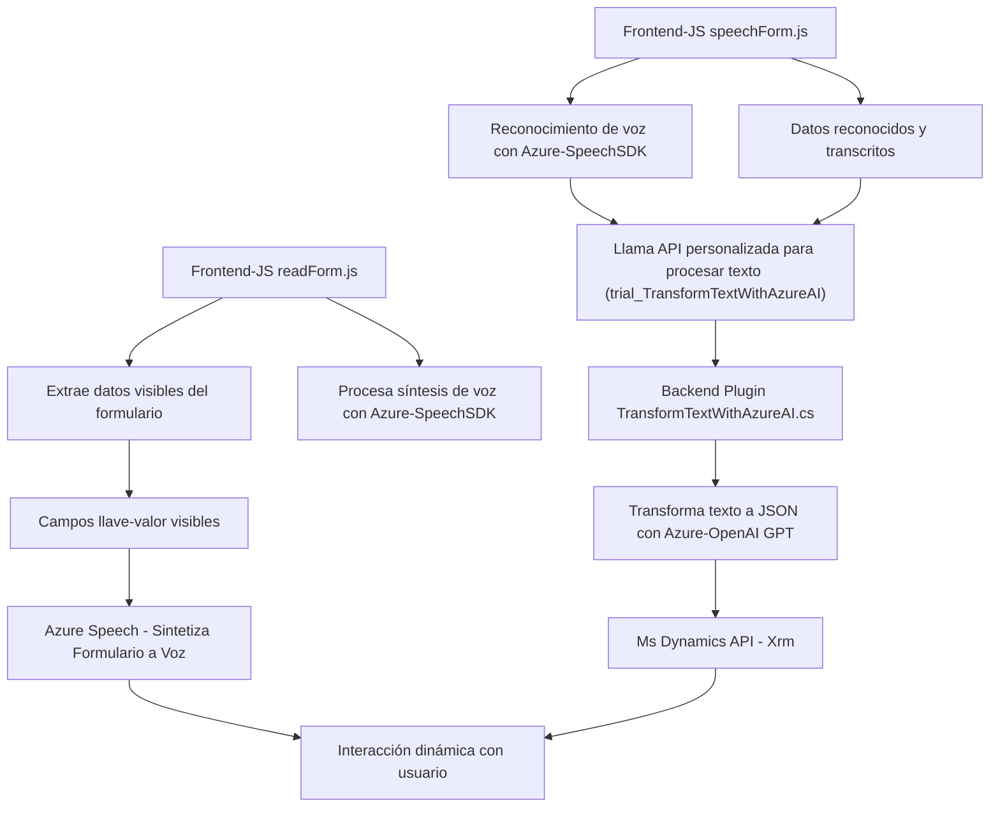

### Breve resumen técnico:
El conjunto de archivos y descripción del repositorio indica que estamos trabajando con una **solución para la integración de datos y voz** entre un frontend en JavaScript, Microsoft Dynamics 365 y Azure OpenAI. La funcionalidad principal es extraer datos de formularios en Dynamics 365, procesar datos desde la entrada de voz y convertirlos entre diferentes formatos mediante servicios externos (por ejemplo, Azure Speech SDK y Azure OpenAI). El código está diseñado modularmente y utiliza SDKs y APIs para integración, junto con plugins para la extensión de Dynamics CRM.

---

### Descripción de arquitectura:
La arquitectura presentada es **modular de varias capas**, con un diseño que se adapta a diferentes componentes de software:
1. **Cliente-Servidor**: Los archivos `readForm.js` y `speechForm.js` actúan como la capa de frontend del sistema, gestionando la interacción con el usuario y los servicios de voz/datos. 
2. **Plugin-based**: El archivo `TransformTextWithAzureAI.cs` implementa el plugin de backend que se ejecuta dentro del ecosistema de Microsoft Dynamics CRM, siguiendo un enfoque de extensión funcional.
3. **Dependencia en servicios externos**: Se observa una arquitectura basada en la invocación de servicios remotos de APIs externas (Azure Speech SDK y Azure OpenAI), lo que permite capacidades avanzadas como la síntesis de voz y el procesamiento de lenguaje natural.
4. **Cloud Hybrid Architecture**: La solución vincula un sistema on-premise (Dynamics CRM) con servicios en la nube para maximizar capacidades computacionales y de procesamiento inteligente.

---

### Tecnologías usadas:
1. **Frontend:**
   - Lenguaje: JavaScript (ES6+)
   - **Azure Speech SDK**: Manejo de reconocimiento y síntesis de voz mediante la nube de Microsoft Azure.
   - Microsoft Dynamics API (`formContext`, `executionContext`, etc.).

2. **Backend (Dynamics 365 Plugin):**
   - Lenguaje: C#
   - Framework: .NET
   - **Microsoft.Xrm.Sdk**: SDK para el desarrollo de plugins y extensiones sobre Dynamics CRM.
   - **Azure OpenAI API**: Procesamiento avanzado de texto utilizando GPT-4.

3. **Patrones:**
   - Modular: Código organizado por responsabilidad específica en funciones aisladas.
   - API-Centric: Integración con APIs externas para delegar la complejidad de funcionalidades específicas.
   - Dependency Injection (DI): Uso de `IServiceProvider` para manejar dependencias dentro del contexto de Dynamics CRM.
   - Single Responsibility Principle (SRP): Cada método cumple una tarea bien definida.

---

### Probables dependencias o componentes externos:
1. Azure Speech SDK y sus servicios relacionados:
   - Synthesizer y Speech Recognizer.
2. Azure OpenAI API:
   - Servicios basados en GPT para procesamiento de texto contextualmente.
3. Microsoft Dynamics 365 API (web SDK):
   - Extensiones y plugins integrados.
   - Contexto CRM proporcionado por `executionContext`.

---

### Diagrama **Mermaid** (compatible con GitHub Markdown):

---

### Conclusión final:
Esta arquitectura ofrece una solución híbrida bastante robusta que optimiza la interacción entre usuarios finales y sistemas empresariales. Las funcionalidades de reconocimiento y síntesis de voz en el frontend, junto con la integración de procesamiento avanzado mediante Azure OpenAI API y Dynamics CRM, son un excelente ejemplo de diseño modular y de integración de servicios en la nube. Además, la solución respeta patrones establecidos como SRP y modularidad, asegurando la escalabilidad del sistema en entornos empresariales.