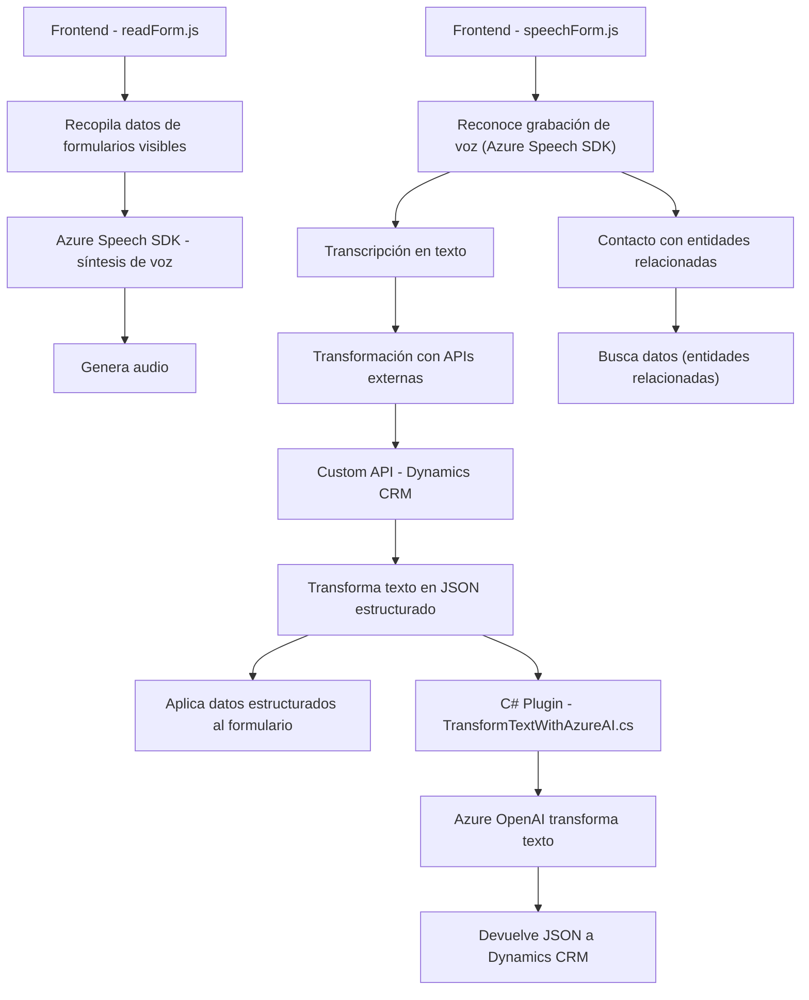

### Breve resumen técnico:

El repositorio en cuestión está relacionado con una solución que integra funciones de interacción de voz y formulación dinámica de datos para formularios en Dynamics CRM. Incluye un plugin para transformar contenido textual utilizando Azure OpenAI y funcionalidades JavaScript que gestionan la síntesis y reconocimiento de voz a través de Azure Speech SDK, embebiendo datos en formularios del CRM.  

---

### Descripción de arquitectura:

La arquitectura general del sistema es **orientada a servicios** con componentes distribuidos. Está diseñada bajo un modelo híbrido entre una estructura de **n capas** (Frontend-Backend) y **orquestación de microservicios**. Las principales características de la arquitectura son:
1. **Cliente-Servidor integrado con Dynamics CRM**: La solución consiste en módulos frontales (JavaScript para interacción y procesamiento de formularios) y un backend/server-side (plugins y APIs de CRM).
2. **Orientación a servicios externos**: Utiliza servicios de Azure (Speech SDK y OpenAI) para síntesis de voz y transformación de datos, en línea con arquitecturas cloud-centric.
3. **Modularización** en el desarrollo de cada parte del sistema, distribuyendo funcionalidades específicas en diferentes módulos (e.g., síntesis de voz, reconocimiento de voz, transformación de contenido).
4. **Carga dinámica de dependencias** en el frontend, garantizando que el SDK de Azure Speech esté disponible antes de la ejecución.

---

### Tecnologías usadas:

1. **Frontend**:
   - **Microsoft Dynamics CRM API**: Enlace directo con el contexto del formulario (`Xrm.Page`).
   - **JavaScript**: Gestión del DOM, asincronía (promises), eventos del ciclo de vida del formulario.
   - **Azure Speech SDK**: Para reconocimiento y síntesis de voz.
   - **Custom API de Dynamics CRM**: Para transformar información específica.

2. **Backend**:
   - **C# (.NET Framework)**: Lenguaje de programación para implementar plugins.
   - **Microsoft Dynamics SDK**: Para integración y extensión del CRM.
   - **Azure OpenAI Service**: Manejo de modelos GPT para la transformación de textos y generación de JSON estructurados.
   - **System.Net.Http / Newtonsoft.Json**: Librerías para gestionar solicitudes y objetos JSON.
    
3. **Otros patrones y características destacadas**:
   - **Carga Condicional de Dependencias**: Implementación en el frontend para asegurar disponibilidad de SDK externos.
   - **Procesamiento basado en IA**: Usando Azure OpenAI para transformar texto mediante prompts interactivos y un esquema definido.
   - **Comunicación con Microservicios/APIs**: Para operaciones de reconocimiento y transformación.
   - **Asincronía (async/await)**: En el manejo de llamadas externas al Speech SDK y APIs.

---

### Diagrama Mermaid:

---

### Conclusión final:

Esta solución implementa un ecosistema bien definido para gestionar accesibilidad mediante voz y procesamiento AI en formularios Dynamics CRM utilizando tecnologías modernas de Azure. El diseño promueve:
1. **Modularidad**: Cada componente cumple con un propósito específico y está desacoplado.
2. **Integración en la nube**: Dependiendo ampliamente de servicios de Azure (Speech SDK, OpenAI).
3. **Escalabilidad y extensibilidad**: La orientación a servicios externos y arquitectura distribuida permite evolucionar y adaptarse a futuras expansiones.

En general, la solución tiene una estructura robusta para implementar funcionalidades avanzadas de reconocimiento y síntesis de voz con procesamiento AI dentro de un ecosistema CRM. Por medio de la modularización y conectividad Dynamics-Azure, maximiza la interoperabilidad mientras facilita la accesibilidad.