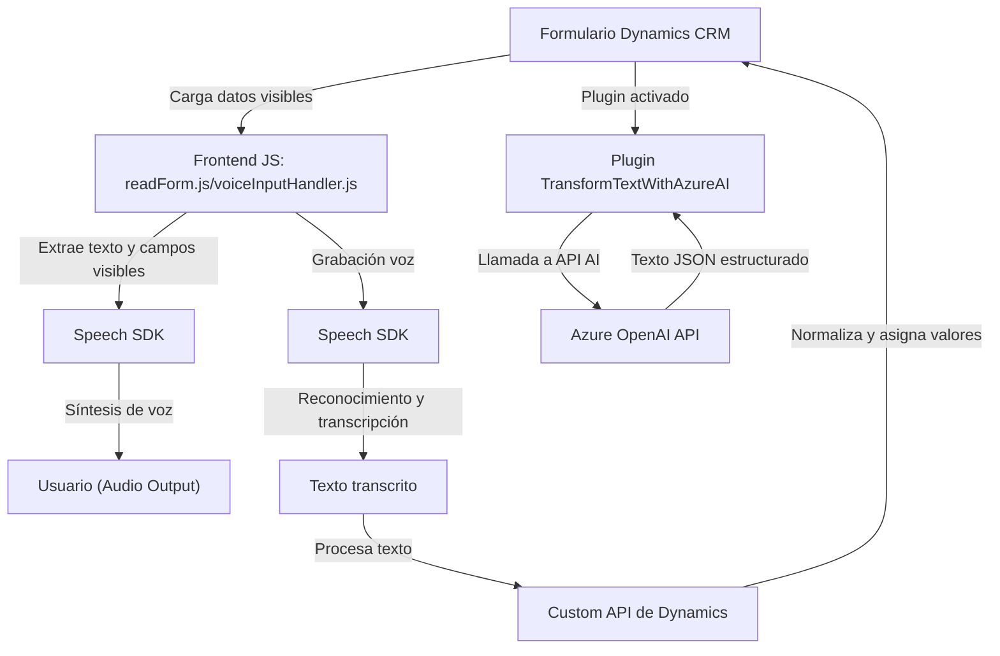

## Breve resumen técnico:
La solución analiza y procesa datos de formularios CRM/Dynamics mediante reconocimiento y síntesis de voz usando el **Azure Speech SDK**, además de un plugin que transforma texto con **Azure OpenAI**. Está diseñada para formularios en aplicaciones empresariales basadas en Dynamics CRM, con integración de IA para tareas dinámicas como transcripción y normalización de datos.

---

## Descripción de arquitectura:
1. **Tipo de solución**: Esta solución actúa como una integración que incluye:
   - **Frontend**: Scripts JavaScript que gestionan formularios y manejan voz/texto.
   - **Backend/plugin**: Una solución extensible sobre Dynamics CRM para procesamiento de texto.
2. **Arquitectura general**:
   - **Modular**: Funciones especializadas en el frontend.
   - **Context-driven plugin**: En el backend, se mueve como un ambiente de ejecución dependiente del contexto CRM.
   - **Integraciones externas**: Azure Speech SDK y Azure OpenAI.

---

## Tecnologías usadas:
1. **Frontend**:
   - Lenguaje: JavaScript (ES6+).
   - Principales herramientas:
     - **Azure Speech SDK**: Para síntesis y reconocimiento de voz.
     - Formularios de Dynamics CRM como fuente de datos.
   - Patrones:
     - Modularización funcional (cada función como tarea independiente).
2. **Backend**:
   - Lenguaje: C# (.NET Framework).
   - Dependencias principales:
     - **Microsoft.Xrm.Sdk**: Para manejar plugins en Dynamics CRM.
     - **Azure OpenAI API**: Procesamiento avanzado de lenguaje natural.
     - **Newtonsoft.Json** y **System.Text.Json** para manejo JSON.
   - Patrones:
     - Plugin Architecture (Dynamics CRM).
     - Middleware para integración externa.

---

## Dependencias externas probables:
1. **SDKs/Bibliotecas**:
   - Azure Speech SDK.
   - Microsoft Dynamics SDK.
2. **Servicios externos**:
   - Azure OpenAI API para procesamiento de texto.
3. **Custom API**:
   - API específica para transformar datos vía Azure AI en frontend.
4. **CDNs**:
   - Speech SDK dinámicamente cargado desde `https://aka.ms/csspeech/jsbrowserpackageraw`.

---

## Diagrama Mermaid:
Este diagrama detalla la interacción de los componentes principales.

---

## Conclusión final:
La solución representa una arquitectura híbrida que combina **frontend funcional** para interacción y entrada de datos con un **plugin backend** para transformación posterior mediante IA externalizada. La modularidad y las integraciones de Azure reflejan una solución escalable y adaptable diseñada para entornos empresariales como Dynamics CRM.