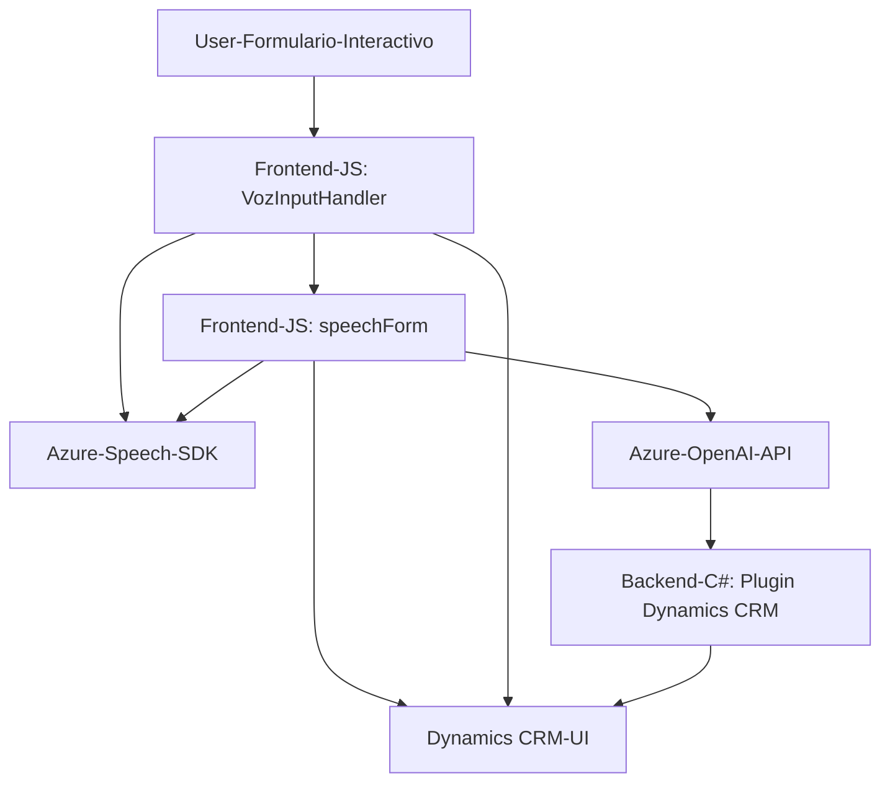

### Breve Resumen Técnico
El repositorio descrito es una solución híbrida diseñada para interactuar con formularios dinámicos en un entorno como Microsoft Dynamics 365, utilizando servicios de Azure. La funcionalidad se centra en dos aspectos principales: síntesis de voz y reconocimiento/sugerencias mediante entrada de voz, además de extender la funcionalidad mediante un plugin para transformar texto con modelo de IA de Azure OpenAI.

---

### Descripción de Arquitectura
1. **Tipo de solución:**
   - La solución incluye componentes para la **interacción de usuarios con formularios web** mediante un frontend (JavaScript) que gestiona voz y texto.  
   - También se integra un **plugin backend (.NET)** que extiende la funcionalidad de Dynamics CRM, utilizando una arquitectura mixta de patrones tradicionales y modernos con servicios adicionales de REST APIs externas (Azure Speech y Azure OpenAI).

2. **Tipo de arquitectura:**
   - El sistema tiene una arquitectura **n-capas**, que integra los siguientes componentes:
     - Capa de **servicio de voz**: Frontend basado en JavaScript que interactúa con Azure Speech SDK para grabar, sintetizar o transcribir entrada de voz.
     - Capa de **presentación**: Formularios dinámicos o UI basados en Microsoft Dynamics 365 que presentan datos e interactúan visualmente con el usuario.
     - Capa de **negocio (plugin)**: Unidad empresarial en .NET que aplica procesamiento de datos textuales utilizando Azure OpenAI y las interfaces del servicio CRM.
     - Capa de **servicios externos**: Comunicación vía API REST con herramientas de Azure (Speech SDK y OpenAI).

3. **Patrones de diseño aplicados:**
   - **Plugin Design Pattern** en Dynamics CRM.
   - **Encapsulación Modular** en las funciones de JavaScript, aisladas por responsabilidades: síntesis de voz, transcripción y manipulación de formularios.
   - **Callback Asynchronous Pattern** con SDK externo y eventos.
   - **Integrated Microservices** al consumir servicios REST de Azure.

---

### Tecnologías y Frameworks Usados
1. **JavaScript Frontend:**
   - Azure Speech SDK (biblioteca `SpeechSDK`).
   - Gestión de formularios dinámicos (Microsoft Dynamics SDK).

2. **Backend (C# Plugin):**
   - .NET Framework.
   - REST API consumo de Azure OpenAI.
   - Newtonsoft.Json para manipulación JSON.

3. **Herramientas Externas:**
   - Servicios de API con Azure:
     - **Speech SDK**: Para transcripción y síntesis de voz.
     - **OpenAI**: Para procesamiento de texto utilizando IA.

4. **Capa de servicios (Microsoft Dynamics CRM):**
   - Ejecución de operaciones dinámicas mediante: `IPluginExecutionContext`, `IOrganizationService`.

---

### Diagrama Mermaid

---

### Conclusión Final
La solución implementada presenta una arquitectura distribuida de n-capas con una fuerte integración de servicios externos como Azure Speech SDK y Azure OpenAI. Está diseñada para entornos corporativos con necesidades de accesibilidad (síntesis y entrada de voz), gestión de datos dinámicos y procesamiento de texto avanzado mediante inteligencia artificial. Su diseño modular permite escalar funcionalidades y mantener una clara separación entre capas de presentación, lógica de negocio y datos.