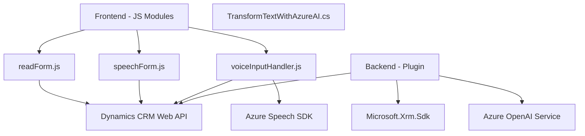

### Breve resumen técnico:
El repositorio alberga componentes de una solución completa que integra tecnologías para procesamiento de voz, interacción con formularios web y un plugin para integrar servicios externos (Azure OpenAI) con Microsoft Dynamics CRM. La solución en conjunto parece ser diseñada para interactuar con un sistema basado en Dynamics CRM, enriqueciendo las funcionalidades mediante reconocimiento de voz y transformación de texto con Inteligencia Artificial.

---

### Descripción de arquitectura:
1. **Tipo de solución**:
   - Este repositorio es una solución híbrida que combina:
     - Un **frontend** con capacidades de entrada/salida por voz, utilizando formularios interactivos (presencia de `readForm.js` y `speechForm.js`).
     - Un **plugin backend** (archivo `TransformTextWithAzureAI.cs`) vinculado a Dynamics CRM, permitiendo integración con servicios de Azure OpenAI para transformación avanzada de textos.
   - En términos generales, esta solución podría clasificarse como una **API/Plugin para Dynamics CRM**, integrada con un frontend especializado en interacción por voz.

2. **Arquitectura**:  
   - La solución presenta un enfoque mixto:
     - El frontend utiliza una arquitectura modular sencilla con **capas funcionales** (interacción de voz, manipulación de formularios).
     - El backend (plugin) sigue el patrón de **capas orientadas al dominio** típico de Dynamics CRM, con inclusión de servicios externos.
   - En conjunto, esta solución tiene características de arquitectura distribuida (combinando frontend y backend) con separación de responsabilidades.

---

### Tecnologías usadas:
1. **Frontend**:
   - **Azure Speech SDK**: Para la integración de reconocimiento y síntesis de voz.
   - **Dynamics 365 APIs**: Para manipulación de formularios del sistema CRM.

2. **Backend**:
   - **Microsoft Dynamics CRM SDK** (`Microsoft.Xrm.Sdk`): Para eventos y extensión de Dynamics CRM mediante el plugin.
   - **Azure OpenAI Service**: Para transformar texto aplicando modelos generados por IA (como `gpt-4o`).
   - **Framework .NET**: Para la implementación del plugin en código C#.
   - **Librerías adicionales**: `Newtonsoft.Json`, `System.Text.Json`, `System.Net.Http`.

3. **Patrones usados**:
   - **Modularidad funcional** (frontend).
   - **Callback approach** para la carga dinámica de Azure SDK en frontend.
   - **Servicio externo HTTP** encapsulado en métodos (`GetOpenAIResponse`) en el backend.
   - **Encapsulación de lógica de negocio** en `TransformTextWithAzureAI`.

---

### Dependencias y componentes externos:
- **Azure Speech SDK**: Reconocimiento y síntesis de voz en el frontend, importado desde una URL dinámica.
- **Dynamics CRM APIs**: Operaciones sobre formularios CRM (`Xrm.WebApi`).
- **Azure OpenAI Service**: Transformación avanzada de texto en el plugin backend.

---

### Diagrama Mermaid válido para GitHub:

---

### Conclusión final:
Esta solución es una integración sofisticada de frontend y backend con servicios externos de Azure. El diseño modular en el frontend permite una interacción eficiente basada en voz mientras que el backend, mediante un plugin con Dynamics CRM, amplía capacidades utilizando Inteligencia Artificial. La arquitectura implica una distribución funcional con componentes que garantizan agilidad y escalabilidad en escenarios CRM. Podría ser optimizada aún más aplicando principios de **Clean Architecture** (especialmente en el plugin) o potenciando el frontend con estructuras más orientadas a la reactividad (como SPA).