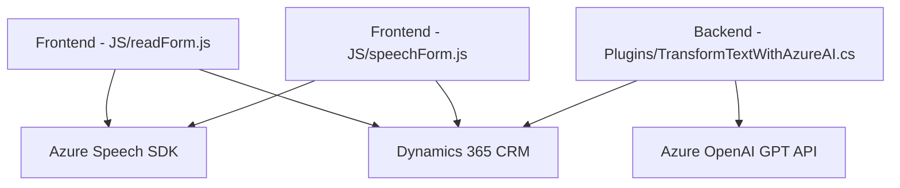

### Breve resumen técnico
El repositorio integra funcionalidades relacionadas con procesamiento de texto, voz y datos en entornos Dynamics 365 utilizando Azure AI. Los módulos implican una combinación de frontend (JavaScript), plugins back-end (C#), y soporte de servicios externos como Azure Speech SDK y Azure OpenAI. 

### Descripción de arquitectura
La arquitectura en el repositorio se asocia a una solución **modular de n capas** dentro de un entorno de Dynamics 365. Los módulos de frontend están integrados en una capa de presentación interactiva para captura y manipulación de datos por parte de usuarios, mientras que los plugins representan la capa de lógica de negocio en el backend. Estas se conectan mediante servicios externos y la API de Dynamics 365. 

### Tecnologías usadas
1. **Frontend**:
   - **Tecnologías**: JavaScript/ES6+, HTML.
   - **Frameworks/Librerías**: Azure Speech SDK, Dynamics Client API (`Xrm.WebApi`).
   - **Patrones**: Modularidad, Promesas y Callback asíncronos.

2. **Backend**:
   - **Technologías**: C#, .NET Framework, Dynamics CRM SDK.
   - **Frameworks/Librerías**: Azure OpenAI (GPT), Newtonsoft.Json.
   - **Patrones**: Plugin-based Architecture, HTTP API Client Abstraction.

3. **Servicio externo**:
   - **Azure services**:
     - Speech SDK: Voz a texto y síntesis de voz.
     - OpenAI GPT: Transformación de texto.

### Dependencias o componentes externos
1. **Azure Speech SDK**:
   - Manejo de reconocimiento de voz, síntesis de texto a voz y transcripción de audio.
2. **Azure OpenAI GPT API**:
   - Procesamiento avanzado de texto con inteligencia artificial.
3. **Dynamics 365 Client API**:
   - Operaciones CRUD, manipulación de datos y eventos relacionados con formularios del sistema CRM.
4. **Newtonsoft.Json**:
   - Serialización/deserialización de datos JSON.
   
### Diagrama Mermaid válido para GitHub Markdown

### Conclusión final
La solución propuesta refleja una **arquitectura de n capas** enfocada en integración entre servicios externos de AI, un sistema CRM empresarial (Dynamics 365) y una interfaz frontend enriquecida. Su diseño prioriza modularidad, asíncronismo y encapsulación adecuada de responsabilidades, utilizando componentes extensibles como el Azure Speech SDK y Azure OpenAI GPT API para inteligencia artificial y procesamiento avanzado.