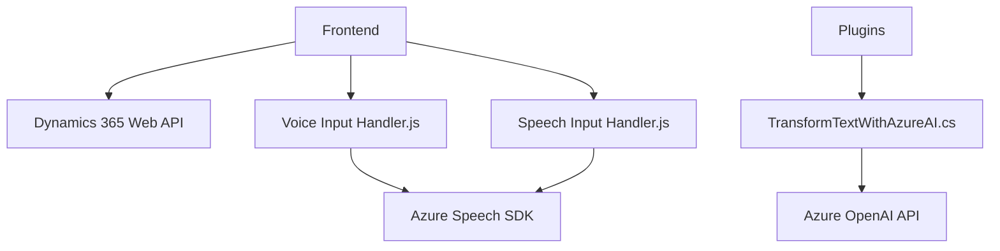

### Breve resumen técnico:
La solución integra funcionalidades de procesamiento de formularios y entrada de voz con un backend que utiliza procesamiento textual avanzado en el entorno de Dynamics 365 CRM. El sistema utiliza el Azure Speech SDK para lectura y entrada de voz y el Azure OpenAI API para transformación de texto en un formato JSON normativo.

---

### Descripción de la arquitectura:
La arquitectura es una combinación de **microfrontend** y **plugin-based microservicios**. Consta de tres capas funcionales:
1. **Frontend**:
   - Implementado con JavaScript para manipulación de formularios y con integración del Azure Speech SDK.
   - Proporciona funcionalidades de síntesis y reconocimiento de voz.
2. **Backend**:
   - Implementado mediante plugins Dynamics CRM (.NET Framework), que se integran directamente con la plataforma y usan servicios externos (como Azure OpenAI API) para procesamiento avanzado.
3. **Servicios externos**:
   - Se usa el Azure Speech SDK para reconocimiento y síntesis de voz.
   - La API Azure OpenAI para procesamiento de texto.
   - Dynamics CRM API para manejo de datos relacionados con los formularios y entidades del sistema.

La arquitectura usa un enfoque **orientado a eventos**, donde las interacciones del usuario en formularios desencadenan operaciones de síntesis de voz, entrada de voz o procesamiento textual. El sistema está organizado para facilitar la integración de servicios externos en un contexto modular y desacoplado.

---

### Tecnologías usadas:
1. **Frontend**:
   - **JavaScript**: Para manipulación del DOM y lógica de procesamiento.
   - **Azure Speech SDK**: Para reconocimiento y síntesis de voz.
   - **Dynamics 365 Web API (JavaScript SDK)**: Para interacción con formularios y datos en Dynamics CRM.

2. **Backend**:
   - **C# .NET Framework**: Para desarrollo de plugins.
   - **Azure OpenAI API**: Para procesamiento avanzado de texto.
   - **Microsoft.Xrm.Sdk**: Para interacción con eventos y contexto de Dynamics CRM.

3. **Servicios externos**:
   - Comunicación REST con Azure Speech y Azure OpenAI APIs.

---

### Dependencias o componentes externos:
1. **Azure Speech SDK**: Para reconocimiento y síntesis de voz, cargado dinámicamente mediante un URL (`https://aka.ms/csspeech/jsbrowserpackageraw`).
2. **Azure OpenAI API**: Para procesamiento avanzado de texto.
3. **Dynamics 365 Web API**: API integrada que permite manipulación de datos del CRM.
4. **Microsoft SDKs**: (Microsoft.Xrm.Sdk, Newtonsoft.Json.Linq, System.Net.Http) para el desarrollo y ejecución del plugin en el servidor del CRM.

---

### Diagrama Mermaid:

---

### Conclusión final:
La solución combina tecnologías frontend y backend para mejorar la usabilidad de formularios en un sistema CRM, usando entrada y procesamiento de voz y texto con servicios avanzados como Azure Speech SDK y OpenAI API. La arquitectura modular facilita la integración de nuevos servicios y garantiza una buena separación de responsabilidades entre frontend, backend y servicios externos. Además, el uso de plugins propietarios de Dynamics CRM posiciona este sistema como una solución robusta para empresas que manejan datos contextuales altamente dinámicos.

