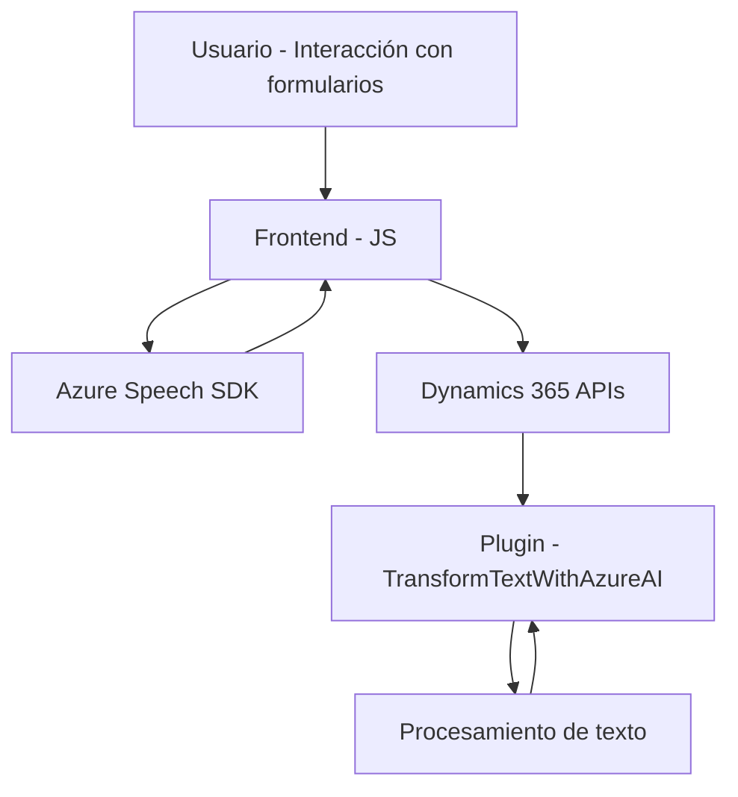

### Resumen técnico
Este repositorio implementa un sistema que integra servicios de voz e inteligencia artificial en un contexto de Microsoft Dynamics 365. Los archivos están estructurados principalmente para trabajar con formularios en Dynamics 365, empleando el Azure Speech SDK para gestiones de entrada y salida de voz, junto con capacidades avanzadas de procesamiento de lenguaje natural mediante Azure OpenAI desde un plugin.

---

### Descripción de arquitectura
1. El sistema combina múltiples capas de funcionalidad:
    - **Frontend**: Implementado en JavaScript (archivos como `readForm.js` y `voiceInputHandler.js`) para gestionar la interacción con formularios de Dynamics 365, incluyendo lectura de datos, procesamiento de transcripciones, y comunicación con el SDK de Azure Speech.
    - **Backend**: Plugin de Dynamics CRM (`TransformTextWithAzureAI.cs`) que procesa texto y realiza llamadas a API externas (Azure OpenAI) para obtener información y transformar contenido.
    - Existe una combinación de arquitectura **n-capas** para dividir responsabilidades (procesamiento de datos en el frontend y lógica empresarial en el backend) y **microservicios**, especialmente para comunicaciones externas a servicios de Azure (Speech SDK y OpenAI).

2. Patrones empleados:
    - **Gestión dinámica de recursos**: Carga del SDK de Azure Speech en tiempo de ejecución.
    - **Modularidad**: Cada archivo cumple roles independientes para funcionalidades específicas.
    - **Basado en servicios**: Dependencia de APIs externas (Azure SDK, Azure OpenAI, y Dynamics APIs).
    - **Callback y Observer**: Uso de callbacks en la carga de SDK y manejo de eventos como la síntesis de voz.

---

### Tecnologías usadas
1. **Frontend**:
    - Lenguaje: JavaScript.
    - SDK: Azure Speech SDK para capturar, procesar y sintetizar voz.
    - Framework de integración: Dynamics 365 APIs para manipulación de formularios.

2. **Backend**:
    - Lenguaje: C#.
    - SDK: Microsoft Dynamics CRM SDK para extensiones de plugins y servicios.
    - External APIs:
        - Azure OpenAI para procesamiento avanzado de texto.
        - HTTP (`System.Net.Http`) para solicitudes REST.

3. Dependencias adicionales:
    - **Newtonsoft.Json** y **System.Text.Json** para trabajo con JSON.
    - Plugins como entidad extensible para Dynamics.

---

### Diagrama Mermaid
A continuación, un diagrama simple que representa la interacción entre los componentes principales:

---

### Conclusión final
Este repositorio implementa una solución robusta y modular basada en servicios, integrando capacidades de inteligencia artificial y procesamiento de voz en el ecosistema de Microsoft Dynamics 365. La arquitectura se organiza principalmente en capas, donde el frontend se encarga de la interacción directa con el SDK de Azure Speech, mientras que el backend actúa como un intermediario para gestionar datos transformados mediante servicios en la nube (OpenAI).

El diseño es eficiente, usa tecnologías modernas y sigue buenas prácticas: modularidad, desacoplamiento mediante APIs externas, y uso extensivo de callbacks. La solución está orientada hacia la escalabilidad y facilidad de mantenimiento.