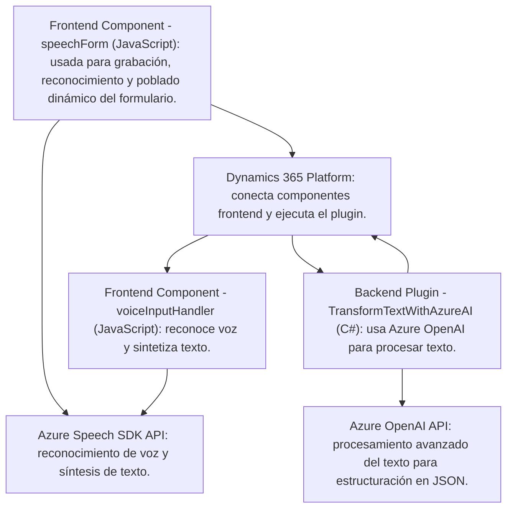

### **Resumen Técnico**

El repositorio describe tres archivos que interactúan con Dynamics 365 y servicios externos (Azure Speech SDK y Azure OpenAI). Juntos forman una solución extendida que mejora la accesibilidad y la automatización del procesamiento de datos en formularios (entrada de voz, síntesis vocal y transformación de texto). La solución combina tecnologías frontend (JavaScript), backend (.NET plugins para Dynamics CRM), servicios de nube (Azure Speech SDK y Azure OpenAI) y el framework de Dynamics 365.

---

### **Descripción de Arquitectura**

- **Arquitectura General**: **n capas** con integración cliente-servidor. Incluye una capa de presentación (frontend con JavaScript), una capa de negocio (plugins .NET para Dynamics CRM), y una capa externa para accesos a APIs de terceros (Azure Speech SDK y Azure OpenAI).
- **Funciones clave**:
  - Entrada y salida de datos de formularios desde Dynamics 365.
  - Reconocimiento y síntesis de voz para mejorar la accesibilidad.
  - Transformación de texto mediante IA (Azure OpenAI) para estructurar datos en formato JSON listo para procesamiento.

---

### **Tecnologías Usadas**

1. **Frontend**:
   - Lenguaje: JavaScript.
   - Framework/Entorno: Dynamics 365.
   - SDK adicional: Azure Speech SDK.

2. **Backend**:
   - Lenguaje: C#.
   - Frameworks/Bibliotecas:
     - Microsoft.Xrm.Sdk (Dynamics CRM Plugins).
     - Newtonsoft.Json para manipulación de JSON.
     - System.Net.Http para comunicación con APIs.
     - Azure OpenAI.

3. **Servicios Externos**:
   - **Azure Speech SDK**: Para reconocimiento y síntesis de voz.
   - **Azure OpenAI API**: Para transformar texto con normas específicas a un JSON estructurado.

4. **Patrones**:
   - Modular Design: Separación clara entre las funciones dentro de cada archivo.
   - Plugin-Based Architecture: Gestión de lógica de negocio en Dynamics CRM utilizando C# Plugins.
   - Interacción cliente-servidor: Conexión entre interfaz de usuario (formularios) y APIs externas.
   - Factory Method: Utilizado para inicializar configuraciones del SDK (Azure Speech SDK y OpenAI).

---

### **Dependencias o Componentes Externos**

1. **Azure Speech SDK**:
   - Disponible mediante CDN para cargar dinámicamente en aplicaciones frontend.
   - Permite el reconocimiento de voz y síntesis vocal en tiempo real.
   - Requiere una clave de suscripción y una región válidas.

2. **Azure OpenAI API**:
   - Accesible mediante solicitudes HTTP desde el backend.
   - Utiliza servicios de AI de Azure para transformar texto en estructuras JSON.

3. **Dynamics 365 APIs**:
   - Utiliza `Xrm.WebApi` para ejecutar operaciones en el servidor Dynamics CRM, como almacenar datos de formularios.

---

### **Diagrama Mermaid**

---

### **Conclusión Final**

El repositorio implementa una solución que utiliza múltiples tecnologías (Azure Speech SDK, Azure OpenAI y Dynamics 365) para mejorar la interacción humano-computadora en formularios. La integración de capacidades de voz (reconocimiento y síntesis) y procesamiento con IA indica una orientación hacia la accesibilidad y automatización inteligente. La arquitectura basada en n capas facilita la separación de responsabilidades y modularidad, permitiendo conexiones eficientes entre cliente, servidor y servicios externos. 

La solución sobresale en cuanto a diseño modular, adherencia a patrones como Factory Method y Single Responsibility, y su capacidad para extender las funciones nativas de Dynamics CRM con tecnologías externas líderes en el mercado.