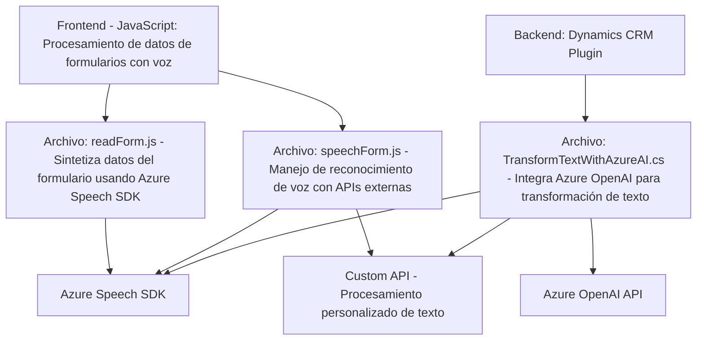

### Breve Resumen Técnico:

Este repositorio contiene una solución centrada en funcionalidades de integración entre formularios en sistemas CRM y servicios de reconocimiento y síntesis de voz, junto con capacidades avanzadas de transformación de texto utilizando Azure Speech SDK y Azure OpenAI. Su enfoque está claramente orientado a extender la experiencia de usuario en formularios CRM mediante voz y procesamiento de texto basado en inteligencia artificial.

---

### Descripción de la Arquitectura:

1. **Tipo de solución:**
   - Este repositorio define una **plataforma integrada** con módulos de frontend en **JavaScript**, junto con extensiones y plugins backend para un sistema de **Dynamics CRM**.  
   - Los archivos procesan formularios CRM (front y backend) usando **servicios externos de Azure**.

2. **Arquitectura:**
   - La arquitectura es **modular y multicapa**, con las siguientes capas principales:  
     - **Presentación (frontend):** JavaScript para manejo de formularios con voz/transcripción.  
     - **Lógica empresarial:** Definida en plugins de Dynamics CRM que procesan datos y comunican con APIs externas.  
     - **Integración de Servicios:** Interacción directa con servicios como **Azure Speech SDK** y **Azure OpenAI API**.
   - En general, la arquitectura se asemeja a un híbrido de **arquitectura n-capas** y **microservicios**, pues integra servicios externos para funciones avanzadas.

---

### Tecnologías Usadas:

1. **Frontend:**
   - Lenguaje: **JavaScript**.
   - SDKs: **Azure Speech SDK** (síntesis y reconocimiento de voz).
   - Framework: Sin un framework específico mencionado, parece una solución que utiliza funciones autónomas de JS en CRM.

2. **Backend:**
   - Lenguaje: **C#**.
   - Microsoft Dynamics CRM SDK para lógica del negocio.
   - API REST para comunicación con **Azure OpenAI** (GPT).

3. **Servicios Externos:**
   - **Azure Speech SDK:** Para síntesis y reconocimiento de voz.
   - **Azure OpenAI API:** Para transformación avanzada mediante inteligencia artificial.

---

### Dependencias o Componentes Externos:

1. **Azure Speech SDK:**  
   - Usado para reconocimiento y síntesis de voz.  
   - URL de acceso: `"https://aka.ms/csspeech/jsbrowserpackageraw"`.

2. **Azure OpenAI:**  
   - Servidor configurado en un endpoint específico como microservicio externo.  
   - Procesa texto usando modelos GPT para devolver resultados transformados.  

3. **Microsoft Dynamics CRM SDK:**  
   - Usado para la integración del plugin backend.  

4. **Bibliotecas .NET:**  
   - **System.Net.Http (utilizado para APIs)**.  
   - **Newtonsoft.Json (manipulación avanzada de JSON)**.   

5. **Custom APIs:**  
   - API personalizada para transformación y procesamiento de datos de texto transcrito en el archivo `speechForm.js`.

---

### Diagrama Mermaid Compatible con GitHub:

---

### Conclusión Final:

El repositorio presenta una solución **modular multicapa**, diseñada específicamente para integrarse con el entorno de Dynamics CRM y servicios avanzados de **Microsoft Azure**. La interacción entre capas y servicios externos como **Azure Speech SDK** y **Azure OpenAI API** evidencia un enfoque sofisticado hacia la modernización de formularios CRM mediante inteligencia artificial y voz.

La arquitectura híbrida, combinando n-capas con microservicios, refleja un diseño adaptable y extensible. No obstante, la gestión segura de claves de API y la idempotencia de los procesos asincrónicos (como cargado del SDK) son factores críticos que deben ser monitoreados cuidadosamente en esta implementación.