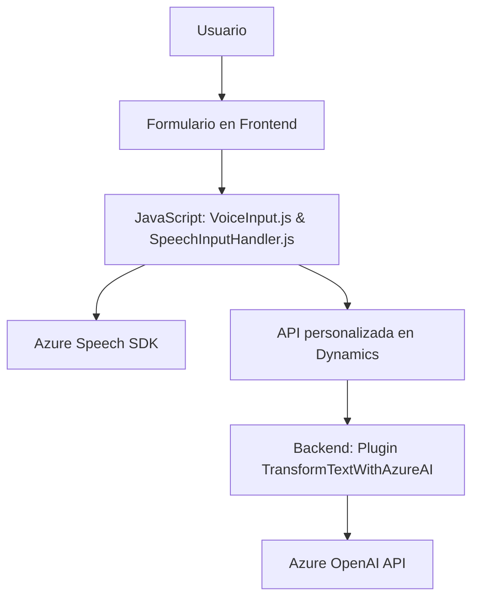
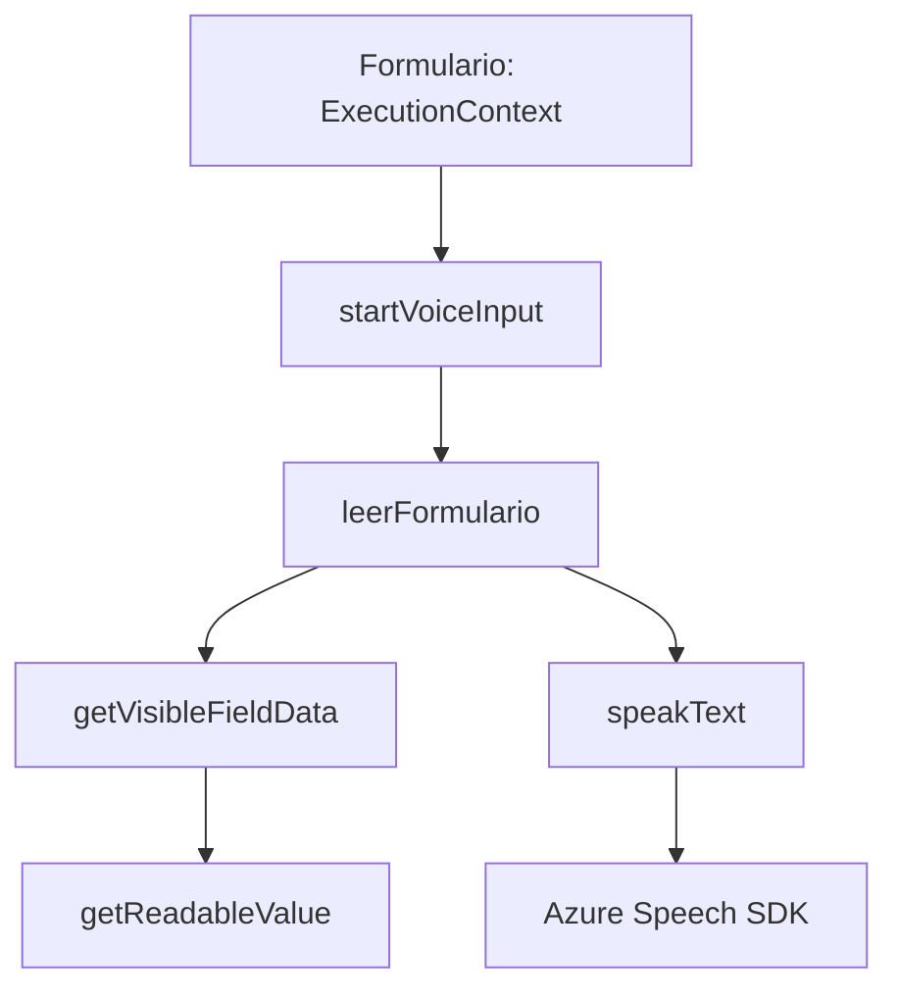
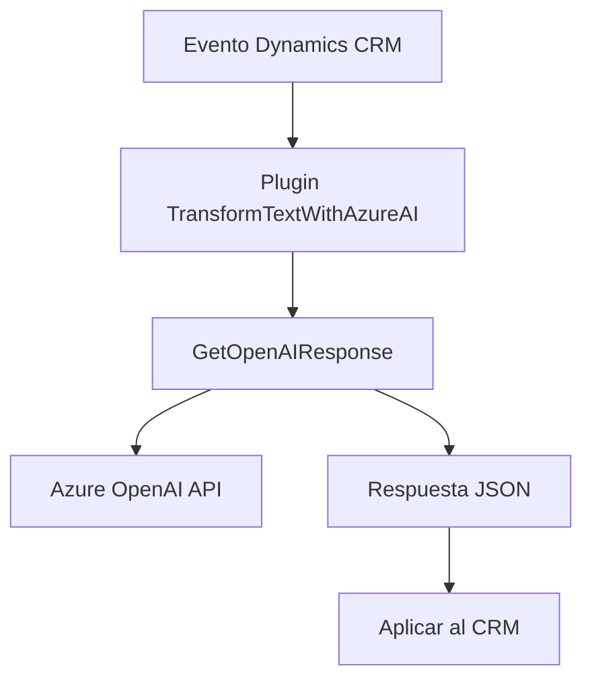

### Breve resumen técnico

El repositorio contiene recursos para una solución orientada a la integración de servicios relacionados con reconocimiento y síntesis de voz (Azure Speech SDK) y transformación de texto mediante inteligencia artificial (Azure OpenAI). Los archivos sugieren una solución híbrida que abarca tanto frontend (interacciones de usuario) como lógica backend (plugin en Dynamics CRM).

---

### Descripción de arquitectura

La arquitectura muestra aspectos de integración entre frontend y servicios externos, junto con un plugin diseñado para Dynamics CRM. Se puede clasificar en una **arquitectura multicapa** que incluye:
1. **Frontend** - Responsable de la interacción del usuario con formularios (incluye reconocimiento de voz, síntesis de voz, y procesamiento local de datos).
2. **Backend/Plugins** - Procesa solicitudes relacionadas con la transformación de texto mediante API remota de Azure OpenAI y se integra en la lógica de negocios de Dynamics CRM.

El empleo de Dynamics CRM como base para el backend sugiere que se trate de una solución específica para una plataforma CRM con soporte de microservicios externos (Azure Speech y OpenAI).

---

### Tecnologías usadas

1. **Frontend**:
   - **Azure Speech SDK** para síntesis y reconocimiento de voz.
   - **JavaScript** como lenguaje principal.
   - Patrones:
     - Carga dinámica de dependencias.
     - Modularidad basada en funciones específicas.

2. **Backend/Plugin**:
   - **Dynamics CRM SDK** para componentes internos y lógica de negocios.
   - **.NET Framework / C#** como lenguaje principal.
   - **Azure OpenAI Service** para procesamiento avanzado de texto.
   - Patrones:
     - Integración con APIs externas para procesamiento en la nube.
     - Plugin Design para trabajos en contexto CRM.

3. **Servicios Externos**:
   - **Azure Speech SDK**: Reconocimiento y síntesis de voz.
   - **Azure OpenAI API**: Procesamiento y respuesta basada en IA.

---

### Diagramas Mermaid válidos para GitHub

#### Diagrama general de la solución

#### Diagrama detallado del flujo en frontend (VoiceInput.js y SpeechInputHandler.js)

#### Diagrama detallado del plugin en backend (TransformTextWithAzureAI.cs)

---

### Conclusión final

La solución es un híbrido entre un servicio API y una aplicación de frontend. La arquitectura se organiza en capas, facilitando la integración de servicios externos como Azure Speech y OpenAI, mientras que la lógica del modelo de datos está fuertemente acoplada a Dynamics CRM a través de plugins. Esto la hace idónea para automatizar procesos en contextos empresariales orientados a formularios y procesamiento de datos dinámicos por medio de reconocimiento y síntesis de voz, así como IA para transformación de texto.