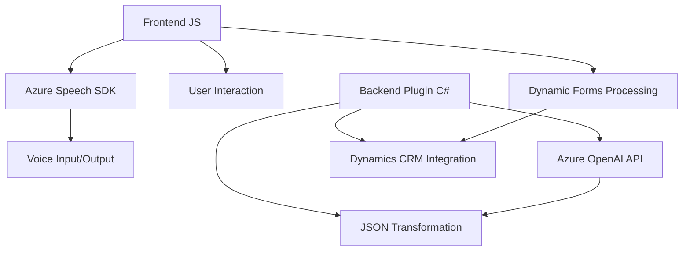

### Resumen técnico

El repositorio implementa una solución que integra funcionalidades de interacción entre formularios, síntesis/entrada de voz, y procesamiento de datos en un contexto empresarial basado en Dynamics 365. Entre los componentes destacados están:
- Un **Frontend** en JavaScript que se conecta con Azure Speech SDK para proporcionar entrada y salida de voz.
- Un **plugin en C#** que utiliza Azure OpenAI (GPT-4) para transformar texto, devolviendo estructuras JSON altamente adaptativas.
- Una estructura orientada a unir trabajo manual, inteligencia artificial y automatización centrada en Dynamics CRM.

---

### Descripción de la arquitectura

La arquitectura implementa una solución híbrida, combinando una **estructura n-capas** con integración de **SDKs y APIs externas**:
1. **Frontend (JS)**: Módulos descentralizados basados en funciones individuales que cumplen tareas específicas (principio de separación de responsabilidades). Este nivel gestiona la interacción entre el usuario, voz, y datos.
2. **Plugins (C#)**: Nivel de negocio, ejecutado en el servidor, centrado en procesar y transformar datos con los servicios de Azure OpenAI.
3. **Servicios externos (Azure Speech SDK y APIs)**: Conexión directa al ecosistema de Azure para realizar tareas de síntesis, reconocimiento de voz, y procesamiento de texto con IA.

La solución no utiliza una arquitectura completamente desacoplada como **hexagonal** o **microservicios**, ya que los componentes dependen fuertemente de Dynamics 365 y Azure como núcleo central.

---

### Tecnologías usadas

#### Frontend
- **JavaScript**: Base para implementar las funciones de síntesis y entrada de voz, junto con lógica de procesamiento y manejo de datos de formularios.
- **Azure Speech SDK** (JS): Para conexión en tiempo real con los servicios de voz de Microsoft Azure.

#### Backend
- **C#**: Lenguaje base del plugin para Dynamics CRM.
- **Azure OpenAI**: Conexión al modelo GPT-4 para transformar texto.
- **Newtonsoft.Json** y **System.Text.Json**: Librerías para manipulación y serialización de JSON.
- **Microsoft.Xrm.Sdk**: Librería para integración principal con Dynamics 365.

#### General
- Arquitectura n-capas: Separación entre frontend, backend y servicios externos.
- Integración con SDK y APIs externas: Facilita las funcionalidades de síntesis de voz y procesamiento de texto adaptativo.
- Principios de diseño modular: Cada función y clase se orienta a tareas específicas, siguiendo el principio SOLID.

---

### Diagrama Mermaid válido para GitHub

---

### Conclusión final

El repositorio describe una solución orientada a transformar y simplificar la interacción entre personas y sistemas empresariales usando formularios interactivos y Azure Speech SDK en el frontend, mientras que en el backend utiliza un poderoso plugin en C# para gestionar texto y convertirlo en estructuras JSON mediante Azure OpenAI. La solución está diseñada bajo una arquitectura n-capas con integración directa de APIs externas y SDKs, permitiendo extensibilidad y un nivel avanzado de automatización. Aunque funciona de manera efectiva dentro del contexto Dynamics CRM, podría beneficiarse de paradigmas de arquitecturas más desacopladas para mejorar la escalabilidad y adaptabilidad.