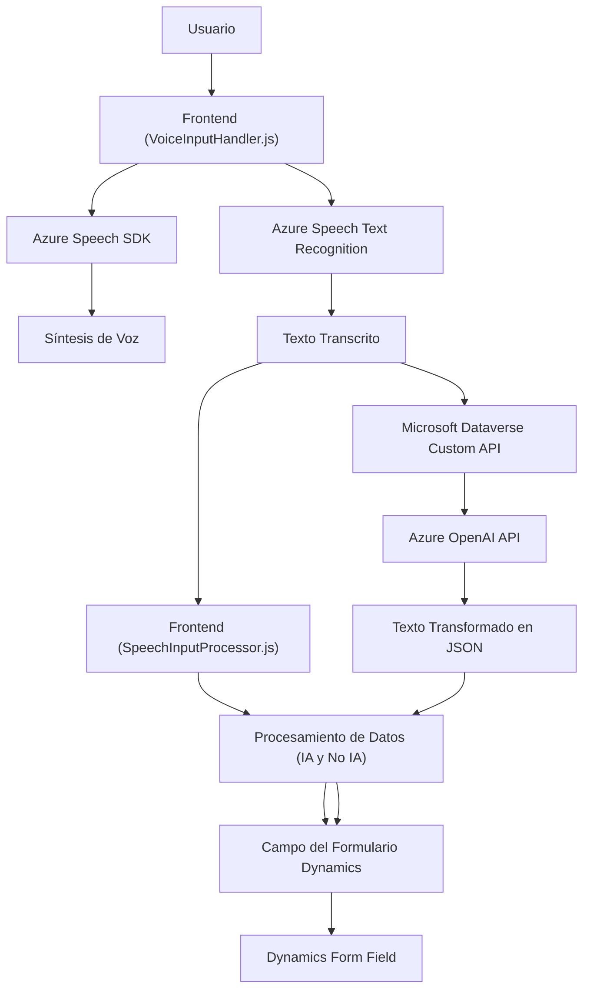

### **Breve resumen técnico**
El repositorio describe una solución orientada al procesamiento dinámico de voz y texto en formularios CRM (Dynamics 365) con integración de tecnologías de Microsoft Azure Speech SDK y Azure OpenAI. Está compuesto por dos archivos principales en el frontend que se encargan de entrada/salida de voz, y un plugin en C# que utiliza la API de Azure OpenAI para transformar texto en formatos específicos.

---

### **Descripción de la arquitectura**
La solución parece estar diseñada implementando una arquitectura basada en **integración de servicios externos (Hybrid Cloud Integration)**, con elementos de un enfoque **cliente-servidor** (frontend en JavaScript) y **plugin design pattern** en el backend dentro de Dynamics CRM. La solución se distribuye como un conjunto de funcionalidades que integran servicios de Azure en un contexto de CRM.

#### **Arquitectura detallada:**
1. **Frontend:** Una solución en JavaScript orientada a la interacción del usuario mediante la entrada/salida de voz, diseñada para obtener datos de un formulario, procesarlos, y enviarlos al servicio Azure Speech para síntesis de voz y reconocimiento de texto.
2. **Backend Plugin:** Interacción directa con el Dynamics CRM mediante el plugin (`IPlugin`), encargándose de procesar la lógica de transformación del texto en JSON según las normas especificadas y delegándolo al servicio Azure OpenAI.

---

### **Tecnologías y frameworks usados**
1. **Frontend (JavaScript):**
   - **Microsoft Azure Speech SDK:** Para la entrada y salida de voz.
   - **Microsoft Dataverse Web API (`Xrm.WebApi.online`)**: Herramientas para integración y manipulación dinámica de datos en la interfaz de Dynamics CRM.

2. **Backend (C# Plugin):**
   - **Microsoft Dynamics CRM SDK (`IPlugin`, `IServiceProvider`):** Desarrollado como un plugin que implementa eventos en el sistema de Dynamics CRM.
   - **Azure OpenAI:** Utilizado para transformar textos en JSON procesado según normas específicas.
   - **Newtonsoft.JSON:** Para manejo y manipulación de objetos JSON.

#### **Patrones utilizados:**
- **Callback Pattern:** Para cargar el SDK y ejecutar funciones dinámicamente.
- **Mapper/Repository Pattern:** FieldMap es utilizado como un mapa lógico para resolver claves de formulario.
- **Plugin Design Pattern:** Procesamientos backend en Dynamics CRM.
- **API Consumer:** Integración con Azure para Speech y OpenAI para delegar procesos.

---

### **Diagrama Mermaid compatible con GitHub Markdown**

---

### **Conclusión final**
La solución presentada integra funcionalidades de voz y procesamiento textual con la tecnología de Microsoft Dynamics CRM mediante servicios externos de Azure (Speech SDK y OpenAI API). Se utiliza una arquitectura modular basada en la interacción cliente-servidor para el procesamiento y aplicación dinámica de voz y texto en los formularios del CRM. Aunque no es una solución distribuida como un microservicio, el diseño refleja una implementación híbrida con componentes interdependientes que aprovechan arquitecturas modernas en sistemas empresariales.

Una posible optimización podría incluir mejoras en la gestión de errores en las solicitudes HTTP y en el manejo de resultados del SDK. La solución es robusta, reutilizable y bien estructurada según los principios de diseño de software modular.