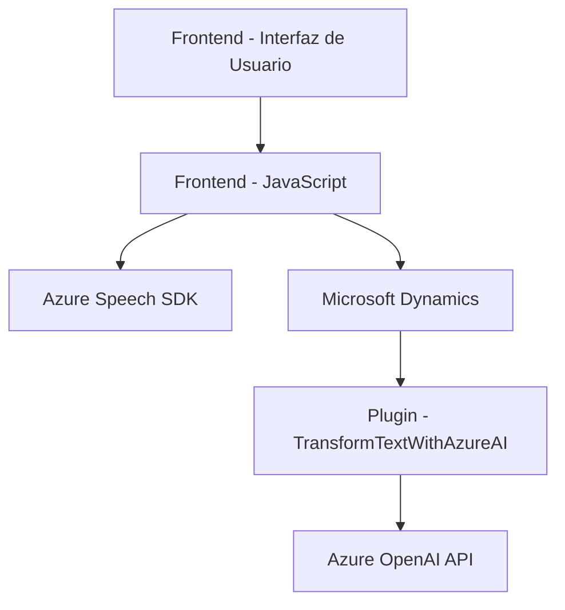

### Breve Resumen Técnico

El repositorio muestra una solución que integra tecnologías de frontend (JavaScript) y desarrollo de plugins para Microsoft Dynamics CRM, todo ello con dependencia de servicios externos como Azure Speech SDK y Azure OpenAI API. Su funcionalidad está centrada en el procesamiento de datos de formularios mediante reconocimiento de voz y transformación avanzada de texto, proporcionando capacidades de interacción más intuitiva dentro de un entorno empresarial como Dynamics 365.

---

### Descripción de Arquitectura

La solución tiene una arquitectura híbrida, con las siguientes capas y componentes principales:

1. **Frontend:** Implementado en JavaScript, interactúa con el usuario mediante reconocimiento y síntesis de voz. Las funciones están organizadas de forma modular, interactuando con elementos del DOM y con la API de Azure Speech SDK.
   
2. **Backend:** Implementado como un Plugin de Dynamics CRM, que interactúa con el contexto CRM y realiza solicitudes a Azure OpenAI API para procesar datos textuales en JSON. El backend actúa como un interceptor para ciertos eventos del CRM.

3. **Integración de servicios externos:** Dependencia fuerte de servicios como Azure Speech SDK y Azure OpenAI API, que impulsan funcionalidades clave como el reconocimiento de voz y procesamiento de texto con inteligencia artificial.

#### Patrón arquitectónico dominante:
- **N capas:** La solución divide las responsabilidades en capas (frontend para interacción y presentación, backend para lógica empresarial) y consume APIs externas, funcionando como orquestador de datos entre capas.
- **Microservicios:** Mientras no hay microservicios separados en el sentido estricto, el Plugin y las integraciones con Azure actúan como servicios desacoplados que cumplen principios de consumo REST.
- **Plugin/event-driven:** En el caso del backend, el plugin se ejecuta bajo demanda cuando se invoca en un evento del sistema CRM, típico del patrón de interceptores.

---

### Tecnologías Usadas

1. **Frontend:**
   - **JavaScript:** Para manipulación de DOM y carga de Azure Speech SDK.
   - **Azure Speech SDK:** Para reconocimiento y síntesis de voz.
   - **Dynamics 365 frameworks:** Acceso a atributos y controles del formulario.

2. **Backend:**
   - **Microsoft Dynamics CRM:** Framework para desarrollo de plugins.
   - **Azure OpenAI API:** Para transformar texto en JSON estructurado.
   - **C#:** Lenguaje usado para el desarrollo del Plugin.
   - **Libraries:** System.Text.Json y Newtonsoft.Json para manejo de JSON.

3. **Servicios Externos:**
   - **Azure Speech SDK:** Integrado en el frontend.
   - **Azure OpenAI API:** Llamado desde el backend para inteligencia artificial.

---

### Diagrama Mermaid (válido para Markdown de GitHub)

---

### Conclusión Final

Esta solución ofrece una experiencia avanzada de usuario mediante el uso de reconocimiento de voz, síntesis de datos de formularios y transformación de texto con IA. Su arquitectura modular basada en n capas y plugins permite extensibilidad y desacoplamiento de las funcionalidades clave. Los componentes externos como Azure Speech SDK y Azure OpenAI API robustecen la solución, pero también generan una alta dependencia respecto a terceros. Es una solución ideal para entornos empresariales que buscan enriquecer la interacción con Dynamics 365.