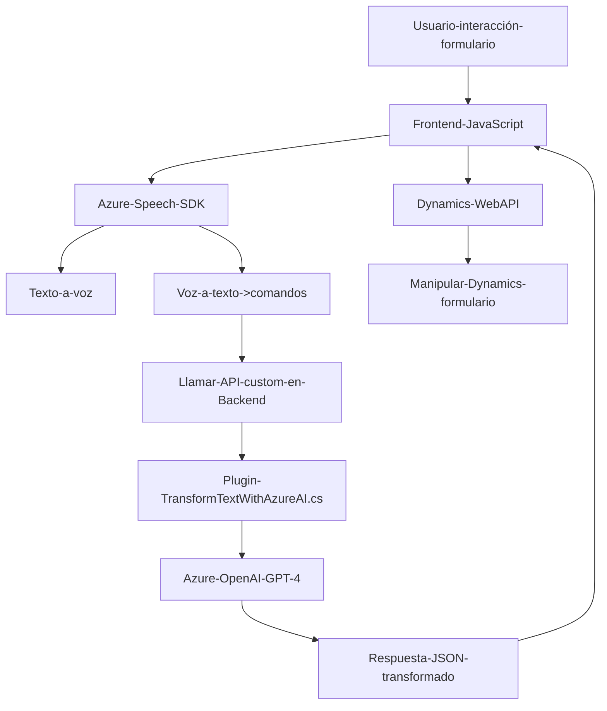

### Análisis y Explicación Técnica

#### Breve Resumen Técnico
El repositorio contiene tres principales componentes dentro de dos contextos diferentes: **Frontend** y **Backend (plugin)**. Combinados, forman una solución destinada a manipular formularios en Microsoft Dynamics 365 CRM utilizando voz para entrada y salida, junto con manipulación de texto mediante Azure Speech SDK y Azure OpenAI GPT.

---

#### 1. Descripción de la Arquitectura

La solución tiene dos capas principales:
1. **Frontend**:
   - Implementa una capa de presentación en Dynamics 365 CRM a través de scripts JavaScript. Este código define manejadores para funcionalidades de entrada por voz y salida de texto en voz. Además, llama APIs externas (Azure Speech SDK y plugins en Dynamics).
   - Arquitectura usada: Client-Server con elementos basados en *Gestión de estados para formularios*.

2. **Backend**:
   - Contiene un plugin para Dynamics CRM que utiliza Azure OpenAI GPT para transformar texto según estándares. Sigue una arquitectura basada en microservicios al delegar la transformación de textos al servicio de Azure OpenAI.
   - Arquitectura usada: *Plugin Design Pattern* combinado con *Microservicios* para dependencias externas.

---

#### 2. Tecnologías, Frameworks y Patrones

**Tecnologías**:
- **Frontend**:
  - **JavaScript**: Para manejo dinámico de DOM (manipulación de formularios en Dynamics CRM).
  - **Azure Speech SDK**: Para entrada de voz y síntesis de texto a voz.
  - **Dynamics 365 WebAPI**: Para manipulación de datos del formulario en Dynamics CRM.
  
- **Backend**:
  - **Microsoft Dynamics CRM SDK**: Framework para desarrollar plugins en Dynamics.
  - **Azure OpenAI Service (GPT-4)**: Para transformación de texto en JSON.
  - **System.Net.Http**: Procesamiento de comunicación HTTP hacia APIs externas.

**Patrones**:
- **Frontend**:
  - Modularización: Separación lógica en funciones independientes para mantenimiento y comprensión.
  - Asincronía: El código utiliza callbacks para operaciones dinámicas como carga SDK.
  - Encadenamiento de dependencias: Flujos secuenciales de tareas (SDK → Procesar → API).
  - Service Pattern: Integra directamente APIs externas (Azure SDK y Dynamics WebAPI).

- **Backend**:
  - Plugin Pattern: Encapsulación lógica para eventos en Dynamics CRM (validación de entrada, manipulación de datos, responder con JSON).
  - Microservicios: Delegación de procesamiento a Azure OpenAI GPT.

---

#### 3. Dependencias o Componentes Externos

- **Azure Speech SDK**: Sintetiza texto a voz y convierte voz en texto.
- **Azure OpenAI GPT-4**: Procesa y transforma texto a mediante modelos de lenguaje avanzado.
- **Dynamics CRM Web API**: Manipula datos de formularios y llama APIs personalizadas.
- **HTTP Client**: Realiza conexión directa con APIs externas, asegurándose la transferencia JSON segura para abrir o recibir datos desde Azure.

---

#### 4. Diagrama Mermaid **100% compatible con GitHub Markdown**

---

#### Conclusión Final

La solución implementa una integración entre **Dynamics 365** y tecnologías de Microsoft Azure para aprovechar capacidades de inteligencia artificial y procesos de voz. Su arquitectura es híbrida, combinando:
- Frontend: Modularización y Service Pattern para sintetizar y procesar voz desde formularios.
- Backend: Plugin Design basado en Dynamics CRM con procesamiento de texto ajustado al modelo de microservicios gracias a la integración de Azure OpenAI GPT.

### Evaluación:
- **Escalabilidad**: La solución puede adaptar más servicios externos configurando endpoints y APIs, pero la dependencia de componentes como registros en `Dynamics` puede limitar en entornos menores o externos.
- **Recomendación**: Utilizar almacenamiento o configuración externa (como Azure Key Vault) para claves API, y considerar alternativas menos dependientes de `Dynamics` si se desea una solución desacoplada.