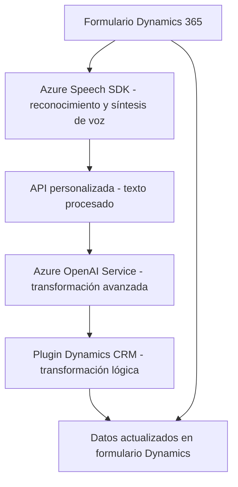

# Resumen Técnico del Repositorio

Este repositorio parecería implementar una solución para formularios interactivos que utilizan inteligencia artificial y servicios de Azure para síntesis de voz, reconocimiento de voz y transformación de datos. Los archivos analizados se centran en diferentes funcionalidades que trabajan con formularios de Dynamics 365 y tienen una clara separación entre frontend (JavaScript) y backend (.NET Plugins).

---

## Descripción de la Arquitectura

**Tipo de solución:**  
La solución implementa una **API combinada con un sistema frontend y Plugins (back-end)**. Específicamente,:
- **Frontend:** Implementado en JavaScript, interactúa con formularios de Dynamics 365 para entrada y salida de datos, usando servicios externos como Azure Speech SDK.
- **Backend:** Utiliza Plugins de Dynamics CRM (.NET) y la API de Azure OpenAI para realizar transformaciones de datos.

**Arquitectura general:**  
- El sistema tiene características de una **arquitectura en capas con integración de microservicios**:
  - Capa **Frontend/Presentation**: Interactúa directamente con los usuarios y captura sus acciones (formulario en Dynamics 365 y SDK de Azure Speech).
  - Capa **Logica/Business Rules**: Realiza lógica de transformación de datos y ejecución de reglas específicas en Dynamics CRM.
  - Capa **API/Microservicios Externos**: Interfaces con servicios externos como Azure Speech y Azure OpenAI mediante patrones de integración.

**Patrones arquitectónicos principales:**  
- **Microservicios:** El uso del SDK de Azure Speech y la API de OpenAI posiciona claramente partes del sistema como dependientes de microservicios externos.
- **Capa de Plugins CRM:** La implementación de lógica personalizada en Dynamics mediante `IPlugin` refuerza el uso de una **arquitectura extendida para sistemas empresariales**.
- **Modularidad:** Separación clara de responsabilidad entre los diferentes archivos de scripts y plugins. Cada archivo realiza una función específica (synthesizing voice, processing input data, external API calls).
- **Carga dinámica:** Recursos como el SDK de Azure Speech se integran solo bajo demanda para optimizar el rendimiento y evitar dependencias innecesarias.

---

## Tecnologías, Frameworks y Dependencias

### **Frontend (JavaScript)**
- **Frameworks/Bibliotecas:**
  - **Azure Speech SDK**: Para reconocimiento de voz y síntesis de texto en voz.
  - **Funcionalidades estándar de JavaScript** (importación dinámica de scripts).
  
- **Patrones de diseño:**
  - **Carga dinámica de dependencias** (ensureSpeechSDKLoaded).
  - **Data Mapper** para transformar etiquetas de formulario en claves.

### **Backend (.NET/Plugins)**
- **Frameworks/Bibliotecas:**
  - **Microsoft.Xrm.Sdk**: Para integración con Dynamics CRM.  
  - **Newtonsoft.Json y System.Text.Json**: Serialización y deserialización para integrar APIs.
  - **System.Net.Http**: Para llamadas HTTP hacia el servicio de Azure OpenAI.

- **API Externa:**
  - **Azure OpenAI Service**: Usado para transformación avanzada de datos textuales.
  - **Xrm.WebApi**: API específica de Dynamics 365 para operación con formularios y datos CRM.

### **Integraciones clave:**
- **Servicios Azure**:
  - Azure Speech SDK.
  - Azure OpenAI Service.

---

## Diagrama **Mermaid** 100% compatible con GitHub Markdown

**Descripción:**  
El diagrama representa las interacciones principales entre componentes del sistema: formulario de Dynamics, SDK de Azure Speech, servicio OpenAI, y Plugins de Dynamics CRM.

---

## Conclusión Final

El repositorio implementa una solución híbrida que combina frontend interactivo y procesamiento backend con una integración sólida de microservicios de Azure. Su arquitectura promueve modularidad y escalabilidad, lo que es esencial para sistemas empresariales como Dynamics 365.  
Las tecnologías elegidas (Azure Speech SDK y Azure OpenAI) refuerzan la capacidad de esta solución para manejar experiencias de usuario amplificadas mediante IA y servicios cognitivos. Sin embargo, la dependencia de servicios externos introduce requerimientos estrictos en configuración y costos operativos.