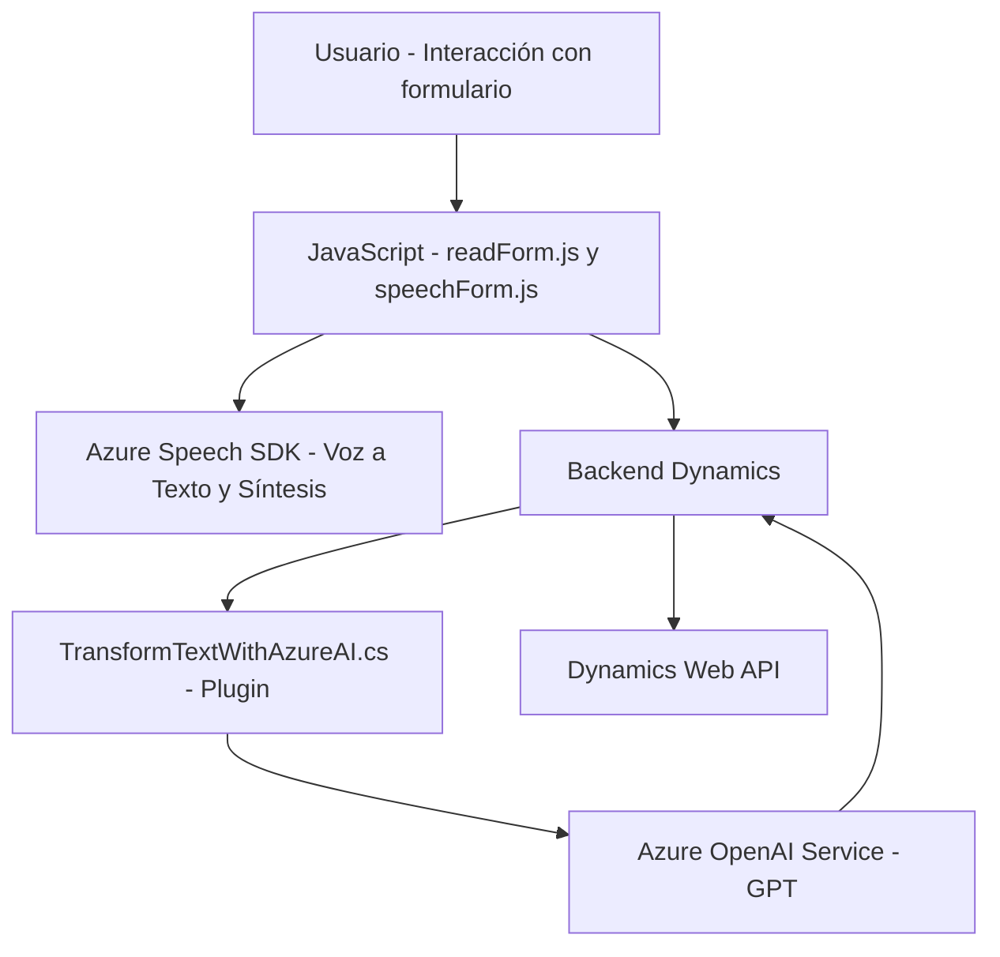

### Breve Resumen Técnico

El repositorio examinado presenta una solución con múltiples componentes asociados a la automatización de interacción entre usuarios y formularios dinámicos en Dynamics 365, utilizando reconocimiento de voz (speech-to-text) y síntesis de texto (text-to-speech) con Azure Speech SDK y procesamiento de texto avanzado mediante el servicio Azure OpenAI.

Los archivos analizados sugieren que se trata de una solución híbrida que integra dinámicas cliente-servidor. Por un lado, se implementan scripts en JavaScript para la interacción con los usuarios (lectura de voz y manipulación de formularios) y, por otro lado, un plugin en C# extiende funcionalidades con reglas de negocio aplicadas desde Dynamics CRM.

---

### Descripción de Arquitectura

1. **Arquitectura General**:  
   - **N capas**: Dividida en:
     - **Capa de presentación**: Archivos frontend en JavaScript (por ejemplo, `readForm.js`, `speechForm.js`) manejan la interfaz del usuario.
     - **Capa de negocios**: Plugins en C# (como `TransformTextWithAzureAI.cs`) manejan el procesamiento avanzado con Azure OpenAI. Usan reglas específicas para transformar texto dinámico en JSON estructurado.
     - **Capa de integración**: Comunicación directa con servicios remotos de Azure (Speech SDK y OpenAI).

2. **Patrones de diseño**:
   - **Service-Oriented Architecture (SOA)** con APIs externas (e.g., Azure Speech y Azure OpenAI).
   - **Modular Design**: Las funciones separan claramente las preocupaciones (normativa SRP) para procesar formularios, integrarse con APIs, realizar operaciones CRUD, etc.
   - **Dynamically Loaded Library**: SDK cargado de forma condicional, lo que optimiza recursos.
   - **Event-driven architecture**: Plugins activados mediante eventos predefinidos en Dynamics CRM.

---

### Tecnologías Usadas

1. **Frontend**:
   - `JavaScript`: Para interactuar con los usuarios y recoger datos.
   - **Azure Speech SDK**: Reconocimiento y síntesis de voz.
   - Bibliotecas estándar como manipuladores de objetos y Promises para manejar requests asíncronos.

2. **Backend**:
   - `C#` (ASP.NET plugins): Extensión de Dynamics CRM a través de la interfaz `IPlugin`.
   - **Azure OpenAI Service (GPT)**: Procesamiento avanzado del lenguaje para transformar datos en JSON estructurado.
   - `HttpClient`: Para invocar APIs externas (Azure OpenAI y Dynamics Web API).
   - `System.Text.Json` y `Newtonsoft.Json.Linq`: Serialización y manipulación de JSON.

3. **Dependencias Externas**:
   - **Dynamics 365 Context**: Web API de Dynamics y servicio de formulario en tiempo real.
   - **Azure Speech SDK y Azure OpenAI**: Componentes centrales en la solución.
   - Servicios HTTP RESTful para integración de resultados con APIs externas.

---

### Diagrama **Mermaid** 100% compatible con GitHub Markdown

---

### Conclusión Final

La solución analizada utiliza una arquitectura **n capas**, bien dividida con **responsabilidad modular** entre la gestión del frontend, procesamiento sever-side y conectividad con servicios externos de Azure. Combina JavaScript, Dynamics plugins en C#, y APIs como piezas integradas en el diseño. El uso de tecnologías como Azure Speech y OpenAI permite cubrir funcionalidades avanzadas de reconocimiento de voz y procesamiento inteligente de texto.

Sin embargo, se podrían analizar mejoras en la seguridad del almacenamiento de claves de API, y aplicar controles sobre tiempos de respuesta en las dependencias hacia servicios externos, asegurando robustez en caso de problemas de conectividad.