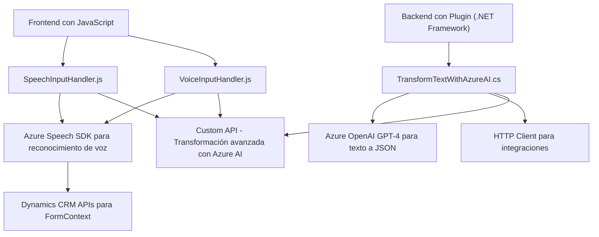

### Breve resumen técnico
El repositorio define un sistema que utiliza procesamiento de voz y texto basado en Azure Speech SDK y Azure OpenAI, integrándose con Microsoft Dynamics CRM. Ofrece capacidades de síntesis de voz y reconocimiento para interactuar con formularios, así como un plugin que utiliza inteligencia artificial avanzada para transformar texto en estructuras JSON comprensibles.

---

### Descripción de Arquitectura
La solución combina un **frontend especializado** en procesamiento de voz (con JavaScript y APIs web) utilizando Azure Speech SDK y una **backend extendida** con un plugin en .NET que consume Azure OpenAI para procesamiento avanzado. Es una arquitectura híbrida basada en la extensibilidad de Dynamics CRM con componentes integrados. Se observa un diseño con `n capas` debido a la separación clara entre la interfaz de datos y los servicios de procesamiento externos.

---

### Tecnologías usadas
1. **Frontend (JavaScript, Dynamics CRM):**
   - *Azure Speech SDK*: Para reconocimiento y síntesis de voz.
   - *Dynamics 365 JavaScript API*: Para interacción con formularios de CRM.
   - *Custom API*: Para la transformación remota de texto.

2. **Backend (.NET, Plugin de Dynamics):**
   - *C# .NET Framework*: Para desarrollar extensiones de plugins.
   - *Azure OpenAI GPT-4*: Para transformación de texto en JSON estructurado.
   - *HTTP Client y Json.NET*: Para integrar servicios externos.

3. **Patrones utilizados:**
   - **Modularidad:** Separación de responsabilidades por función o archivo.
   - **Facade Pattern:** Coordinación de SDK mediante métodos externos como `ensureSpeechSDKLoaded`.
   - **Adapter Pattern:** Uso del plugin y custom API para integrar capacidades de Dynamics CRM con servicios externos.
   - **Integration Service Pattern:** Explotación de Azure Speech SDK y OpenAI mediante servicios de red HTTP.

---

### Posibles dependencias y componentes externos
1. **Azure Speech SDK**:
   - Generación y reconocimiento de voz.
   - SDK dinámicamente cargado desde URL.
2. **Azure OpenAI**:
   - Transformación avanzada de texto en JSON basado en reglas.
   - API específica configurada en el plugin (.NET).
3. **Dynamics 365 (Xrm API)**:
   - Manipulación de formularios y datos de entidad.
4. **Custom API**:
   - Procesamiento de transcripciones con IA personalizada.
5. **JSON.net (Newtonsoft.Json)**:
   - Facilita el manejo y transformación de datos en formato JSON.

---

### Diagrama Mermaid (válido para GitHub)

---

### Conclusión final
Este repositorio ofrece una solución extensible que implementa procesamiento avanzado de voz y texto utilizando tecnologías modernas como Azure Speech SDK y OpenAI GPT-4. La arquitectura de `n capas` separa claramente la lógica de presentación, procesamiento y servicios externos, facilitando la escalabilidad y mantenibilidad en el ecosistema de Dynamics CRM. El diseño cumple con principios de modularidad y adaptabilidad, pero podría beneficiarse de una gestión más segura de configuraciones relacionadas con las claves de servicio.