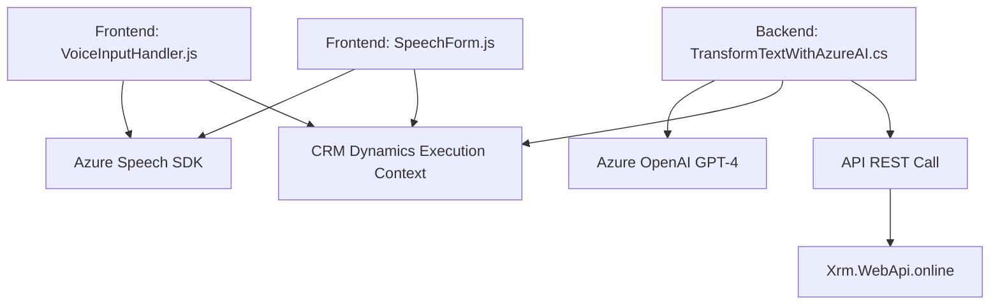

### Breve resumen técnico

El repositorio contiene tres archivos principales que implementan funcionalidades relacionadas con reconocimiento de voz, síntesis de voz, y transformación de texto usando servicios de Microsoft Azure (Speech SDK, OpenAI). Estas funcionalidades están integradas con sistemas CRM como Dynamics 365 para enriquecer la experiencia de usuario mediante voz e inteligencia artificial.

---

### Descripción de arquitectura

La solución combina una arquitectura **basada en n capas** para la integración de módulos frontend (JavaScript) y plugins backend (.NET) con el sistema Dynamics CRM. Los JavaScript en el frontend manejan la interacción con el usuario mediante el reconocimiento de voz y la síntesis de texto. El plugin backend (.NET) procesa datos utilizando herramientas avanzadas de Azure AI (GPT-4) para dar soporte a operaciones estructuradas de lógica empresarial con comunicación REST.

Algunos patrones observados:
- **Modularidad**: Separación clara entre los módulos frontend y funcionalidad backend.
- **Service-Oriented Architecture (SOA)**: La solución interactúa con servicios externos (Azure Speech SDK y Azure OpenAI), en línea con este patrón.
- **Integración con Dynamics CRM**: A través de objetos como `executionContext` y llamadas API específicas (`Xrm.WebApi`).

---

### Tecnologías usadas

#### Frontend:
- **JavaScript**: Lenguaje principal para manejar la interacción del usuario en el formulario.
- **Azure Speech SDK**: Para reconocimiento y síntesis de voz.
- **Dynamics CRM Execution Context**: Para integrar lógica con objetos CRM.

#### Backend:
- **C# (Plugins)**: Para integrar lógica personalizada en Dynamics CRM.
- **Azure OpenAI (GPT-4)**: Para transformación avanzada de texto.
- **Microsoft Dynamics SDK**: Para implementar extensiones en el sistema CRM.
- **Newtonsoft.Json / System.Text.Json**: Para operar con estructuras JSON.
- **HTTP Client (System.Net.Http)**: Para comunicación REST.

---

### Diagrama Mermaid

---

### Conclusión final

La solución es una integración avanzada diseñada para mejorar la interacción del usuario con un sistema CRM (Dynamics 365) mediante voz e inteligencia artificial. Su arquitectura es **n capas**, con división clara entre frontend (JavaScript) y backend (Plugins en C#). Se apoya en servicios externos como **Azure Speech SDK** para manejar funciones de voz y **Azure OpenAI GPT-4** para inteligencia artificial.

Aunque funcional, existen algunos puntos que podrían mejorarse, como la gestión de claves API en el código (endpoints hardcoded) para aumentar la seguridad y facilitar la configuración multi-ambiente. Sin embargo, esta solución ofrece una integración flexible y modular, adecuada para entornos empresariales que busquen ampliar la funcionalidad de sus plataformas CRM.