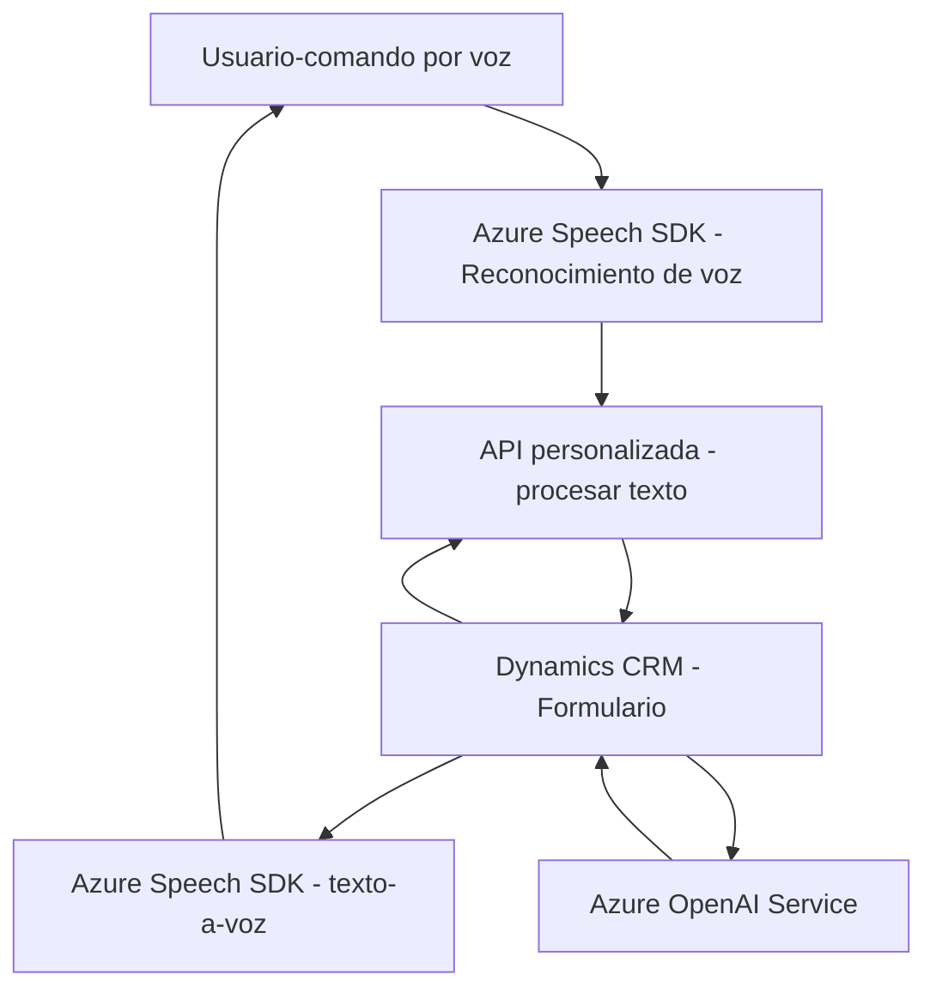

## Breve resumen técnico
El repositorio analizado es parte de una solución orientada a la integración de entrada y salida de voz con Dynamics 365, utilizando tecnologías de Azure como Speech SDK y OpenAI. Está dividido en múltiples archivos que aprovechan SDKs externos y servicios de nube, logrando procesar datos escuchados o hablados en tiempo real y realizar transformaciones inteligentes con inteligencia artificial.

---

## Descripción de arquitectura
La solución utiliza una arquitectura modular y en capas, con los siguientes componentes principales:
1. **Frontend:** Archivos JavaScript que interactúan con Dynamics CRM a través de su SDK, realizando manipulación directa de formularios y acciones basadas en comandos de voz. Este componente también realiza llamadas a servicios externos como Azure Speech SDK y APIs personalizadas.
2. **Backend (Plugin):** Un plugin basado en C# y diseñado para Dynamics CRM que implementa transformaciones avanzadas de texto mediante Azure OpenAI, siguiendo un patrón orientado a servicios (SOA).
3. **External APIs:** Integración con Azure Speech SDK para texto a voz y reconocimiento de voz, así como con Azure OpenAI para procesamiento inteligente.

---

## Tecnologías usadas
### **Frontend**:
- **JavaScript** 
- **Azure Speech SDK**: Texto a voz (TTS) y reconocimiento de voz (ASR). Importado dinámicamente desde un CDN (`https://aka.ms/csspeech/jsbrowserpackageraw`).
- **Dynamics CRM SDK (Xrm.WebApi)**: Manipulación de formularios y operaciones CRM.
- **API personalizada**: Integra capacidades adicionales como transformación de texto inteligente.

### **Backend**:
- **C# (.NET)**: Desarrollo del plugin.
- **Microsoft.Xrm.Sdk**: Interacción con Dynamics CRM.
- **Azure OpenAI Service**: Procesamiento avanzado de texto.
- **System.Net.Http y System.Text.Json**: Manipulación de peticiones HTTP y deserialización JSON.
- **Newtonsoft.Json.Linq**: Trabajos sobre objetos JSON.

---

## Diagrama **Mermaid** válido para GitHub:

---

## Conclusión final
La solución se basa en una arquitectura **orientada a servicios (SOA)**, complementada con **modularidad** en los componentes frontend y backend, integrando capacidades específicas como síntesis y reconocimiento de voz, manipulación dinámica de formularios, y procesamiento inteligente mediante Azure OpenAI. Aprovecha dos SDKs de Azure, mientras que su diseño técnico está organizado para ser expansible en Dynamics CRM.