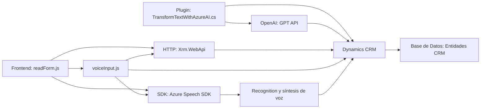

### Breve resumen técnico
El repositorio contiene una solución orientada a habilitar capacidades de reconocimiento de voz y síntesis de voz en aplicaciones conectadas a Dynamics CRM. Además, integra inteligencia artificial (Azure OpenAI) para transformar datos textuales en estructuras JSON. La arquitectura es modular, basada en SDKs y APIs externas, con componentes para frontend (JavaScript) y backend (Dynamics CRM Plugins).

---

### Descripción de la arquitectura
La solución está organizada como una arquitectura de **n capas**, en la que:
1. **Capa de presentación**: Archivos en JavaScript (con Azure Speech SDK) para el frontend que gestionan interacciones de voz y datos en formularios web.
2. **Capa lógica de negocio**: Plugins en Dynamics CRM que procesan datos desde el frontend y aplican transformaciones mediante Azure OpenAI.
3. **Capa de integración**: Comunicación entre aplicaciones y servicios externos como Azure Speech SDK y Azure OpenAI.
4. **Capa de datos**: Manejo del contexto de formulario (formContext) en el frontend y operaciones de bases de datos sobre entidades de Dynamics CRM en el backend.

---

### Tecnologías utilizadas
#### **Frontend**:
- **Javascript**:
  - `Azure Speech SDK`: Para síntesis y reconocimiento de voz.
  - `Xrm.WebApi`: Para realizar operaciones en Dynamics CRM desde el frontend.
- **Patrones usados**:
  - Modularidad: Cada función cumple una responsabilidad específica, lo que facilita el mantenimiento.
  - Event-driven: Uso de callbacks para gestionar eventos dinámicos como la carga del SDK.

#### **Backend (Plugins)**:
- **C#**:
  - **Microsoft Dynamics SDK**: Administración del contexto del CRM (entidades, plugins, etc.).
  - **Azure OpenAI API**: Invocación remota para transformar texto.
  - **Newtonsoft.Json** y **System.Text.Json**: Para manipulación de datos en formato JSON.
- **Patrones usados**:
  - Plugin Pattern: Extensión de Dynamics CRM mediante la implementación de la interfaz `IPlugin`.
  - Adapter Pattern: Adaptación entre APIs externas y la lógica interna de Dynamics CRM.

---

### Dependencias o componentes externos
1. **Azure Speech SDK**: Para la funcionalidad de síntesis y reconocimiento de voz en el frontend.
2. **Azure OpenAI API**: Generación de textos transformados mediante inteligencia artificial.
3. **Microsoft Dynamics CRM**:
   - `IOrganizationService`: Para realizar operaciones CRUD con entidades de Dynamics.
   - `Xrm.WebApi`: API JavaScript para comunicación directa.
4. **Newtonsoft.Json** y **System.Text.Json**: Manejo avanzado de datos estructurados en JSON.
5. **Sistema de formularios**: Utiliza `executionContext` y `formContext` proporcionados por Dynamics CRM para interactuar con campos en tiempo de ejecución.

---

### Diagrama **Mermaid**

---

### Conclusión final
La solución implementa una arquitectura orientada a la interacción natural mediante voz y texto. En el frontend, el uso de Azure Speech SDK automatiza la síntesis de voz y el reconocimiento de entrada hablada, mientras que en el backend, un plugin facilita la integración con Azure OpenAI para transformar datos. La elección de arquitecturas basadas en n capas y el uso de APIs externas garantizan modularidad, escalabilidad y clean code. Es especialmente adecuado para entornos empresariales que dependen de Microsoft Dynamics CRM.