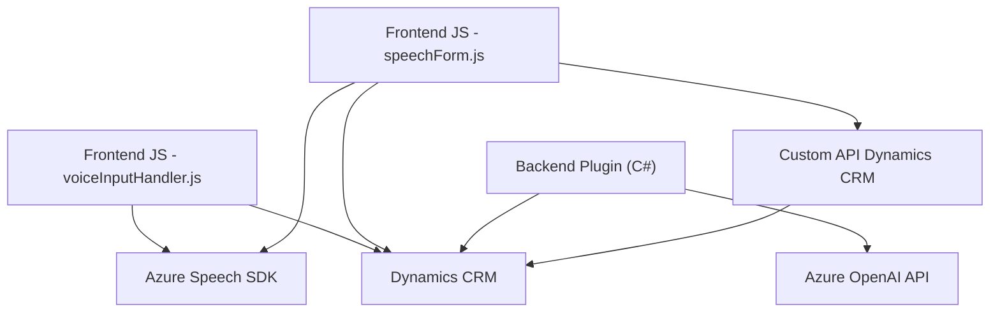

### Breve resumen técnico

El repositorio presentado implementa funcionalidades relacionadas con **procesamiento de voz** y **transformación de texto basada en inteligencia artificial**, integradas en un entorno probablemente relacionado con **Dynamics CRM**. Estas soluciones incluyen una combinación de JavaScript y C# para proporcionar interacción avanzada con formularios, mediante reconocimiento de voz, procesamiento de datos y generación de respuestas estructuradas con la ayuda del **Azure Speech SDK** y **Azure OpenAI API**.

---

### Descripción de arquitectura

La arquitectura parece ser de tipo **n-capas**, aunque con características adicionales de **integración externa** y **plugins**, especialmente diseñados para Dynamics CRM:

1. **Capa de presentación (Frontend)**:
   - Archivos JavaScript ofrecen interacción directa con los usuarios mediante entrada de voz y manipulación de formularios en Dynamics CRM.  
   - Uso del **Azure Speech SDK**, junto con APIs personalizadas, para captura y procesamiento de voz.

2. **Capa de lógica de negocio**:
   - C# implementa un plugin para Dynamics CRM que aplica procesamiento avanzado utilizando la API de Azure OpenAI.
   - Funciones específicas se encargan de transformar texto, manejar datos CRM, y generar respuestas en JSON.

3. **Capa de integración/Servicios**:
   - Servicios de Azure como Speech SDK y OpenAI API son utilizados para añadir capacidades de voz e inteligencia artificial.

4. **Dinámica Plugins y API**:
   - La arquitectura usa actores externos (e.g., servicios REST) y extensiones internas (plugins CRM) para ampliar funcionalidad.

Aunque no es una arquitectura **monolítica** (por sus dependencias externas), todavía está orientada hacia un sistema centralizado basado en Dynamics CRM con módulos bien definidos.

---

### Tecnologías usadas

1. **Frontend (JavaScript)**:
   - **Azure Speech SDK**: Para integración de texto a voz y reconocimiento de comandos mediante voz.
   - **JavaScript ES6**: Con enfoque modular.
   - **Dynamic DOM manipulation**: Carga de scripts externos y mapeo de atributos del formulario (DOM).

2. **Backend (C#)**:
   - **Dynamics CRM SDK**: Manejo de plugins y objetos API como `IPlugin`, `IOrganizationService`.
   - **Azure OpenAI API**: Procesamiento avanzado de texto basado en IA.
   - **Newtonsoft.Json.Linq** y **System.Text.Json**: Manipulación de JSON para entradas y salidas.
   - **System.Net.Http**: Realización de llamadas HTTP hacia APIs externas.

3. **Infraestructura**:
   - **Azure Services**: Para IA y procesamiento de voz.
   - **Custom API**: Integración con API personalizadas de Dynamics CRM (probablemente vía `Xrm.WebApi`).
   - **REST**: Llamadas a servicios externos.

---

### Diagrama Mermaid válido para GitHub

---

### Conclusión final

El repositorio demuestra una solución de **procesamiento de entrada de voz** y **inteligencia artificial**, integrando servicios avanzados de Azure y web APIs dentro de Dynamics CRM a través de una combinación de JavaScript (Frontend) y C# (Backend). La arquitectura modular y conectada con servicios externos sugiere una estructura de **n-capas** con patrones destacados de **plugins** para extender el comportamiento del sistema.

Este enfoque proporciona una plataforma adaptable y escalable, especialmente útil para entornos corporativos que requieren interacción dinámica, automatización y capacidades avanzadas como la inteligencia artificial aplicada al procesamiento de interacción humano-computador (voz y texto).