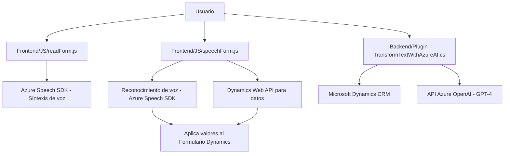

### Breve resumen técnico

El repositorio presenta diversos módulos que se integran con Microsoft Dynamics y servicios de Azure (Speech SDK y OpenAI). Estos módulos están diseñados para mejorar la experiencia del usuario en sistemas de CRM mediante funcionalidades como la entrada de voz y la transformación de texto utilizando AI. 

Los archivos proporcionados tienen un enfoque en la interacción con formularios de Dynamics 365, donde la lógica de negocio involucra la extracción de valores de los campos visibles del formulario, la síntesis de voz y el reconocimiento de voz para interacción verbal, además de procesamiento avanzado de texto utilizando Azure OpenAI.

---

### Descripción de arquitectura

La arquitectura del repositorio parece ser **n-capas**, donde los módulos están organizados funcionalmente y con separación de presentación y lógica del negocio. Los scripts de frontend como `readForm.js` y `speechForm.js` funcionan como accesos directos entre la presentación (formularios) y el procesamiento de voz (utilizando Azure Speech SDK). Por otro lado, el plugin `TransformTextWithAzureAI.cs` implementa una capa específica para lógica de negocio en el backend, integrándose con Microsoft Dynamics mediante su API y extensibilidad basada en el Plugin Design Pattern.

La solución probablemente es una **aplicación monolítica en varios niveles** que opera exclusivamente dentro del ecosistema de Dynamics CRM asociado a los servicios de Microsoft Azure.

---

### Tecnologías usadas

- **Frontend (JS):**
  - **Vanilla JavaScript:** Desarrollo de funciones de interacción con Azure Speech y conexión a formularios web.
  - **Azure Speech SDK:** Para funcionalidades de reconocimiento de voz y síntesis de voz.
  - **Dynamics Web API (`Xrm.WebApi`)**: Para interactuar con los formularios y datos del sistema Dynamics CRM.

- **Backend (C#):**
  - **Microsoft Dynamics SDK:** Para desarrollo de plugins que interactúan directamente con el sistema CRM.
  - **Azure OpenAI:** Integración con API externa de Azure para procesamiento de texto utilizando modelos avanzados, como GPT-4.
  - **Newtonsoft.Json** y **System.Text.Json:** Librerías para la manipulación y serialización de JSON.
  - **HTTP Library (System.Net.Http):** Para realizar solicitudes REST API externas.

- **Patrones de diseño:**
  - **Event-driven architecture:** Los módulos JS basados en el frontend utilizan eventos para activar operaciones (e.g., cargar SDK).
  - **MVC-like architecture:** Modularización entre controlador (input-processing), formularios (vista) y la API externa (modelo).
  - **Facade pattern:** Simplifica la interacción con diversos servicios y dependencias.
  - **Plugin Design Pattern:** En el backend, el plugin para Dynamics utiliza estándares de implementación para lógica empresarial.
  - **Adapter pattern:** Mapea valores a atributos dinámicos que cambian según el formulario.
  - **Integration Pattern:** Conexión entre Dynamics y Azure SDK para datos ingresados a través de voz o texto.

---

### Dependencias o componentes externos

Los siguientes componentes y servicios externos son utilizados en los archivos analizados:

1. **Azure Speech SDK**:
   - Sintetización y reconocimiento de voz.
   - Dependencias del script: `window.SpeechSDK` (cargado de un CDN externo).

2. **Azure OpenAI Model API**:
   - Procesamiento de texto utilizando modelos GPT (e.g., GPT-4) para transformar el lenguaje natural en JSON estructurado.

3. **Microsoft Dynamics SDK**:
   - Integración directa con formularios y datos del CRM.
   - Plugins como `TransformTextWithAzureAI.cs` lo usan para extender funcionalidades.

4. **Dependencias en C# Backend**:
   - HTTP Client para conectividad con el servicio OpenAI.
   - Newtonsoft.Json y System.Text.Json para manipulación de respuestas JSON.

5. **Frameworks internos de Dynamics**:
   - Uso de entidades, atributos, contextos, y métodos como `Xrm.WebApi` y `IPluginExecutionContext`.

---

### Diagrama Mermaid válido para GitHub

---

### Conclusión final

Este repositorio representa una solución **integrada entre Frontend, API externa y Backend** dentro del ecosistema de Dynamics CRM y Azure. Aunque no estamos ante una arquitectura de microservicios ni hexagonal, se ha implementado una capa nítida de interacción entre el frontend y los formularios en Dynamics. Además, en el backend se realiza un procesamiento significativo mediante plugins que implementan operaciones avanzadas basadas en AI. 

El diseño modular, los patrones usados (Facade, MVC-like, Adapter) y la integración con servicios clave de Azure y Dynamics robustecen la funcionalidad de la aplicación y promueven mantenimiento sencillo. Sin embargo, es fundamental considerar el manejo seguro de las credenciales de API, optimizar los flujos de error y eventualmente evaluar una posible evolución a arquitecturas más distribuidas para escalar adecuadamente.