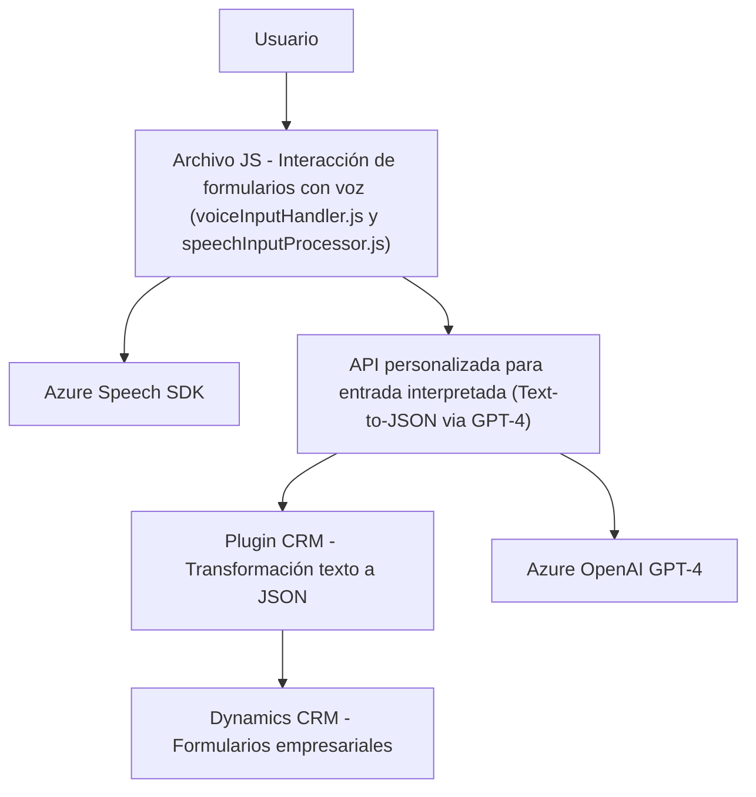

## Breve resumen técnico
Este repositorio implementa una solución integrada que combina entrada y salida por voz (utilizando Azure Speech SDK), procesamiento avanzado de texto con integración de IA (Azure OpenAI GPT-4), y actualizaciones en formularios del sistema Dynamics CRM (utilizando la API de XRM y un plugin personalizado). El objetivo principal es optimizar la accesibilidad y automatizar flujos de trabajo dentro de un entorno CRM dinámico mediante tecnologías en la nube.

---

## Descripción de arquitectura
La solución se basa en una **arquitectura de n-capas** y evidencia principios de **SOA (Service-Oriented Architecture)**:
1. **Capa de presentación**: Archivos `readForm.js` y `speechForm.js`, que manejan la interacción con el usuario a través de funcionalidad basada en voz e integración directa con el CRM.
2. **Capa lógica/intermedia**: Plugin `TransformTextWithAzureAI.cs`, que se encarga de procesar texto mediante Azure OpenAI API y devolverlo estructurado para el CRM.
3. **Capa externa de servicios**: Comunicación directa con Azure Speech SDK y Azure OpenAI API para servicios de Text-to-Speech, Speech-to-Text y procesamiento avanzado con IA.

La solución se organiza de manera modular y reutilizable, donde cada componente aborda responsabilidades específicas:
- Modificación y acceso a datos del formulario.
- Integración con APIs y SDK externos.
- Generación de JSON estructurado para facilitar la interacción entre voz y formulario.

---

## Tecnologías usadas
### **Frontend**
- **JavaScript**: Para la gestión de formularios CRM y funcionalidad de interacción por voz en el lado del cliente.
- **Azure Speech SDK**: Implementación de Text-to-Speech y Speech-to-Text directamente desde el navegador.

### **Backend (Plugins)**
- **C# (.NET Framework)**: Para la funcionalidad de extensiones (plugins) en Dynamics CRM.
- **Microsoft Dynamics CRM SDK**: Gestión de formularios y datos en la plataforma.
- **Azure OpenAI Service (GPT-4)**: Procesamiento y transformación de texto mediante inteligencia artificial.

### **Otros componentes**
- **API personalizada**: Utilizada desde el frontend para la transformación de texto mediante una lógica definida en el proyecto.

---

## Diagrama Mermaid válido para GitHub

---

## Conclusión final
Este repositorio implementa una solución avanzada que combina inteligencia artificial (Azure OpenAI) y tecnologías de reconocimiento de voz (Azure Speech SDK) para mejorar la accesibilidad y automatizar la interacción en entornos empresariales basados en CRM (Dynamics CRM). Con una arquitectura orientada a servicios (SOA) y separación en n-capas, cada componente es modular y cumple su rol específico. La solución emplea estándares modernos, como APIs REST, plugins, y carga dinámica de SDKs. Para optimizar el manejo de credenciales y configuración, se recomienda seguir mejores prácticas de seguridad para servicios externos.