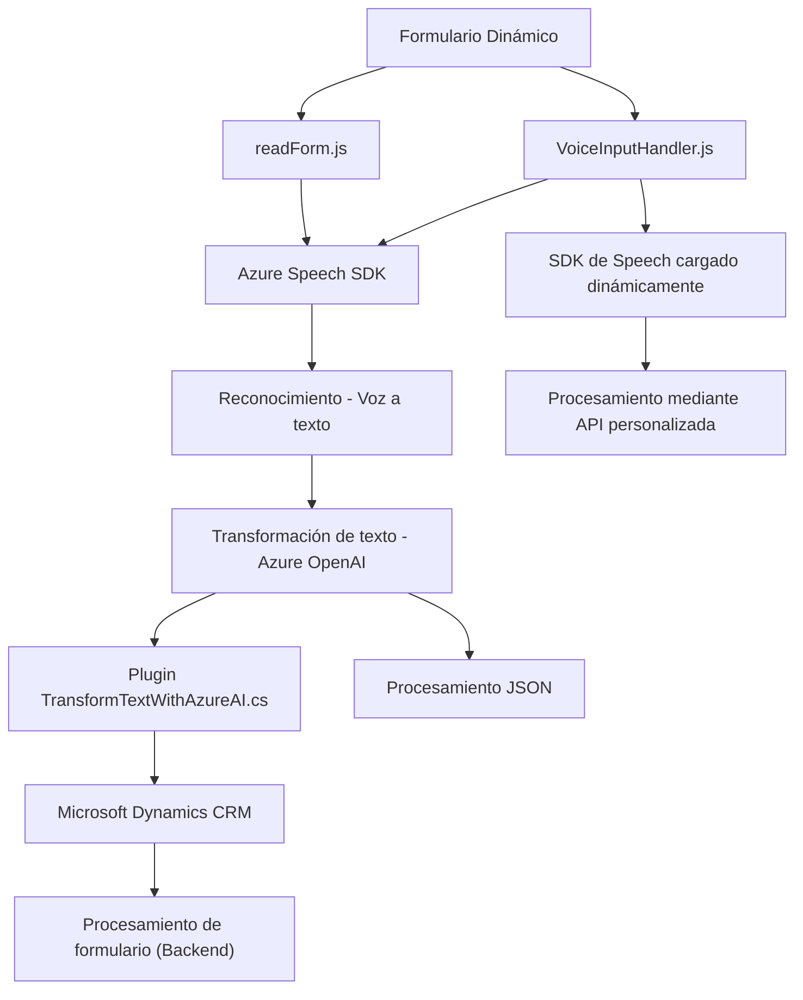

# Análisis Técnico

### Breve Resumen Técnico
El repositorio presenta un conjunto de archivos utilizados para integrar capacidades de reconocimiento de voz, síntesis de texto en voz, y transformación de datos mediante Azure OpenAI, dentro del contexto de un formulario dinámico asociado con Microsoft Dynamics CRM. Está diseñado principalmente para interactuar con servicios de Cloud Computing (Azure Speech y OpenAI) y con un sistema CRM.

### Descripción de Arquitectura
La solución implementa arquitectura **basada en n capas+plugin**:
1. **Backend (Plugins - TransformTextWithAzureAI.cs)**:
   - Maneja la lógica del servidor con dependencia de servicios externos mediante Azure OpenAI y Microsoft Dynamics SDK.
   - Organiza tareas específicas en función de peticiones del cliente y procesamiento automatizado.
   
2. **Frontend (VoiceInputHandler.js, readForm.js, etc.)**:
   - Ofrece una interfaz basada en JavaScript para interactuar con formularios dinámicos, soportando reconocimiento y síntesis de voz mediante SDK de Azure Speech.
   - Las funciones están separadas por responsabilidades como extracción y procesamiento de datos visibles, interacción con APIs, y sincronización en tiempo real con el backend.

### Tecnologías Usadas
1. **Microsoft Dynamics CRM SDK**:
   - Utilizado en el backend para manejar eventos y acciones contextuales dentro del sistema CRM.
   
2. **Azure Speech SDK**:
   - Implementa reconocimiento y síntesis de voz en navegadores.

3. **Azure OpenAI API**:
   - Utiliza `gpt-4` para transformar datos de texto basados en reglas específicas.

4. **REST Services**:
   - Integración mediante APIs (ejemplo: Azure Speech y OpenAI) para comunicación externa.

5. **Frameworks/Idiomas**:
   - **Frontend**: JavaScript para manipulación del DOM y manejo de SDKs cloud.
   - **Backend**: C# para lógica implementada en plugins compatibles con Dynamics CRM.

6. **Arquitectura por capas y modularidad**:
   - Se observan patrones como módulos desacoplados y separación de lógica de negocio.

### Dependencias o Componentes Externos
1. **SDK Externos**:
   - Azure Speech SDK para voz.
   - Microsoft Dynamics SDK para lógica CRM.
2. **APIs en la nube**:
   - Azure OpenAI para inteligencia artificial.
   - Servicios REST para llamadas externas.
3. **Herramientas del navegador**:
   - Manipulación del DOM y eventos en tiempo real.

---

### Diagrama Mermaid Compatible con GitHub Markdown

---

### Conclusión Final
El repositorio representa una solución de integración avanzada entre un sistema CRM basado en Microsoft Dynamics y servicios de nube como Azure Speech y OpenAI. La arquitectura basada en n capas+plugin organiza la interacción entre frontend, backend y servicios externos. Su diseño modular garantiza que cada módulo tenga responsabilidades claras, y aprovecha lo mejor de los servicios en la nube para ofrecer capacidades de voz e inteligencia artificial al sistema CRM. Esto lo hace ideal para aplicaciones empresariales que requieren procesamiento inteligente de datos en tiempo real.