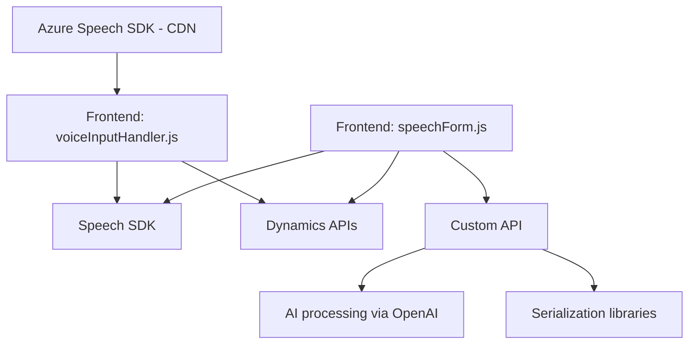

### Breve resumen técnico
Este repositorio contiene un sistema orientado a integrar capacidades de síntesis y reconocimiento de voz con formularios de Dynamics 365 CRM, utilizando **Azure Speech SDK** y **Azure OpenAI** para habilitar operaciones como texto a voz y análisis de texto estructurado.

---

### Descripción de la arquitectura
La solución adopta una **arquitectura de N capas**, con 3 módulos separados:
1. **Frontend (JavaScript):**
   - Procesa formularios en el navegador y permite la interacción con Azure Speech SDK para la generación de texto a voz y voz a texto.
   - Realiza llamadas API a Dynamics CRM usando servicios integrados.
2. **Integración en Dynamics CRM:**
   - Un plugin (`TransformTextWithAzureAI.cs`) se ejecuta desde eventos del sistema. Utiliza datos de formularios CRM y conecta con el servicio de Azure OpenAI para transformar texto según reglas predefinidas.
3. **Servicios en la nube:**
   - Azure Speech SDK y OpenAI API son componentes externos que proporcionan las capacidades de voz y análisis semántico.

---

### Tecnologías usadas
1. **Frontend:**
   - **JavaScript**: Para la lógica de frontend, ejecución de API calls.
   - **Dynamics 365 CRM APIs** (`Xrm.WebApi.online.execute`, `Xrm.WebApi.retrieveMultipleRecords`): Para manipulación de datos en formularios CRM.
   - **Azure Speech SDK**: Servicios de reconocimiento y síntesis de voz.

2. **Backend (`Plugins/TransformTextWithAzureAI.cs`):**
   - **C#**: Lenguaje usado para el desarrollo del plugin de Dynamics CRM.
   - **Microsoft.Xrm.Sdk**: Para la interacción con CRM como plugins de Microsoft Dynamics.
   - **Newtonsoft.JSON** y **System.Text.Json**: Para manejo de datos en formato JSON.
   - **System.Net.Http**: Para realizar llamadas HTTP al servicio Azure OpenAI.
   - **Azure OpenAI API**: Servicios de transformación de texto basados en IA.

3. **Cloud Services**:
   - **Azure Speech SDK**: Carga dinámica desde CDN para síntesis y reconocimiento de voz.
   - **Azure OpenAI API**: Procesamiento de texto inteligente y generación de output en JSON.

---

### Diagrama Mermaid válido para GitHub Markdown

---

### Conclusión final
Este sistema emplea una solución basada en **N capas** que combina funcionalidades individuales de frontend, backend y servicios en la nube. El uso del **Azure Speech SDK** permite interactuar fácilmente con la interfaz de usuario de Dynamics CRM mediante voz, mientras que el plugin backend aprovecha el poder de **Azure OpenAI API** para transformar texto de entrada en base a reglas predeterminadas. Se observa una clara separación de responsabilidades en cada componente del sistema, asegurando modularidad y escalabilidad.

Sin embargo, se sugieren las siguientes mejoras:
1. **Gestión de claves de acceso:** Utilizar mecanismos seguros como Azure Key Vault para almacenar credenciales en lugar de incrustarlas directamente en el código.
2. **Separación de configuración:** Extraer las normas de validación del plugin hacia un archivo de configuración externo (e.g., JSON).
3. **Logging:** Incluir un sistema de logs robusto para registrar los errores y el estado de las integraciones con servicios externos.

En general, el sistema es un ejemplo sólido de integración de servicios basados en la nube, que aprovechan tecnologías modernas de IA y síntesis de voz en aplicaciones empresariales.