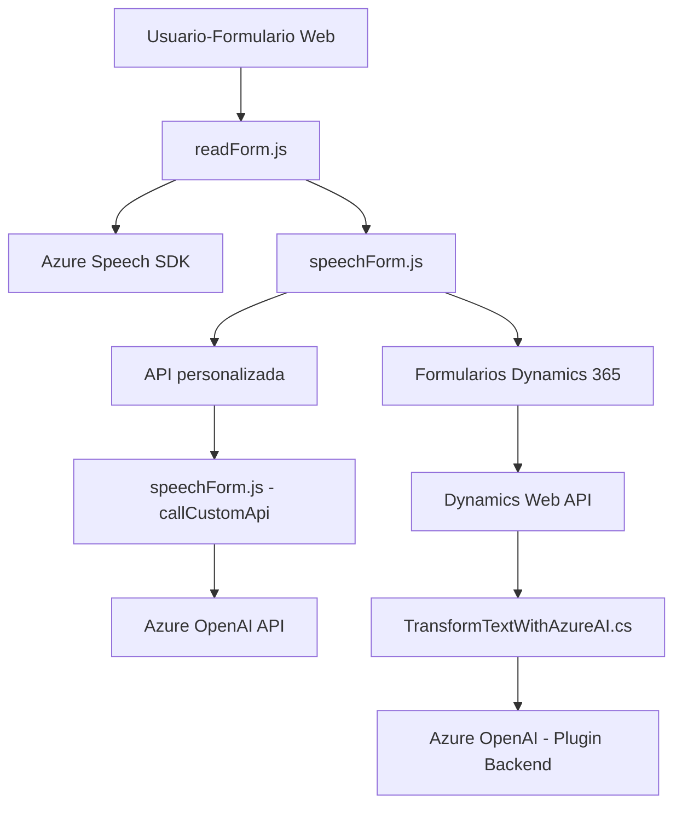

### Breve resumen técnico

El repositorio contiene tres archivos clave (`readForm.js`, `speechForm.js`, y `TransformTextWithAzureAI.cs`) que evidencian una solución orientada a la integración de funcionalidades con **Microsoft Dynamics CRM**, accesibilidad vía voz y procesamiento de texto utilizando servicios de IA en la nube como **Azure Speech SDK** y **Azure OpenAI API**. Implementa capacidades de entrada por voz para formularios dinámicos y funciones de transformación y estructuración de texto mediante un **plugin de Dynamics CRM**.

---

### Descripción de arquitectura

La solución sigue una **arquitectura modular** orientada a servicios, con la siguiente estructura:

1. **Frontend** (JavaScript archivos):
   - Maneja la entrada y síntesis por voz interactuando con formularios web en Dynamics CRM.
   - Utiliza el **Azure Speech SDK** para reconocimiento de voz y procesamiento local basado en eventos.
   
2. **Backend** (Plugin .NET para Dynamics CRM):
   - Implementa el patrón de **Plugin** para integrar procesamiento de texto estructurado a través de **Azure OpenAI API**.
   - Monitorea eventos en el contexto de Dynamics CRM y delega la transformación de texto a servicios externos.

3. **Integraciones Externas**:
   - Interactúa con servicios **SaaS** (Software as a Service) como Dynamics 365 API, Azure Speech SDK y Azure OpenAI, evidenciando patrones de consumo de APIs REST.

Esta arquitectura puede clasificarse como **multicapa** con integración de servicios remotos. Aunque hay separación de responsabilidades y componentes, sigue una estructura monolítica embebida en el ecosistema de Dynamics 365.

---

### Tecnologías usadas

1. **Frontend**:
   - **JavaScript**: Para interacción de usuarios con formularios y entrada por voz.
   - **Azure Speech SDK**: Para reconocimiento y síntesis por voz.
   - **Microsoft Dynamics CRM (JavaScript API)**: Interacción con entidades y formularios dinámicos.

2. **Backend**:
   - **C# (.NET Framework)**: Para la implementación del plugin de Dynamics CRM.
   - **Azure OpenAI API (GPT)**: Procesamiento avanzado de texto.
   - **System.Text.Json** y **Newtonsoft.Json**: Manipulación de datos JSON.
   - **Microsoft Dynamics SDK**: Para administración del contexto del plugin.

3. **Servicios API**:
   - Azure SaaS: Speech SDK y OpenAI para AI y voz.
   - Dynamics Web API: Gestión de datos dentro de Dynamics 365.

---

### Diagrama **Mermaid**

---

### Conclusión final

La solución está diseñada para integrarse profundamente en Microsoft Dynamics CRM con funcionalidades de accesibilidad y automatización mediante voz e inteligencia artificial. Utiliza patrones de consumo de servicios externos con SDKs, APIs REST y plugins personalizados para lograr modularidad en su funcionamiento.

Aunque encaja bien en un entorno monolítico, la arquitectura puede evolucionar hacia microservicios si se separa la lógica de voz e inteligencia artificial en componentes independientes y externos. Esto garantizaría mejor escalabilidad y mantenibilidad.