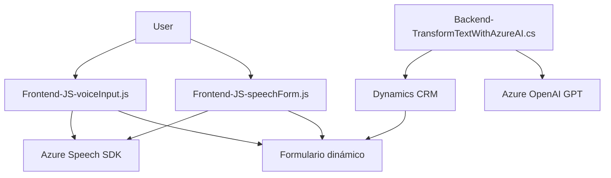

### Breve resumen técnico
El repositorio analiza una solución centrada en la integración de tecnologías de reconocimiento de voz (Azure Speech SDK) y procesamiento con IA (Azure OpenAI GPT). Está diseñada para interactuar con formularios dinámicos y personalizables en el entorno de Dynamics 365 CRM. 

Dos módulos principales componen la solución:
1. **Frontend JavaScript (readForm.js y speechForm.js):** Implementa funciones para capturar voz, convertirla en texto, sintetizar texto en voz y llenar formularios dinámicos vía SDK y APIs.
2. **Backend Plugin (TransformTextWithAzureAI.cs):** Define un plugin para Dynamics CRM que transforma entradas textuales en JSON utilizando Azure OpenAI GPT.

### Descripción de arquitectura
La solución tiene una **arquitectura de n capas** orientada a servicios en Dynamics CRM:
1. **Capa de presentación:** Representada por los archivos JavaScript alojados en el cliente para la interacción con el usuario.
2. **Capa lógica/transformación:** Plugin que interactúa con servicios de Azure OpenAI para procesamiento avanzado.
3. **Capa de datos:** Uso de modelos y acceso a datos del CRM vía Dynamics Web API y objetos del modelo del SDK.

### Tecnologías usadas
1. **Azure Speech SDK**: Maneja captura de voz, transcripción y síntesis de voz.
2. **Azure OpenAI**: Realiza procesamiento complejo con GPT-4 basado en prompts dinámicos.
3. **Dynamics 365 CRM**: Entorno de ejecución del plugin y el origen/destino de datos.
4. **Microsoft.Xrm.Sdk**: API para interactuar con el modelo de datos del CRM.
5. **JavaScript**: Implementación de lógica frontend y comunicación con APIs.
6. **REST API**: Comunicaciones entre el backend del plugin y Azure OpenAI.

### Diagrama Mermaid válido para GitHub Markdown

### Conclusión final
La solución es una implementación robusta que combina tecnologías modernas como Azure Speech SDK y Azure OpenAI para enriquecer la interacción con formularios dinámicos en Dynamics CRM. Tiene una **arquitectura de n capas** eficaz, donde la capa de presentación (JavaScript en el cliente) interactúa directamente con dependencias externas (Azure Speech SDK) y facilita la actualización en Dynamics 365 CRM. Además, la capa lógica en el backend usa un **patrón de integración desacoplada** mediante REST API y plugins, lo cual permite una alta versatilidad y extensibilidad.

La integración de IA (Azure GPT) en el backend para modificar y estructurar datos añade valor a la experiencia del usuario y la automatización de procesos.