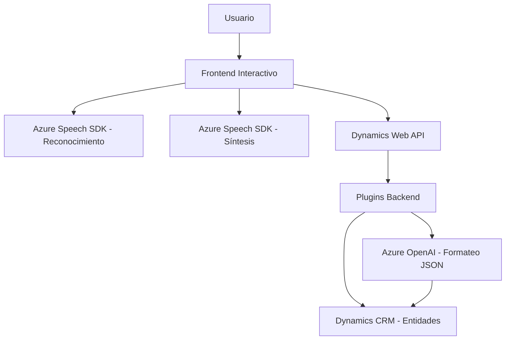

### Resumen técnico
El repositorio parece implementar una solución para mejorar la interacción con formularios en la plataforma Dynamics 365 utilizando servicios de Azure Cognitive Services y Azure OpenAI. Los archivos muestran una integración avanzada con reconocimiento de voz, síntesis de voz y procesamiento de texto orientado a asistentes interactivos y enriquecimiento de datos en tiempo real.

---

### Descripción de la arquitectura
La arquitectura sigue un enfoque **modular y n-capas**, en donde cada módulo tiene responsabilidades claras:
1. **Frontend:** Implementa lógica relacionada con interacción del usuario y procesamiento dinámico de datos.
2. **Plugins:** Encapsulan la lógica que se ejecuta en el backend de Dynamics 365, interactuando directamente con los servicios de OpenAI para estructurar y procesar texto.
3. **Servicios externos:** Utiliza servicios de Azure Speech SDK y Azure OpenAI para reconocer voz, sintetizar texto en audio y transformar datos en respuestas enriquecidas y estructuradas.

La arquitectura se basa en un patrón de **integración de servicios en la nube**, destacando la conexión entre Dynamics 365 y Azure. Aunque el repositorio no sigue un patrón estricto (como hexagonal), la modularidad lo hace extensible.

---

### Tecnologías usadas
1. **Frontend:** 
   - JavaScript para lógica dinámica del cliente.
   - SDK de Azure Speech para funciones de reconocimiento y síntesis de voz.
   - Dynamics 365 Web APIs para manejo del contexto y entidades del formulario.

2. **Backend (Plugins):**
   - C# utilizando Microsoft Dynamics SDK (`Microsoft.Xrm.Sdk`) para crear plugins.
   - Azure OpenAI (GPT-4).
   - `Newtonsoft.Json` y `.Net HttpClient` para parseo de JSON y manejo de solicitudes API.

3. **Patrones:**
   - **Carga dinámica:** `ensureSpeechSDKLoaded` para cargar scripts según demanda.
   - **Integración de servicios:** Servicios externos (Azure Speech/OpenAI) se acceden directamente con claves de API.
   - **n-capas:** Separación entre módulos frontend y backend con interacción claramente delimitada.

---

### Dependencias o componentes externos
1. **Azure Speech SDK:** Para reconocimiento y síntesis de voz.
2. **Azure OpenAI:** Para transformar datos textuales en estructuras JSON enriquecidas.
3. **Dynamics Web API:** Para ejecutar consultas, actualizar formularios y realizar llamadas a APIs personalizadas.
4. **Newtonsoft.Json:** Parseo y manipulación de respuestas JSON obtenidas de Azure.
5. **Dynamics Plugins:** Extensión de lógica CRM que interactúa con servicios Azure.

---

### Diagrama Mermaid válido para GitHub

---

### Conclusión final
Este repositorio implementa una solución compleja orientada a mejorar la experiencia de usuarios en Dynamics 365 mediante interacción con servicios de inteligencia artificial y procesamiento en la nube. La estructura es modular, con separación entre frontend, plugins backend y servicios externos, adecuado para integrarse en un sistema de múltiples capas.

El uso de servicios de Azure facilita el despliegue de capacidades avanzadas como reconocimiento de voz, síntesis y procesamiento ayudado por IA, pero trae desafíos como la gestión y seguridad de las claves de API expuestas directamente en el código. Aunque no utiliza patrones estrictamente definidos como la arquitectura hexagonal, su modularidad ofrece un diseño extensible y eficiente.